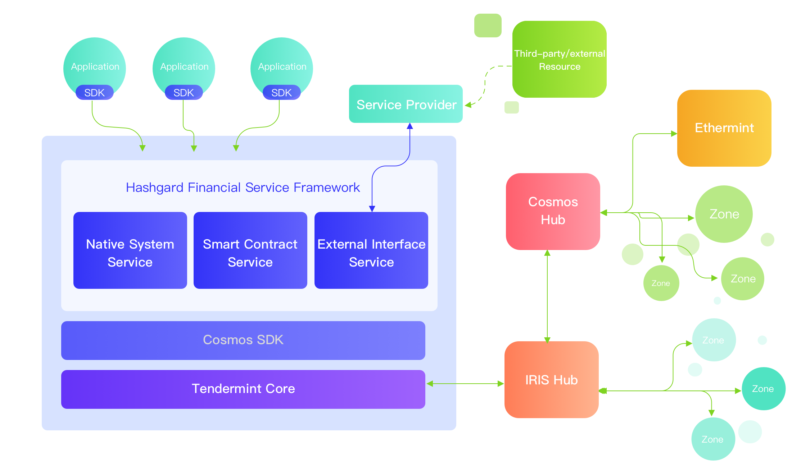
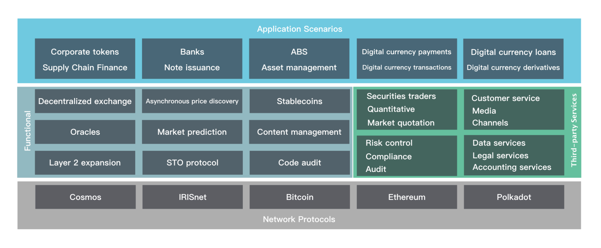

# Hashgard Digital Finance Blockchain White Paper

**A Next-Generation Digital Finance Public Blockchain**

 

March 2019, Hashgard Foundation Ltd.

​    

[TOC]

# Chapter I – Blockchain: A Social Experiment and Financial Revolution

## 1.1 The History of Blockchain Technology

In 1982, American computer scientist David Chaum first put forward the idea of an untraceable cryptographic online payment system. In 1990, he developed this idea into the world’s first anonymous cryptographic electronic cash system, known as eCash.

In 1998, computer engineer Wei Dai published a paper introducing a new system of anonymous and distributed electronic cash, which he named B-money.

In 1998, the same year that Wei Dai's paper was published, Nick Szabo created the architecture for a system called ‘Bit Gold,’ and constructed a system to authenticate property rights. Hal Finney went on to improve this mechanism and transform it into a reproducible proof of work.

In 2008, Satoshi Nakamoto released *Bitcoin: A Peer to Peer Electronic Cash System* on a cryptography mailing list – the first paper to propose the concept of blockchain. He then used this concept to propose the construction of the Bitcoin blockchain network. Since its establishment in 2009, the Bitcoin blockchain network has maintained operations, and the entire digital currency process has now been fully realized, from token issuance to digital asset circulation. At the same time, the basic underlying technology of blockchain has also been applied to a gradually growing set of scenarios, which has subsequently helped to create various new types of digital currencies.

In 2015, the open-source project Ethereum was officially released, featuring the concept of smart contracts, inspiring a host of innovators. Ethereum provides complete freedom through its Turing-complete scripting language, and allows for consistent registration and transfer of a variety of digital assets and smart contracts, greatly facilitating the issuance and circulation of digital currency, and significantly broadening its application scenarios.

The rapid development of blockchain technology has gradually raised the public profile of digital currency. This has especially been the case since early 2017, when initial coin offerings (ICOs) became an increasingly prominent and frequent business practice, helping a broad plethora of products to continuously emerge across the industry, bringing a new cycle of prosperity to the digital currency market. At the end of 2017, this surge reached its peak, and observers inside and outside the industry widely opined that blockchain would become the next tech revolution following the mobile internet. During this same period, a large number of leaders in the tech and finance industries began to actively embrace blockchain for use in their companies or projects. 

## 1.2 The Impact of Blockchain on Traditional Finance

Technological innovation and development has allowed the format of financial services to evolve. Over the past five decades, electronic financial data has replaced hand-written records, enabling an era of credit cards. The popularity of terminals has marked the ATM era, while the coming of Internet and mobile Internet has introduced electronic banking and mobile payments.

The arrival of blockchain today marks another historical era.

Blockchain, together with technologies such as big data, AI, cloud computing, and bio-informatics, will form the financial infrastructure for the next generation. This infrastructure will be able to overcome several longstanding problems in the current financial system, as follows.

1.  In the traditional centralized financial system, financial intermediary fees are high enough to limit transaction scale. Intermediaries not only have large expenses for themselves, but also require high profits to cover potential credit risks. Due to the high cost, when using traditional financial intermediary services, financial institutions often set minimum scales of transactions for deposit, cross-border transfer, stock and fund transaction sizes, frequently blocking small and micro-sized transactions. However, blockchain distributed ledger is a trust machine. It can help financial institutions save on intermediary costs, without requiring a third-party intermediary, making small and micro-sized peer-to-peer transactions possible. 

2.  In the traditional centralized financial system, users may be defrauded. Transactions are frequently not “atomized,” but rather the intermediary assumes the responsibility as a guarantor, which makes it possible for either party to maliciously default and defraud the other party. Since blockchain is a distributed technology, though, a financial system based on it contains no single point of failure, and creates no risk of collapse. 

 

3.  In the traditional centralized financial system, users’ private data and assets are potentially vulnerable. In recent years, cases of private user data leakage have been reported by various media outlets. Massive amounts of personal identities, bank accounts, transaction records, and even passwords have been listed for sale on various websites, resulting in serious threats to user privacy and asset security. However, in the blockchain network, user data is kept by users themselves, instead of in a centralized system, realizing democratization of data, and effectively protecting privacy and asset security. 


Obviously, with the continuous development of blockchain technology, its distributed ledgers, smart contracts, zero-knowledge proofs, multi-party secure computation, and homomorphic encryption can effectively resolve pain points in the current financial industry, and may create the possibility for new models and products, thus creating a more intelligent, more effective, and safer financial ecosystem. 


## 1.3 Blockchain + Finance Integration and Pilot Projects

At the present phase, extensive blockchain integration and pilot projects have been developed in cross-border payments, asset management, digital fiat currency, trusted identity, internal settlement, and security and asset transactions.

### 1.3.1 Blockchain + Cross-border Payments

Blockchain has the following strengths for transfer: low cost, real-time settlement, regulatory-friendly, and high liquidity. Blockchain project Ripple has launched several cross-border payment schemes for the banking sector, including (1) xCurrent: a real-time settlement solution for financial institutions, realizing quick, convenient and low-cost end-to-end cross-border interbank transfers; (2) XRapid: a real-time settlement solution based on Ripple (XPR) token, which can save 40% - 70% compared to the cost of ordinary international remittance schemes; (3) XVia, which provides a standard interface product for payment between companies through a real-time gateway settlement channel. In January 2019, Ripple announced that it had served over 200 cross-border payment providers, such as MUFG, Mizuho Bank, Crédit Agricole, SEB, the international payments platform of American Express, and Banco Santander, with 2 - 3 new customers being added per week. With its rapidly growing cross-border payment business, many experts predict that Ripple will replace SWIFT to become a cross-border payment giant. 

### 1.3.2 Blockchain + Asset Management

The digital asset management industry is currently in the ascendant. By February 2019, there were 700 cryptocurrency funds, with asset under management of 10 billion US Dollars globally. On November 1, 2018, the Securities and Futures Commission (SFC) of Hong Kong released a *Statement on Regulatory Framework for Virtual Asset Portfolios Managers, Fund Distributors and Trading Platform Operators* (the “Statement”), allowing licensed fund companies to allocate up to 10% of their assets in the digital currency market. Fidelity Fund, one of the world's largest fund managers, also established a digital asset custody company in 2018. The company provides solutions for custody of BTC, ETH, and other cryptocurrencies, as well as 24-hour advisory services for cryptocurrency transaction platforms and institutions.

### 1.3.3 Blockchain + Digital Fiat Currencies

Venezuelan President Nicolás Maduro announced the birth of the Petro in a televised speech on December 3, 2017. Venezuela launched the pre-sale on February 20, 2018, making the country a world leader in digital fiat. The pre-sale raised 735 million USD on the first day. 

According to the White Paper, the Venezuelan government expected to issue 100 million Petros, worth about 60 billion USD, and it will be listed on cryptocurrency exchanges. The government will accept Petros as payment for taxes, fees, donations, and public services. State-owned companies including the petroleum company PDVSA will also participate in Petro sale and purchase. 

Maduro said that the new currency would be supported by Venezuela's oil, gasoline, gold, and diamond reserves. The Petro will help Venezuela “move forward in currency sovereignty” and provide the country with “a new form of international financing.” Through this innovative step, Maduro hoped to lead the country out of its mire of hyperinflation and severe economic crisis, paying off debts and increasing imports of necessities and raw materials. He also hoped to bypass the economic sanctions imposed by the US government, allowing US individuals and Venezuelan enterprises to resume business.

Besides Venezuela, many other countries are also accelerating research on digital fiat currencies based on blockchain. For example, the Monetary Authority of Singapore and Deloitte have jointly launched Project Ubin to digitize the Singapore dollar (SGD). The Bank of Canada has also launched CAD-coin, a Jasper-based digital fiat currency project; the People's Bank of China has established the Digital Currency Research Institute, organizing experts to study central bank digital currencies; and the Marshall Islands will issue its own legal tender cryptocurrency, pegged to the US dollar. As the technology continues to develop, we believe that more countries will eventually use blockchain to build their own digital currencies. 

### 1.3.4 Blockchain + Trusted Identity

In early 2018, SecureKey, initially established in Canada, cooperated with IBM to release a nationwide identity and authentication system based on blockchain. The new system applies IBM’s blockchain technology to enable users to prove their identity to the government, banks, and telecommunication operators through mobile phones and Windows devices. Through the app, they can also confirm details such as their age or credit score when accessing services. Online consumers will no longer need to sign documents by themselves or provide other identification materials when applying for new apartments or mobile phones. The blockchain authentication system will enable them to control and share their personal information without using a centralized system to create “value” information, with its security vulnerabilities. It is reported that Toronto-Dominion Bank, the Royal Bank of Canada, and other large financial institutions have invested CAD 30 million (about US$ 23.5 million) in the program. 

### 1.3.5 Blockchain + Corporate Tokens

In February 2019, J.P. Morgan Chase & Co., the largest US commercial bank, announced a plan to issue its own digital currency, JPMCoin on its private chain platform Quorum. JPMCoin is pegged at a 1:1 ratio to the US dollar, and the company will use its strong capital reserve to ensure the stability of its token. JPMCoin is designed for inter-enterprise capital flow, and its early applications mainly involve cross-border payment, securities trading, and US dollar substitution for large enterprise customers. However, few institutional customers have participated in the test. Meanwhile, the internet giant Facebook is also quietly moving into cryptocurrency. 

### 1.3.6 Blockchain + Asset Transaction

In December 2018, Bakkt, a digital asset trading platform founded by the Intercontinental Exchange (ICE), the parent company of the New York Stock Exchange (NYSE), announced the completion of its first round of funding, raising US$ 183 million from 12 partners and investors.

Bakkt is using ICE's trading infrastructure to a certain extent to provide new infrastructure – including the industry's first institutional-level regulated trading platform and clearance and savings services for physical delivery and storage – in the hope that Bitcoin futures trading becomes more widely accepted.

Both the Chicago Board Options Exchange and Chicago Mercantile Exchange trade Bitcoin futures without delivering the actual currency, making settlements in cash based on changes in Bitcoin prices. This makes them an instrument for betting on future currency prices. Bakkt takes physical delivery and trades without margin.

Bakkt is building an open, seamless global network, enabling users to purchase, sell, store and use digital assets simply, securely, and efficiently. Bakkt also hopes to use Bitcoin to simplify and disrupt the retail payment industry, allowing consumers to switch from swiping credit cards to scanning Bitcoin apps. The market space is massive: consumers pay up to US$ 25 trillion a year worldwide in credit card and online shopping fees.

*Fortune Magazine* also said that “ICE's foray into cryptocurrency trading is a big deal. It is a well-established, respected and extremely powerful institutional player in the financial industry.”

### 1.3.7 Blockchain + Security Tokens

There is no clear definition of security tokens, but according to general understanding in the industry, it can be simply defined as asset tokenization in accordance with regulations. The definition includes two main parts.

1.  Token issuance and trading should comply with government regulations 

2.  Any kind of asset (tangible or intangible) may be transferred on the blockchain in the form of tokens.

Regulation is the focus of security tokens. For example, in the United States, its issuance is subject to regulation by the SEC and other relevant bodies. Their subjects are also constrained by federal law. In general, security tokens must be registered with the SEC (except for exemptions which meet certain terms, such as Reg A+, Reg D, and Reg S, etc.) and observe all rules of securities laws. Regulation will push up issuance and transaction cost, and increase the threshold for participation in such tokens.

 

Although regulation has increased cost of issuance, the advantages of security tokens are clear:

1.  Lower investment and trading thresholds. For example, a valuable office building can theoretically be split into infinite units using security tokens, greatly reducing the investment threshold and allowing anyone to participate.

2.  Higher asset liquidity. For example, in a private fund with a closed period of 10 years, investors can only recover their investment after that time. But if the fund is tokenized, the investors can buy and sell fund shares at any time, improving asset liquidity.

3.  Lower issuance costs: issuance fees and time costs of traditional IPOs are extremely high, accounting for 4-7% of the total fund raised. With STOs, the cost will be greatly reduced.

4.  Reduced regulatory costs: the costs and difficulty of regulation are reduced through programmatic sequencing, breaking down the barriers between regulators and between countries, making cross-border asset trading more convenient.

5.  Increased market efficiency: because the token can be sold and traded worldwide (as permitted by regulation), asset pricing becomes more equitable, and price discovery becomes more efficient, making the token more attractive to investors.

6.  More financing channels for SMEs: more than 650,000 companies are created each year in the US alone, but Wall Street, Silicon Valley and angel investors do not provide sufficient capital for startups. Therefore, regulated and security tokens issuance, or Security Token Offerings (STOs), can help SMEs find new financing channels.

​    

# Chapter II – Background and Design Objectives of Hashgard

## 2.1 Background 

Hashgard project was officially launched in March 2018, but its genesis can be traced back to exploration and research by its main team members on blockchain technology in 2013. This took forms including technical research on blockchain network architecture and open source code, development and verification of smart contracts based on Ethereum, early conception and incubation of blockchain projects, and establishment and management of token funds.

Through long-term research, the Hashgard team eventually discovered that existing public blockchains could not satisfy application cases in the financial industry. The reasons included the following:

1.  The performance of most public blockchains is far from meeting the concurrency requirements of the financial system. For example, Bitcoin can only process seven transactions per second, and Ethereum can only do a few dozen.

2.  The user learning curve for most public blockchains is high, and user-friendliness needs to be improved. For example, Ethereum's smart contracts must be written in Solidity, and the smart contracts of EOS need to be written in C/C++. These languages are difficult for most users to learn and master.

3.  Most public blockchains lack cross-chain capability, flexible scalability, and interoperability with other public blockchain tokens, and are unable to support component-based functional modules.

4.  Most public blockchains are too free, and not subject to regulation. However, the financial industry itself is strongly regulated, so regulator and regulatory observer nodes will need to be considered in large-scale commercialization.

## 2.2 Design Objectives

Hashgard team is building a blockchain network better adapted for the financial industry, promoting the production and development of distributed financial products and commercial applications. We believe that the future financial blockchain should have the following features:

1.  Capacity for financial-level trading

2.  Support token issuance for corporate 

3.  More flexibility and scalability for future expansion

4.  Support cross-chain interoperability 

5.  Compliance with the requirements of financial regulations

## 2.3 Use Cases

Hashgard is designed to support applications of both traditional finance and tokens.

### 2.3.1 Traditional Finance Applications 

#### 2.3.1.1 Rights Authentication and Financial Asset Tokenization

Hashgard allows financial assets including stock equity, creditor's rights, and income rights, etc., to be registered, traded, and settled, etc. directly on the chain. Regulated, non-blockchain institutions take settlement and delivery based on blockchain records, greatly enhancing asset liquidity.

#### 2.3.1.2 Issuance of Bonds and Bills 

The bottom layer of Hashgard supports a forward payment protocol, making it easy to convert tokens into forward contracts. Automatic delivery is executed based on the bottom-layer protocol, which naturally supports issuance of multiple tokenized bond and bill on-chain.

#### 2.3.1.3 Supply Chain Finance Applications

Through tokenization of commercial paper and bank acceptance bills, Hashgard supports applications scenarios such as multi-agent supply chain finance cooperation, multi-level credit transfers, asset digitization, and smart control of process.

#### 2.3.1.4 Issuance of Financial Derivative

Hashgard supports tokenization and issuance of financial derivatives including forwards, futures, options, and swap contracts based on both traditional and digital financial assets.

#### 2.3.2 Token Applications 

#### 2.3.2.1 Enterprise Token Issuance

On Hashgard public chain, enterprises can issue their own tokens, which can be taken as: (1) points in their ecosystem, to support both internal and external operations; (2) proofs representing equity ownership, to guarantee dividends; (3) bond tokens, guaranteeing repayment of the principal and interest upon maturity.

#### 2.3.2.2 Batch Release 


In most cases, enterprise tokens purchased by investors are released by instalment. For example, ABCCoin tokens may be issued in ten batches, of which 10% will be released per month. Taking the ERC20 Token of Ethereum as an example, the issuer usually adopts two methods: (i) Transfer in manual installments. The drawback of this method is that the purchaser may not receive the tokens on schedule because it relies on centralized transfer, so there is a great risk of default. (ii) The issuer employs smart contracts, adding the recipient’s address to be the contract so that the subsequent tokens are released in batches on schedule, avoiding possible default due to the centralized system. In the meantime, investors can only await delivery of the tokens, rather than trading the tokens they hold in advance. The token issuance and forward payment protocols based on Hashgard can fully resolve these problems. The issuer mints ABCCoin tokens through the token issuance protocol, then creates multiple forward token batches through the forward payment protocol for sale to the buyers. The forward tokens can be separated and circulated before maturity, and are automatically converted into spot tokens upon maturity, which not only prevents the risk of default, but also increases liquidity.

#### 2.3.2.3 Locked-up Plans

Token issuers usually make use of position locking to reduce liquidity, encouraging users to hold tokens to stimulate market prices. Most tokens currently use centralized exchanges or wallets to lock positions. In this method, the issuer cooperates with a third-party centralized platform, and users lock their own tokens in platform accounts to obtain locked-up rewards upon maturity. Due to the risk of default or theft on the third-party platform, this method is insecure for both the issuers and users. Hashgard deposit and forward payment protocols will provide better decentralized position locking experience for token holders. The issuer creates a timed deposit box, sets the locking rules, and adds a locking reward. The holder puts their own tokens into the box according to the requirements, and obtains a corresponding certificate. Upon expiration, the user receives the corresponding principal back plus the reward, realizing decentralized position locking.

#### 2.3.2.4 Stable coins Pegged to Fiat Currency

Most stable coins currently use Bitcoin extension information or the ERC20 Ethereum protocol, and provides exchange services between the token and its pegged fiat currency through off-chain institutions; i.e. USDT is issued by Tether, and PAX by PAXO. Stable coins greatly facilitate on-chain pricing and payment for assets, and provide users with good trading experience, but the following problems still exist:

1. Because they are based on Bitcoin or Ethereum, besides the coin itself, the user must also hold BTC or ETH to pay transaction costs on the network, which most ordinary users find confusing and inconvenient; 
2. Unlike with bank deposits, users holding stable coins in their wallets do not earn interest. This is because the processing capacity of the blockchain network is limited, and the stable coin issuers are not able to pay daily dividends; 
3.  Stable coins held by users can only transact within one network, and they can't be used across chains. For example, users holding USDT (based on Bitcoin) are unable to purchase goods or services priced by the ERC20 version of USDT in Ethereum. 

In view of these weaknesses, Hashgard provides a better way to issue stable coins: 

1. Payment for gas is very flexible, and more currencies can be added as options through online proposals and governance voting. Even stable coin users who do not hold Hashgard currency can also use their own stable coin to pay gas fees for business operations 
2.  Hashgard provides a native reward distribution protocol, allowing stable coin issuers to pay dividends and interest to holders by means of "one-time dividends and asynchronous withdrawal," improving user experience without increasing network load;
3. Hashgard natively supports cross-chain usage, so users can pay the stable coin directly on other networks.

#### 2.3.2.5 Decentralized Exchanges

Hashgard provides a native atomic swap protocol, through which sellers can list their tokens at a specified price on chain, and buyers can submit orders at the corresponding price. Once the two parties’ demands match successfully, the exchange of the token assets between the seller and the buyer is completed on the chain. Based on atomic swap protocol, developers can easily develop more user-friendly decentralized exchanges, reducing fees by putting user orders onto a centralized system. The exchange match the buy and sale orders, and the delivery process is realized through the atomic swap protocol to ensure transaction authenticity and transparency.

#### 2.3.2.6 Decentralized Token Funds

Hashgard supports the creation of decentralized digital asset investment funds. Fund managers issue tokens as certificates for fund shares, and assets held by the funds can be traded through atomic swaps on chain. The Hashgard ecosystem can also provide the decentralized funds with a series of off-chain management tools based on the hService protocol such as net value calculation, accounting, transaction settlement, performance calculation, and management fee and carry provisioning. Based on Hashgard, fund managers can establish and manage funds at very low cost, while decreasing counterparty credit risk at the same time. The funds can be either open or closed, and active or passive.

# Chapter III Overview of Hashgard

## 3.1 Technical Foundation

Hashgard is developed on Cosmos-SDK, an open source framework written in Golang. Tendermint is used in its network and consensus layers. It is designed to make it easy for developers to create customized and interoperable blockchain applications on Cosmos network. Cosmos SDK emphasizes both security and flexibility, making extensively use of the “Object-Capability Model” and “Principle of Least Privilege.” Cosmos SDK has two management rules, as follows.

1.   Object A can only send messages to object B when object A is associated with object B.

2.  If object A receives a message related to object C, object A becomes associated with object C.

As a result of the two rules, only through an existing association chain can one object become associated with another. In short, "only connectivity can produce connectivity."

The Cosmos network consists of different independent and parallel blockchains, each of which runs through a classical Byzantine fault-tolerant consensus such as Tendermint. Blockchains on Cosmos are called “zones,” some of which are also called “hubs.” Different zones can communicate with each other through their shared hubs.

Cosmos Hub is the first hub in the Cosmos network, and is mainly used for cross-chain access (such as money transfers and service calls, etc.). If a blockchain is connected to the hub through the IBC Protocol, it automatically gains access to other chains also connected to the hub. All cross-zone token transfers must pass through Cosmos Hub, so the tokens can be transferred between zones safely and quickly. No direct exchange capability is required between zones; rather the total number of tokens held in each zone is tracked and recorded through Cosmos Hub to ensure that the total number of tokens held by all zones remains constant. Cosmos Hub fulfills a function akin to central bank settlement.

IRIS Hub is another hub in the Cosmos Network. IRIS has new semantics allowing cross-chain computing power calls through IBC, and also integrating the distributed file system IPFS, which is particularly important for commercial applications.

Ethermint provides the EVM module, allowing users to run smart contracts on Tendermint 

PBFT consensus.

### 3.1.1 Network Architecture



As shown in the diagram, Hashgard has a similar topological structure to Cosmos and IRISnet. It is a blockchain zone for the financial industry based on Cosmos. On the basis of the Cosmos SDK, Hashgard has developed a completely new framework for finance through which traditional financial institutions can quickly migrate their business to the blockchain world for rapid development and deployment, creating new business application scenarios without the need to deeply understand the underlying technology. Companies with high requirenments on security and reliability can also directly use Hashgard and the packages released on it to build and deploy their own independent chains to run their own applications.

Hashgard Financial Service Framework includes three types of services.

1.   System native services refer to services built within Hashgard and provided by the underlying blockchain infrastructure. These include money transfer, multiple signature, deposit, pledge, proxy voting, token issuance, and atomic swap protocols.

2.   Smart contract services refer to services deployed on Hashgard through smart contracts, such as security token and asynchronous price discovery protocols. Hashgard will provide subsequent smart contract services for users by integrating multiple virtual machines.

3.   External interface services refer to services provided externally through the hService protocol. Service providers interact with users through input/output messages such as real-time financial data and audit report for institutional users. 

### 3.1.2 Consensus Mechanism

Like other networks in Cosmos, Hashgard uses Tendermint as its consensus layer. After Castro and Liskov introduced the Practical Byzantine Fault Tolerance (PBFT) algorithm in 1999, Tendermint was Jae Kwon’s first PoS adaptation. This section is cited from Tendermint official website.


“*BFT-based PoS protocols pseudo-randomly assign a validator the right to propose new blocks during a multi-round voting process. However, committing and finalizing blocks depends on a supermajority* *—* *a >⅔ quorum* *—* *of all validators signing off on the proposed block. This may take several rounds, or polkas, before blocks become finalized. BFT systems can only tolerate up to a ⅓ of failures, where failures can include arbitrary or malicious behaviour.*

 

*Tendermint consists of two chief technical components: a blockchain consensus engine and a generic application interface. The consensus engine, called Tendermint Core, ensures that the same transactions are recorded on every machine in the same order. The application interface, called the* [*Application Blockchain Interface (ABCI)*](https://github.com/tendermint/abci)*,* *enables the transactions to be processed in any programming language.*

*At the core, Tendermint works as a round-based voting mechanism which makes the consensus protocol. A round is broken up into a three-step process through which validators propose blocks, signal commitment intent and then sign to commit new blocks. This mechanism yields a secure state replication machine for atomic broadcast with an added layer of accountability* *—* *safety faults are perfectly attributable in Tendermint.*


*Tendermint consensus algorithm begins with a set of validators. Validators maintain a full copy of the blockchain and are identified by their public keys. They take turns proposing blocks at each new block height. There is at most one proposer per voting round. Each proposal is signed by a validator’s corresponding private key so that the validator responsible for it can be identified if some failure were to occur. The rest of the validators then vote on each proposal, signing their votes with their private keys. This constitutes a single round. But it may take several rounds before a new block is committed due to network asynchrony.*


*Validators may fail to commit a block for a number of arbitrary reasons; i.e., the current proposer may be offline, or a network may be experiencing latency. Tendermint allows a validator to be skipped. Validators wait a small amount of time to receive a complete proposal block from the proposer before voting to move to the next round. This reliance on a timeout is what makes Tendermint a weakly synchronous protocol, rather than an asynchronous one. However, the rest of the protocol is asynchronous, and validators only make progress after hearing from more than ⅔ of the validator set. As such, Tendermint requires 100% uptime from a supermajority of its validators because if ⅓ or more are offline or partitioned, the network may halt.*

*Assuming less than ⅓ of the validators are Byzantine, Tendermint guarantees that safety will never be violated* *—* *that is, validators will never commit conflicting blocks at the same height. Therefore, a Tendermint-based blockchain never forks.”*

 

### 3.1.3 Cross-chain Interaction

Cross-chain interaction is an important function we expect to realize on Hashgard, making seamless transfer between fungible and non-fungible tokens possible. Hashgard plans to use the Inter Blockchain Communication (IBC) protocol of Cosmos to realize cross-chain interaction between main chains, but it is important to note that it can only be used when both chains have finality. Bitcoin however does guarantee finality, and Ethereum will not guarantee it until it evolves to Casper.

## 3.2 System Native Services

### 3.2.1 Transfer

In Hashgard network, a user can sign randomly hashed digital signatures by transferring a number of tokens to another user to prove that the act is initiated by himself, completing the payment. The signature verifies that the transfer was initiated by the user themselves. If the result is verified, it is added to the chain, leaving an irrefutable, undeletable, and immutable record.

### 3.2.2 Multi-signature

Two or more users may authenticate a message body together through a digital signature, called multi-signature. In other words, multi-signature is achieved through combination of single signatures. Hashgard includes a native multi-signature account type consisting of several ordinary accounts. This mechanism allows the signature weight of the ordinary accounts and the multi-signature operation threshold to be set up, thereby mitigating risks and improve security.

### 3.2.3 Recording

Storing data on blockchain can be costly, and the technical characteristics of blockchain determine that the volume of data anchored on it cannot be too large. Therefore, institutions do not record all of the data on the chain, but rather digest it to obtain digital fingerprints. The hash values are calculated using the Merkle Tree algorithm to reduce data volume. Finally, the hash is written into the chain, which is equivalent to storing the data in an immutable transaction, completing the recording process. This process, which we call anchoring, actually anchors the chain of traces of the records to the blockchain. Blockchain-based records make effective use of the computing power of the blockchain network to enhance credibility, making electronic data verifiable, traceable, and reliable.

### 3.2.4 Deposits

Hashgard allows users who are unable to build validators to delegate their tokens to active validators, to share their block production rewards and participate in community governance.

For redemption, tokens must be locked for a period of time before they can be released and circulated freely. If any hidden dangers are found affecting asset security, such as instability of an active validators, the delegator can immediately transfer the token to other active nodes.

### 3.2.5 Proposals and Voting

Hashgard network operates in a decentralized manner, which requires a complete set of management mechanisms to coordinate various activities on the chain. Hasgard supports three types of proposals: text, parameter changes, and software upgrades. The proposal and voting process is as follows.

1.  Proposal submission

2.   Pledged token deposit (voting starts after the pledges reach a sufficient amount)

3.  Voting

All active validators are responsible for voting on the proposal. If an active validator fails to vote immediately, it automatically lose its active rights for a period of time, called the absenteeism penalty period (usually a week).

The delegator automatically inherits the voting rights of the delegated active validators. If it disagrees with the delegated node, it can vote separately to cover the weight of the voted representative. Tokens not linked to the delegated validators have no voting weight.

Any user can initiate proposals, each of which requires a certain number of GARD tokens as a deposit (the minimum proposal deposit) to prevent malicious users from launching spam proposals to attack the network.

Users can vote in four ways: “agree,” “oppose,” “abstain,” and “strongly object.” When counting votes, only the votes of active validators and the users they represent are calculated. If the voting rate is lower than the minimum percentage, the result is "failure," and the system punishes the non-voting nodes. If more than one-third of the votes are "agree," the result is "success," unless more than one-third of the votes are "strong objection," in which case it fails.

### 3.2.6 Token Lock-up

Hashgard supports the token lock-up function, financial institutions and users can lock up tokens for a limited period of time in financial activities. It has following features: 

1. Hashgard supports this native function from the bottom of the blockchain. It is simple, secure and efficient. Users need to set the token type, amount and lock-up time of the token.

2. Information is transparent and available for inquiry. 

### 3.2.7 Fungible Token Issuance Protocol (HRC10)

Hashgard supports the issuance of fungible utility tokens with similar functions to the well-known ERC20 token of Ethereum, but with following features.

1. Token issuance is supported from the bottom level of the blockchain, rather than using smart contracts. Users only need to call the standard system interface to issue tokens instead of using solidity or other languages. Given the many security vulnerabilities in Ethereum smart contracts, we realize that user-customized smart contracts contain high potential security risks. To reduce risks, user programming for standard functional components should be minimized.

2.  The creator of a token is called its owner. This user has ownership of the token and can modify and configure its parameters.

### 3.2.8 Atomic Swap Protocol (HRC11)

An atomic swap protocol allows exchange of two or more cryptocurrencies on a peer-to-peer basis without requiring either party to trust the other, or mediation through a trusted third party.

Before the atomic swap protocol, major centralized trading protocols (such as exchanges and financial service institutions) had weaknesses inherent in the information-based trading model:

1.   Most of the costs were passed on to users

2.  Exchanges acted as a single point of system failure 

The model also required each party to rely on institutions to facilitate transactions and reverse them in the event of disputes. Due to the lack of transaction finality, the transaction parties inherited the costs of mediation for the need of trust extension.

In Hashgard, using atomic swaps protocol provided by the underlying system, any user can initiate a transaction without trusting or even knowing the other party, and exchange their own tokens for those of the other party's. The transaction either succeeds or fails. No loss is ever caused by only one side paying.

The atomic swap protocol allows two or more participants to exchange cryptocurrencies on an equal footing without extending trust to third-party arbitrator. Programmatic custodian minimizes the need for, and cost of trusted third parties. Through atomic swaps, users and their counterparties can avoid unnecessary fees and minimize counterparty, settlement, and custodian risks.

The atomic swap protocol shows that the following points can be achieved through disintermediation and the digital currency revolution.

1.  Users can own and deploy their own financial service programs (with no requirement on trusted third party)

2.  Users have complete control over assets through the whole transaction process (i.e. decentralization)

3.  Stronger P2P liquidity of tokens in the blockchain network (reduced transaction costs)

### 3.2.9 Deposit Protocol (HRC12)

In Hashgard, users (called box owners) can create a "deposit box," acting as a timed deposit service in a bank. Other users (called box "investors") can add tokens of a specified type and limited number into the box to obtain certificates, using which the investors can receive the principal back with corresponding interest upon deposit maturity. Issuer can set whether the certificate can be traded and transferred and whether the principal and interest are the same token type. 

For example, box owner A creates Box 1, specifying acceptable token type AA. The minimum amount accepted is 1000 AA and the maximum amount is 10,000 AA with total interest rate of 1000 BB and deposit term of 10 days. Therefore, after creating Box 1, owner A needs to deposit 1000 BB to activate the box. After investor B deposits 2000 AA into Box 1, the box reached its minimum required amount. Investor B will be given a certificate (named AA-1). Upon its maturity, the system automatically converts the certificate in investor B's account into 2000 AA and 200 BB as interest. 

### 3.2.10 Future Payment Protocol

FutureBox is a system native special payment box that can be set to pay different amounts of tokens for different users at multiple times. And you can set whether the payment certificate has a trading function. User deposits ones own token to the FutureBox and sets the account address, amounts to be paid, payment time and whether to support the receivable certificate trading function. After the setting is completed, the receiving account will get a receivable certificate. It can be traded according to the issuer's settings. Upon expiration, the system will automatically convert the user's receivable certificate into a 1:1 spot token. Forward payment protocol can be used in financial areas such as bonds, checks, futures and other application scenarios.

### 3.2.11 Dividend Allocation Protocol (HRC13)

Hashgard system provides a native BonusBox with a dividend allocation function, allowing for snapshots at a certain block height, allocating dividends to users holding certain token types.

This function can be used for:

1. Airdropping new tokens to users
2.  Allocating dividends to token holders
3.  Company dividends to shareholders
4.  Paying interest to token holders

For example, supposing the total circulation of ABC token is 100 million, the issuer of another token DEF (known as the distributor) hopes to airdrop to all ABC token holders at a ratio of 100:1 on December 1, 00:00 a.m. The distributor must put 1 million DEF into the box and set up the airdrop before that time. On December 1, the system automatically records each user's ABC holdings, and the corresponding DEF token amount becomes available through a prompt in the user’s “my wallet.” Users can click on the "get" button to receive the airdrop.

### 3.2.12 Alias Service Protocol (HRC14)

In the blockchain world, wallet addresses are composed of random letters and numbers, making them difficult to understand. A native alias service protocol simplifies payment and generates more application scenarios, in order to facilitate migration of traditional financial enterprise users to Hashgard.

A Hashgard account alias is a series of letters and numbers from 8 to 20 characters: for example, "charelie1234" or "taalic5566". Aliases with less than 8 characters are reserved for future expansion.

Any user can choose a customized account alias with a fee and point it to another address, or transfer it to another user. Once the alias is set up, the user can use it to make payments in the system. For example, after a user points the alias "taalic5566" to the address gardABCDEFGHIJKLMNOPQRSK, subsequent payments by any other user can be released to the user's address in the main network just by using "taalic5566".

## 3.3 External Interface Services

In the future, Hashgard will implement the hService interface, through which external service providers can serve Hashgard users. The protocol itself does not limit the services to a decentralized implementation, as long as the provider listens and processes the incoming request message and sends the result back to Hashgard. Providers can also set their own prices.

In the future, Hashgard Foundation will maintain a set of profiles for all external hService service providers, through which users can select the ones they consider appropriate.

External providers must use the Hashgard token GARD as the unit of their pricing.

## 3.4 Smart Contract Services

In the future, Hashgard will provide users with smart contract-based services through integrated virtual machines. Developers preferring to use smart contracts can provide services to users in this way.

## 3.5 Economic Model

### 3.5.1 Basic Idea

We believe that in the distributed business world of the future, tokens will represent the right to use capital or resources, rather than ownership. The difference between the two is something we have deeply considered.

In the single token model with constant quantity, the economic utility of the token is represented by both pledging and trading. As more scenarios focus on the token, it becomes more liquid, but at the same time, people have less incentive on staking. The greatest problem is that this liquidity weakens the security of the network, allowing potential attackers to pool the necessary number of tokens needed to attack a proof of stake system.

For example, suppose a user holds 5% of the total circulating token supply, and less than 15% of the total circulation is staked. The user can then initiate a 33% attack (the Byzantine fault tolerance limit) on the network on their own. This scenario is not impossible, because under the single-token model, the utility of tokens in circulation is broader than that of staked. Through unintentional user action, the single token model in essence amplifies the security risk of the entire network.

In contrast to that model, if PoS/DPoS mainnet is divided into tokens specialized in certain functions, it becomes separate from the functional range represented by different tokens. Equity tokens are used as collateral, while utility tokens are used for transaction, both of which are organically combined through the ecosystem. This setup would reduce the potential attacks on the entire network, and the price of equity tokens rises due to the reduced liquidity of the equity token, making it more expensive for users to initiate a 33% attack.

Besides, capital and physical resources differ fundamentally in a variety of ways.

First, capital is non-consumable, while resources are consumable. For example, if user A transfers RMB 100 to user B in cash or over the Internet, the total amount of capital does not decrease. If the money is transferred over the Internet, though, server and network bandwidth are consumed, although the amount is very small. Capital, meanwhile, is not reduced unless people actively destroy it (similar to writing off a share), but people “consume” physical resources all the time.

Second, additional capital costs little or nothing for the issuer. For example, the central bank prints money to increase currency, or a company may issue new shares. But an increase in physical resources requires real efforts. For instance, new optical fiber is needed if bandwidth is insufficient, or new servers are required if a CPU is full. Supply may increase by the same amount, but the cost is completely different.

Third, pricing of capital is extremely subjective, and strongly influenced by market sentiment. For example, although share price volatility is anchored by distributable profits, it is still volatile, and can even rise sharply without logic. For example, when Trump was elected as President of the US, a stock called "Chuanda Zhisheng" (which sounds like “Trump won”) surged; when the hit TV series “Ode to Joy” was playing, stocks of "Red Star Development," whose name is similar to the company Tan bought on the show, hit the upper limit for three consecutive days. This is especially true for most cryptocurrencies, which are not backed by real assets. The pricing of physical resources is objective for the most part because users buy them for use (and price fluctuations are still subject to supply and demand).

Fourth, we expect the main use of capital to be for holding it, reducing circulation to add value; but consumption is more for usage.

For the above reasons, we believe that the future trend for public blockchains using PoS/DPoS will be to separate the equity utility tokens representing capital, and the utility tokens representing physical resources, to finally realize a "multi-token system."

### 3.5.2 Design Objectives

The core purpose of equity tokens is to protect the security of consensus on the main network of blockchain, not to as payment for fees. Therefore, equity tokens should be characterized as relatively low liquidity. They can also be treated as part of the virtual hardware, as with ASIC (dedicated computing) devices in POW. The reason entities obtain them is to participate in network maintenance. Validators should be strongly incentivized to use their equity tokens for long-term staking. They are rewarded for providing consensus and improving security across the network.

Gas tokens are secondary utility tokens with core purpose of trading. Therefore, they should have higher liquidity.

Through research, we have set this design principle as one way to achieve a well-designed, secure Proof of Stake network.

We expect the Hashgard economic model to achieve the following:

1.  Reward for validators maintaining network stability

2.  Relatively stable and predictable development and operation costs for large-scale network applications

3.  Zero or little network cost for active users, while also stimulating the interest of "lurkers"

4.  Continuous rewards for open source code contributors and developers of the public blockchain

In addition, the cost of using blockchain is often directly linked to the value of the tokens and transaction activity on the chain. The value of a token usually increases with increased usage of the blockchain network, and usage cost of the blockchain network increases significantly when traffic surges, which also is not counting the effect of secondary market transactions on usage cost. Uncontrollable operating costs are unacceptable in any business model.

Therefore, to better meet the needs of both Hashgard project and ordinary users, the economic model we have designed aims for usage/transaction costs to be directly affected as little as possible by price/activity fluctuations.

At the initial launch of Hashgard main network, the expected transaction density is not high, so that transaction fees will not rapidly increase temporarily. At the same time, in the initial stage, GARD equity tokens held by Hashgard Foundation will be delegated to reliable validators, providing consensus and greater security for the entire network, to prevent a 33% attack.

At this time, we believe that the dual-token model still needs more thorough discussion and scenarios. Hashgard will initially adopt a single token model, ensuring a more stable network and reducing a potential sunk costs in the future. Subsequently, when a consensus is reached on community governance, a gas token will be added to the main network, gradually turning it into a more effective multi-token system.

The following discussion is based on the single token economic model.

### 3.5.3 Token Types

Hashgard tokens include system-level and application-level tokens. GARD is a system-level token corresponding to the blockchain operations such as the use of system rights, public network resources, public computing resources, and public storage resources for transfers, enterprise token issuance, and applications building. Application-level tokens are independently created by developers and may be used in associated DApps.

It’s up to app developers to choose token types for payment.     

### 3.5.4 GARD System-level Tokens

GARD is a system-level token, serving as a medium for value transfer and representing usage rights for the entire system to achieve rapid value circulation within the ecosystem. Its five purposes are:  

1.  User apply to be validators or hService service providers by staking

2.   Participate in governance through delegation

3.   Fees to the system or applications

4.  Block producing rewards for active validators 

5.   Ecosystem contribution

100 billion GARD tokens were issued and would be distributed as follows:

| Ratio | Amount  | Purpose                                                  | Release Plan                                             |
| --------- | ----------- | ------------------------------------------------------------ | ------------------------------------------------------------ |
| 6.5%  | 6.5 billion | Early incubators                                             | Released after a year of   listing                           |
| 30%   | 30 billion  | Strategic investors and partners                             | 50% released upon listing, and   the other 50% released 6 months after. |
| 10%   | 10 billion  | Founding team members                                        | Tokens will   be released 6 months after mainnet launch over 24 months. |
| 3.5%  | 3.5 billion | Held by the Foundation for   scientific research and advisors | Released as needed                                           |
| 10%   | 10 billion  | IP contribution team                                         | Will be locked for a year after   listing (7/12/2018)        |
| 40%   | 40 billion  | Allocagted to   Foundation for R&D, marketing and ecosystem building. | 10% will be   allocated for community awards/market promotions, 10%-15% for R&D, and   15%-20% for ecosystem building. |

> Note: The latest turnover of GARD is displayed on official announcements 

## 3.6 Consensus and Governance Structures

From the perspective of the open source spirit, Hashgard is not owned by its early development team, nor, following formal source opening and main network launch, will the team and the Foundation be the only people developing and maintaining the network. As a part of the main network launch, the early team and Foundation will propose governing structures and decision-making processes aimed at supporting the continuous development of the ecosystem.  

Although decentralization is the fundamental concept of blockchain, it would face a reaction lag when making major decisions, and the discourse tends to be controlled by nodes. (This problem is more significant in the PoS model). For the moment, even with blockchain, it is overly idealistic to aim for complete decentralization.     

The crux of Hashgard governance architecture design is to find a balance on decentralization. The governance architecture is able to make proper adjustments according to the actual situation at different ecosystem development stages. Governance architecture is a clearly defined mechanism to coordinate any changes to the blockchain such as system parameters, software updates, and constitutional amendments.

### 3.6.1 Stakeholders

Stakeholders refers to holders of GARD equity tokens, some of whom play specific roles such as active validators and candidate nodes. Stakeholders can be persons with legal identity or anonymous individuals, companies, governmental organizations, non-profit entities, or other organizations. The voting mechanism design ensures full coverage of all stakeholders in the ecosystem.  

### 3.6.2 Validators

In the classic practical Byzantine fault-tolerant algorithm (PBFT), each node shares the same weight. Hashgard validators are related to the voting rights they hold. Those holding considerable voting rights are called active validators, which take turns to submit new blocks and sign their names. Nodes which only synchronize blocks instead of producing them, are called candidate nodes. Election of validators is dynamic. Only when the candidate nodes’ staked equity ranks among the top of the number of active nodes allowed by the current network, do they become validators. Active validators can produce blocks, receive awards, and vote on proposals on behalf of delegators. Note that any users can initiate a proposal, as long as their token deposits reach the activation threshold. However, only votes coming from active validators and their delegators are counted.  

Holders of GARD equity tokens are able to become validators by signing and submitting a self-binding transaction. They must set their commission ratio, maximum ratio, maximum daily commission variation, and minimum quantity of self-deposit (showing their ability to take risks. All pledged equity is released if the number of self-pledged modes falls below the set number). The maximum number of active validators is set during network initialization, and may be modified later through proposals and governance. Anyone may apply to become a validator, and nodes’ total equity is equal to the sum of their self-pledged and commissioned equity. Only when a node’s total equity ranks among the top *n* of the network (where *n* is the maximum active number currently allowed), can it become a validator, and take part in block production and governance. If it no longer ranks in the active validators queue, it is no longer be allowed to produce blocks. Delegators can manually transfer their delegated equity to other active validators.   

The active node selected to propose the subsequent block is called the proposer. Each proposer is elected by clear means, at a frequency related to its total equity ratio (total equity = self-pledged equity + delegators’ equity). For instance, if the active validators have total pledged equity of 10 billion GARD, and the total equity of one of them is 1 billion GARD, there is then a 10% chance that it will be selected as the next proposer.        

Hashgard validators costs include:

1.  Hardware costs (servers connected to internet, backup servers, hardware security modules for signatures, and firewalls that operate on top of applications)

2.  Operating costs (to attract more delegators)

3.  Asset holding costs (self-pledged GARD)


|                                    | *Active Validators* | *Candidate validators/Full validators* |
| ---------------------------------- | ----------------------------- | ------------------------------ |
| Maximum number                     | 100                         | /                              |
| Synchronization of complete blocks | Yes                           | Yes                            |
| Block production                   | Yes                           | No                             |
| Proposal votes counted             | Yes                           | No                             |
| Penalty for reduction              | Yes                           | No                             |


### 3.6.3 Delegators

Delegators are GARD holders unable or do not desire to be a validator. They participate in governance such as online voting through delegation to active validators, and get block production rewards. Their corresponding active validators exercise voting rights on their behalf. A non-delegated token has no voting rights. 

### 3.6.4 Commissions

Rewards received by the equity pool of an active validator are split between the node itself and delegators. The former can reward itself with a set percentage of the proceeds it receives from their delegators as commission. Each validator can freely set its initial commission, maximum daily change ratio, and maximum limit for commission. Hashgard requires each validator to explicitly set these parameters, which can only be set when the campaign is announced, and these parameters can only be further restricted after the announcement.     

### 3.6.5 Block Production Rewards

Hashgard production rewards are granted in proportional to the total equity of active validators, which means that each still maintain the same weight even if every active validator is rewarded upon block production. In the initial stages, block production rewards will be donated by Hashgard Foundation. In the subsequent stages, whether additional GARD are used to reward active validators will depend on community proposals.

For example: Suppose that the block production reward at a certain height is 30,500 GARD, and there are three active validators with equal shares. 

The active validator proposing the block, or the "proposer"(self-pledges account for 20%, and pledges by delegators account for 80%):

- Receives a reward pool of 30,500/305%*105%=10,500 GARD (5% more for the proposer)       

- Proposer's commission: 10,500*80%*5%=420 GARD (validators can set up their own commission, which is 5% in this case)

- Proposer's total rewards: 10500*20%+420=2520 GARD

- Total rewards for delegators of the proposer: 10,500*80%-420=7,980 GARD (each delegator gets a portion of rewards proportional to their equity ratio) 

- Two active validators that did not propose blocks, or "non-proposers" (self-pledges account for 20%, pledges by delegators account for 80%), each:

- Receives a reward pool of 30,500/305%*100%=10,000 GARD  

- Non-proposers’ commission: 10,000*80%*8%=640 GARD (each non-proposer’s commission is 8% in this case)

- Non-proposers’ total rewards: 10,000*20%+640=2640 GARD*

- Total rewards for delegators of the non-proposers: 10,000*80%-640=7,360 GARD (each delegator is rewarded in proportion to their equity ratio) 

### 3.6.6 Fee Allocation

Users must pay certain fees when using Hashgard in order to prevent DDOS attacks. The default token for it is the native token GARD, but new token types can be added through community proposals and voting. The fees are calculated as follows:

```
fee = gas * gasPrice
```

Gas is determined through transactions, and is used to measure the computing and storage consumed. The amount of gas required may differ by transactions types: transfers and delegations may consume less resources; while token issuance and forward payments may consume more, and thus require more gas.

The minimum gasPrice threshold set by each node may differ. Only when the minimum threshold is reached is the transaction placed in the transaction pool of validators to await packaging into a block. Gas, block size as well as the number of transactions packaged, has an upper limit. With frequent on-chain transactions, the gasPrice increases, and the possibility of being packaged into blocks increases. Users must set a reasonable gasPrice when initiate transactions. Validators set appropriate minimum gasPrice thresholds to filter out spam transactions.

Fees are distributed to validators in a way similar to block production rewards. Block proposers can receive additional rewards according to the system’s proportional allocation.

When an active validator is selected to propose the next block, it must obtain a certificate signed by at least 2/3 of the equity value of the current block.  Nevertheless, there is still an incentive to reward signing of certificates over the 2/3. The reward is linear: if the proposer contains 2/3 of the license signatures (the minimum block validity value), the ratio is 1%, and if the proposer gets 100% of the signature licenses, the ratio is 5%.  Of course, proposers should not wait too long to make proposals. Other active validators may time out, and long waits can cause proposal delays. In this way, the proposer must find a balance between waiting time to get the most signatures, and loss of proposal rights for the next block. The purpose of this mechanism is so the proposer doesn’t propose empty blocks, maintaining a better network between active validators, and mitigating censorship.

For example, there are 10 active validators with equal equity share. A block with a gas fee of 3,350 GARD is produced now, of which 30% (1,005 GARD) is allocated to the active validators. Suppose the proposed block contains signatures of 100% of the active validators. The proposer can then receive an additional 5% fee reward. Thus, for the reward for each active validators R: 9*R+R*105%=1,005 ⇔ R=1,005/10.05=100 GARD

The active validators proposing the block, or the "proposer" (self-pledges accounts for 20%, pledges by delegators account for 80%):

- Receives a reward pool of 100*105%=105 GARD (the proposer gets an additional 5%)    

- The proposer's commission: 105*80%*1%=0.84 GARD (validators can set up their own commission, which is 1% in this case)

- The proposer's total rewards: 105*20%+0.84=21.84 GARD   

- Total rewards for the proposer's delegators: 105*80%-0.84=83.16 GARD (each delegator is rewarded in proportion to their share of equity rights) 

- The nine active non-proposing validators, or "non-proposers" (self-pledges account for 20%, pledges by principals account for 80%), each: 

- Receives a reward pool of 100*100%=100 GARD 

- Non-proposers’ commission: 100*80%*1%=0.8 GARD (each of the nine non-proposers charge 1% commission in this case)

- Non-proposers’ total rewards: 100*20%+0.8=20.8 GARD

- Non-proposers’ principals’ total rewards: 100*80%-0.8=79.2 GARD (each principal is rewarded in proportion to their share of equity rights) 


### 3.6.7 Hashgard Improvement Proposals (HIP)

Hashgard is a community-based open source blockchain project and has a long-term evolution mechanism similar to that of Bitcoin, called Hashgard Improvement Proposals (HIPs).

HIPs are design documents that provide information to the Hashgard community or describes new functions, processes, and environments for Hashgard. HIPs should contain a concise technical specification and the basic principles of the function. We hope that HIPs become the primary mechanism to present new functions, collect community opinions on issues, and record Hashgard improvement decisions.

After establishing community consensus, recording different opinions, and refining their own views and ideas, the HIP author is responsible for forming a HIP draft document and submitting it to the Hashgard Foundation for review. The draft must describe the problem/requirements and clearly explain the solution and the main idea in canonical form. It is recommended that each draft includes a single idea rather than multiple ideas, which will help focusing the discussion during review. This phase is called the Draft phase. Under normal circumstances, the Foundation would not directly reject the HIP draft unless it’s duplicate, the idea or solution excessively rough, the technology is problematic, or the HIP is not consistent with the concept and vision of Hashgard.

The Foundation periodically initiates votes for HIP drafts of type “text” on the Hashgard network. HIP drafts which pass community votes are accepted as HIP proposals, to which the Foundation assigns unique HIP numbers which are published on GitHub. Developers in the Hashgard communities can be provided open source code for accepted HIP proposals. The Foundation takes all factors into consideration to recommend the most appropriate implementation schemes, and rewards HIP authors and best proposal implementers. The best implementation scheme would be put on the Hashgard test network for full testing. If the vote passes, it enters the Accepted stage; if it is voted down, it enters the Rejected stage.　

After fully validating the implementation scheme on the Hashgard test network, the Foundation initiates a vote for the HIP proposal, implementation code, and test report, of vote type “software upgrade.” The HIP proposal voted by the community will be included in the next version of Hashgard, and activated for the entire network when the next version is deployed. When the vote passes and the HIP proposal is included in the latest version, it enters the Final stage. If an HIP proposal which has passed the vote cannot be included in the next version, it enters the Deferred phase, waiting for the appropriate version. If the vote fails, it enters the Rejected phase.

After the new version of Hashgard is activated, if the HIP has no problems and the network runs normally, the HIP proposal is archived. The HIP proposal enters the Active phase.

If the new version of Hashgard has problems or the network behaves abnormally after activation, the entire vote rolls back. In the event of serious problems, the Foundation initiates an emergency rollback, so that Hashgard quickly reverts to the previous stable version. The HIP proposal then enters the Replaced phase and shifts to the Accepted phase. After the repair, the HIP proposal enters the test network to be re-verified.

### 3.6.8 Governance Committee 

The decentralized blockchain operation mechanism gives the Foundation a unique governance structure.

Hashgard Foundation Ltd. (Singapore) is a non-profit organization dedicated to the development, governance and advancement of the Hashgard ecosystem. The Governance Committee is its governing body, responsible for formulating major strategies and selecting of the heads of various functional committees. It is elected by stakeholders with clear identity and GARD voting rights.

### 3.7 Development Roadmap

Our expected development roadmap is as follows. This roadmap is only for general direction and timing, and plans may change according to future situation.

- Alfheim (Mar. 2018-Jul. 2019): In the first phase, Hashgard will focus on building its main network. This version will implement basic system native services.

- Midgard (Aug. 2019-Dec. 2020): In the second phase of Hashgard, developers will be provided with SDKs and multiple wallet versions. Hashgard will support hService interface and smart contracts, and the HIP mechanism will be improved. Hashgard will interlink with other networks in the Cosmos Network to gradually expand its application ecosystem.

- Asgard (Jan. 2021-): In the third phase, Hashgard will continue to build a digital financial business ecosystem through developer incentives and community building.

## 3.8 Ecosystem


  

## 3.9 Early Team

Xu Chaoyi

Founder & CEO. Founding partner of BKFUND. Graduated from Anhui University, Charlie has served high-tech companies such as iFLYTEK, Huawei and ZTE, etc. With 13 years of rich experience in R&D, marketing, management and entrepreneurial incubation practice, he was selected as "National Outstanding Innovation and Entrepreneurship Mentor" by the Ministry of Education. He is also the early participant and investor in the blockchain industry.

Yang Yanqing

Co-founder, CTO. Former ZTE corporate level agile coach. Frank graduated from Xidian University in Cyber Security and Cryptography, and has 16 years of experience in software development, 6 years of experience in project management and process improvement, directed multiple teams from traditional R&D to agile mode transformation.

 

Huang Qiaomeng

Co-founder & COO. Co-founder of BKFUND and Hashgard. He graduated from the University of Macau, and then served in a Fortune 500 company. He has extensive experience in blockchain, previously a senior analyst of a top-tier blockchain investment company-Fenbushi Capital, where he focused on industry research and investments in blockchain projects.

### 3.10 Strategic Consultants

Shen Bo

Founding Partner of Fenbushi Capital. Mr. Shen is a pioneer in the blockchain field and is the founder of BitShares and FBS Capital. He is also an expert in traditional finance with decades of extensive investment experience in securities, hedge funds and investment banking.

Kevin Wu

Founding Partner and CEO of PreIPO Capital Partners. Mr. Kevin Wu received a double degree in Engineering and Economics from Shanghai Jiaotong University, and then obtained an MBA degree from University of Southwestern LA. He has taught at the School of Management of Shanghai Jiaotong University since 1987 and served as Assistant to the Mayor of Nanyang City, Henan Province. He began to work in securities investment consulting and investment banking since 1992. Since 1995, he specialized in venture capital and private equity investment in Wall Street. In 2002, he returned to China to establish PreIPO Capital, and served as an EMBA guest lecturer at Peking University, Tsinghua University, Fudan University, Shanghai Jiaotong University, Zhejiang University, etc., and was employed as an economic advisor to several local governments and the United Nations Industrial Development Organization.

Sunny Lu

Co-founder and CEO of VeChain. He graduated from Shanghai Jiao Tong University with a major in Electronics and Communication Engineering. He has been served as IT Executive in Fortune 500 companies over 13 years, former CIO of LV China. he has extensive experience in information systems and technology strategy and management, enterprise digital revolution and digital innovation, and a solid technical background in the field of computers, networks, and communications. Mr. Lu is dedicated to transform blockchain technology into viable applications and demonstrating the advantages of blockchain to the world to promote the development of blockchain technology. The VeChain project was launched in 2015 and is dedicated to blockchain technology promotion and commercial launch.

David Lee 

Prof. Lee is a professor at Singapore University of Social Sciences and is the deputy chairman of the Singapore Society of Economics. He is the founder of several other institutions, including the American College of the Left Bank, the Liberal Institute of Finance, and Ferrell Financial Group in Singapore. Prof. David Lee served as a managing director of several listed companies, and was also the chairman of the board of directors or a non-executive director of several listed companies. The book "Digital Currency" compiled by Prof. David Lee was published by Elsevier and received the American Library Association's Outstanding Reference Book Award..

Bai Shuo

Former Chief Engineer of Shanghai Stock Exchange. Mr. Bai is a senior professional in blockchain industry. He graduated from Peking University with a Ph.D. in Science and was a former associate researcher, researcher, doctoral supervisor, software director, and chief scientist of software in the Institute of Computing Technology, Chinese Academy of Sciences. Since 2000, he has participated in the formation of the National Computer Network Emergency Response Technical Team / Coordination Center of China (CNCERT/CC). Later he joined Wanxiang Blockchain Lab as an advisor and also served as the director of the ChinaLedger Technical Committee. Mr. Bai has rich experience in theoretical research and technical practice in the field of blockchain. He has introduced the impact of blockchain technology on traditional financial services at many events.

Zhang Min

Managing Partner of Heli Investment. Mr. Zhang is the managing partner of Heli Investment and once worked as a director of investment at Morningside Group, focusing on early equity TMT investments. Heli Investment was established in 2012 and is headquartered in Shanghai. The investment team manages a number of RMB and U.S. funds, and the investment business covers early-stage venture capital investments and medium-term growth investments.

Haifeng Xi

Former CTO of WanCloud, co-founder of IRISnet. Senior technical expert, entrepreneur.He received a Bachelor's degree and a Master's degree in automation control from Tsinghua University and a Master's degree in electrical and computer engineering from the University of Maryland. He has won many awards during his six years at IBM. He also holds a US invention patent and has published several professional papers in several academic journals. Prior to joining Border Intelligence, Mr. Xi also served as the CTO of WanCloud, a subsidiary of Wanxiang Blockchain Co., Ltd., which was established in early 2017..

Eva Foo

Founder of Scry.info. Graduated from University of Electronic Science and Technology of China and Sorbonne University in Computer Science and Physics. She joined the China Red Alliance when she was in high school. She created a game studio and sold it to Tencent when she was in college. Later she established a game and software development company and led the project of a mobile product to obtain a monthly turnover of more than 15 million US dollar. In 2014, she established Xcener Blockchain, which is committed to helping farms raise sales and support supply chain finance agricultural trading. It has served more than 3,800 international agricultural companies across 17 countries. In August 2017, she established the SCRY.info blockchain data protocol layer.

Gong Ming

Founder of CYBEX & ChainB. Mr. Gong, known as "Bao Zou Gong Qin Wang", is the founder of decentralized digital asset exchange Cybex, the global blockchain incubator Longhash, and the founder of ChainB (the largest Chinese blockchain media). In 2012, he began promoting the development of digital currency and blockchain industry, translated and wrote a large number of related materials and white papers on blockchain projects, and participated in the writing of "blockchain society" and "blockchain-new economic blueprint", "Digital Currency" and other books.

Huawei Kong

Senior engineer, Director of the Institute of Computing Technology at Chinese Academy of Sciences, Shanghai Branch and Partner of IStart VC. He studied physics at Peking University and Zhejiang University. He was the Chief Scientist of Zhangjiang S&T Investment Corp., and VP of Dawning Information Industry Co., focused on the research of supercomputing and grid computing technologies. He is an expert in regional innovation ecosystem and an entrepreneurship mentor of the Ministry of Science and Technology, and initiated innovative organizations such as ITALK Salon and IC Coffee. Mr. Kong is an in-depth researcher and participant in blockchain industry. In 2013, he served as Technical Consultant of Yibite and was the author of "The Evolution of Digital Currency". He is currently the Scientific Advisor at Canaan.

Cindy Deng

Associate Professor in Finance at SHUFE. She graduated from Nanyang Technological University in Singapore with a PhD degree in Finance. Currently working at Shanghai University of Finance and Economics as the director of Corporate Finance Department and associate professor in Finance, her current research direction is cryptocurrency pricing and governance issues in the blockchain. From Jan. 2018, as a visiting scholar, she studies governance issues in the blockchain at the Columbia Business School.

## 3.11 Partners

SlowMist

SlowMist, top cybersecurity company in China. It focuses on blockchain ecosystem security and was established by a team with more than ten years of cybersecurity attack and defense experience. The team has provided security services to Google, Microsoft, W3C, Ministry of Public Security, Tencent, Ali, and Baidu, etc. Many achievements of the team have also been recognized by global hacking conferences such as Black Hat. In March 2018, its security team successfully disclosed a billion-dollar digital asset theft caused by a defect in the Ethereum ecosystem.

IRISnet

IRISnet is a project of the Wanxiang NewChain accelerator, a strategic partner of Cosmos – the most technologically advanced cross-chain project – and WanCloud under Wanxiang Blockchain, Inc. The core concept of IRISnet is integrating service-oriented infrastructure into a cross-chain ecosystem. As the first regional hub in the Cosmos cross-chain ecosystem, IRISnet will provide the infrastructure for an efficient and secure distributed business collaboration ecosystem.

Primas

Using blockchain to solve problems brought by the internet economy such as fake news, plagiarism, copying, clickbait, low-quality content, Primas' original Distributed Trusted Content Protocol (DTCP) will bring dependable, high-quality information back to the internet and reshape its content value ecosystem. We believe that disseminating high quality information created from wisdom and emotion will promote the development of society.

FINWEX

Committed to becoming the world’s leading advisory service provider for Fintech and blockchain and a think tank leader, FINWEX’s subsidiaries include the world's top financial technology summit FINWEX SUMMIT, the blockchain think tank FINWEX INSTITUTE, with business including ratings, indices, consulting, training, and the FINWEX LABS incubator. The team consists of experienced financial market experts and blockchain industry veterans. Core members come from top blockchain, consulting, finance, and Internet companies.

Scry.info

Scry.info is the world's first open source blockchain underlying protocol, aiming to build a blockchain application community to share mutually beneficial results, so that everyone can become a builder and beneficiary of the community.

Math Wallet

Math Wallet is a mobile wallet app incubated by MediShares, supporting ETH, NEO, and EOS tokens and smart contracts. It supports a variety of biometric technologies such as facial, voiceprint, and live biometrics to ensure asset security.

MyToken

MyToken is the most popular market information platform in the Chinese market, with more than 1.3 million users and 250,000 daily engagements. The client version covers multiple terminals, such as iOS, Android, HTML5, Mac, and Windows, and it is also the first application that novices need to download.

Loopring

Loopring is a next-generation decentralized transaction matching protocol with not only a set of open smart contracts to execute transactions and matching operations, but also a group of off-chain participants to match and broadcast orders. Loopring protocol uses decentralization technology to provide a zero-risk token exchange model, allowing multiple exchanges to compete for the same order for off-chain matching and on-chain settlement.

​    

# Chapter IV – Legal Affairs and Risk Statement

Singapore Hashgard Foundation Ltd. makes no representations or warranties regarding Hashgard and the GARD token except as expressly stated in this White Paper and on the official website. Anyone who participate in GARD token sales program and make procurement are based on their own knowledge about Hashgard project and GARD token, laws and regulations, and information in this White Paper. Without prejudice to the generality of the foregoing, all participants will accept GARD token as it is after the Hashgard public chain project is launched, regardless of its technical specifications, parameters, performance or functionality.

Since targets and and content listed in this White Paper may be changed and some contents of the document may be adjusted in the new White Paper or other documents as the project progresses, the team will make updates available to the public by posting a notice on the website or updating the White Paper or other documents.

Singapore Hashgard Foundation Ltd. hereby expressly disclaims and refuses to accept the following liabilities:

1.    Where anyone breaches any state’s anti-money laundering, anti-terrorism financing or other regulatory requirements in exchanging GARD token;

2.   Where anyone violates any statement, guarantee, liabilities, commitment or other requirements herein in exchanging GARD token, leading to failure or withdraw GARD token;

3.   Where GARD token’s sales plan is abandoned for any reason

4.    Where there are failures to development or abandonment of Hashgard, and consequent inability to deliver or use GARD token; 

5.  Where the development of Hashgard is postponed or delayed, as a result of which the scheduled agenda that has been disclosed fails to progress as scheduled; 

6.    Where there are errors, flaws, defects or other problems with Hashgard and its token source code;

7.    Where there are shutdown, breakdown, paralysis, rollback or hard fork of Hashgard and its token;

8.    Where Hashgard or GARD token fails to achieve any specific function or is not suitable for any specific purpose;

9.    Where funds raised by GARD token sales plan are used;

10.  Where the information relating to the development of Hashgard fails to be disclosed in a timely and complete manner;

11.  Where any participant who leaks, loses or damages the GARD token’s wallet private key

12.  Misconduct, violation, infringement, server collapse and crash, service termination or suspension, fraud, misuse, mistake, negligence, bankruptcy, liquidation, dissolution, or close of business of the third-party distribution platform for GARD token;

13. There is a difference, conflict, or contradiction between contents agreed upon by any person and the third-party platform and that of this white paper;

14.  Any person’s trading or speculation of GARD tokens;

15.  Where GARD token is listed, suspended, or delisted on any trading platform;

16.  Where GARD token is classified as or deemed to be a currency, security, commercial paper, negotiable instrument, investment or other items for being prohibited, regulated or limited by any government, quasi-government agency, authority or public body;

17.  Any risk factors disclosed in this White Paper and any damages, losses, claims, liabilities, penalties, costs, or adverse effects caused or accompanied by such risk factors.

In addition, there are risks not mentioned or anticipated by Singapore Hashgard Foundation Ltd. and the team. Within the maximum scope permitted by applicable laws, for the damage and risks caused by participation, including but not limited to direct or indirect personal damage, loss of business profits, loss of business information, and other economic losses, the Hashgard Foundation and team will not bear any liability. The participants shall fully understand the background of the team before making a decision, know the integrated framework and thinking of the project and participate rationally. 


 

------

[*[1\]*](#_ftnref1) *Interchain Foundation. (2017, November 17). Consensus Compare: Casper vs. Tendermint. Retrieved May 15, 2019, from https://blog.cosmos.network/consensus-compare-casper-vs-tendermint-6df154ad56ae*

 