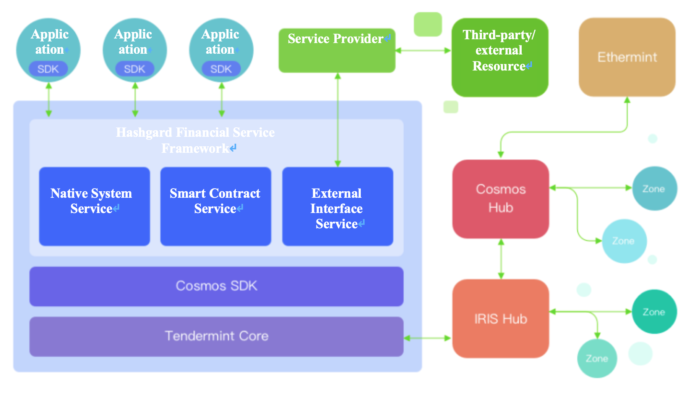
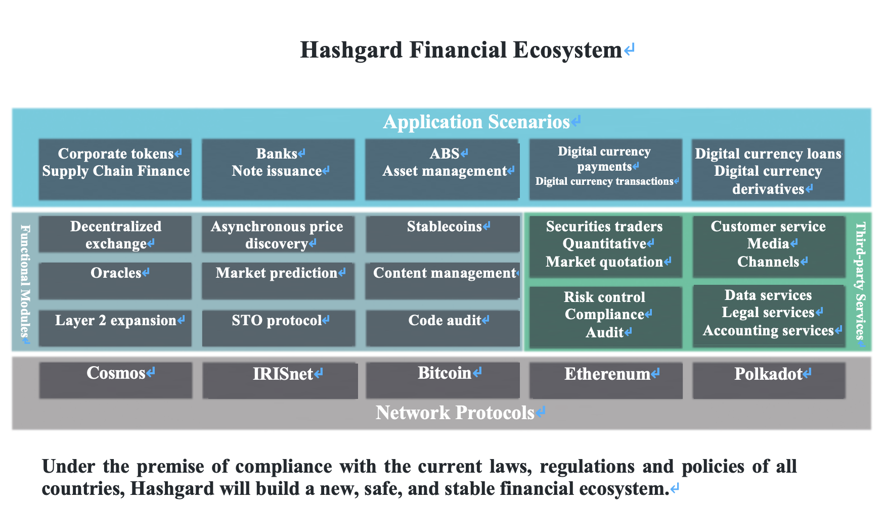

  

# Hashgard Digital Finance Blockchain White Paper

## A Next-Generation Public Digital Finance Blockchain


March 2019, Hashgard Foundation Ltd.


# Chapter I – Blockchain: aA Social Experiment and Financial Revolution

## 1.1 The History of the Technology*

In 1982, the American computer scientist David Chaum first put forward the idea of an untraceable cryptographic online payment system. In 1990, he would develop this idea into the world’s first anonymous cryptographic electronic cash system, known as eCash.

In 1998, the computer engineer Wei Dai published a paper introducing a new system of anonymous and distributed electronic cash, which he named B-money.

In 1998, the same year that Wei Dai's paper was published, Nick Szabo created the architecture for a system called ‘Bit Gold,’ and constructed a system to authenticate property rights. Hal Finney would go on to improve this mechanism and transform it into a reproducible proof of work.

In 2008, Satoshi Nakamoto released *Bitcoin: A Peer to Peer Electronic Cash System* on a cryptography mailing list – the first paper to propose the concept of blockchain. He then used this concept to propose the construction of the Bitcoin blockchain network. Since its establishment in 2009, the Bitcoin blockchain network has maintained operations, and the entire digital currency process has now been fully realized, from token issuance to digital asset circulation. At the same time, the basic underlying technology of blockchain has also been applied to a gradually growing set of scenarios, which has subsequently helped to create various new types of digital currencies.

In 2015, the open-source Ethereum Project was officially released, featuring the concept of the smart contract, inspiring a host of innovators. The Ethereum network provides complete freedom through its Turing-complete scripting language, and allows for consistent registration and transfer of a variety of digital assets and smart contracts, greatly facilitating the issuance and circulation of digital currency, and significantly broadening its usage scenarios.

The rapid development of blockchain technology has gradually raised the public profile of digital currency. This has especially been the case since early 2017, when initial coin offerings (ICOs) became an increasingly prominent and frequent business practice, helping a broad plethora of products to continuously emerge across the industry, bringing a new cycle of prosperity to the digital currency market. At the end of 2017, this surge reached its peak, and observers inside and outside the industry widely opined that blockchain would become the next tech revolution following the mobile internet. During this same period, a large number of leaders in the tech and finance industries began to actively embrace blockchain for use in their companies or projects. 

## 1.2 The Impact of Blockchain on Traditional Finance* 

Technological innovation and development has allowed the format of financial services to evolve. Over the past five decades, electronic financial data has replaced hand-written records, enabling an era of credit cards. The popularity of terminals has marked the ATM era, while the coming of Internet and mobile Internet has introduced electronic banking and mobile payments.

The arrival of blockchain today marks another historical era.

Blockchain, together with technologies as big data, AI, cloud computing, and bio-informatics, will form the financial infrastructure for the next generation. This infrastructure will be able to overcome several longstanding problems in the current financial system, as follows.

1. Financial intermediary fees are high enough to limit transaction scale. Intermediaries not only have large expenses for themselves, but also require high profits to cover potential credit risks. Due to the high cost, when using traditional financial intermediary services, financial institutions often set minimum scales of transactions like deposit amounts, cross-border transfer amounts, and stock fund transaction sizes, frequently blocking small and micro-sized transactions. However, blockchain distributed ledger is a trust machine. It can help financial institutions save on intermediary costs, without requiring a third-party intermediary, making small and micro-sized peer-to-peer transactions possible. 

2. Users may be defrauded. Transactions are frequently not “atomized,” but rather the intermediary assumes the responsibility as a guarantor, which makes it possible for either party to maliciously default and defraud the other party. Since blockchain is a distributed technology, though, a financial system based on it contains no single point of failure, and creates no risk of collapse. 

3. Security vulnerabilities with users’ private data and assets. In recent years, the media have frequently reported upon serious cases of private user data leakage. Massive amounts of personal identities, bank accounts, transaction records, and even passwords have been listed for sale wholesale on various websites, a serious threat to user privacy and asset security. However, in the blockchain network, user data is kept by the users themselves, rather than in the centralized system, realizing true data “democratization,” and effectively protecting privacy and asset security. 

Clearly, as blockchain continues to improve, technologies such as distributed ledger, smart contracts, zero-knowledge proofs, multi-party secure calculation, and homomorphic encryption can effectively handle severe problems in the current financial industry and may create the possibility for new models and products, thus creating a more intelligent, more effective and safer financial ecosystem. 

## 1.3 Blockchain + Financial

At the present phase, extensive integration and pilot projects have been developed in cross-border payments, asset management, central bank digital currencies, trusted identity, internal settlement, and security and asset transactions.

### 1.3.1 Blockchain + Cross-border Payments

Blockchain has the following strengths for transfer: low cost, real-time settlement, friendliness to regulation, and high liquidity. The Ripple cryptocurrency project has launched several cross-border payment schemes for the banking sector, including (1) xCurrent: a real-time settlement solution for financial institutions, realizing quick, convenient and low-cost end-to-end cross-border interbank transfers; (2) XRapid: a real-time settlement solution based on Ripple (XPR), which can save 40%-70% compared to ordinary international remittance schemes; (3) XVia, which provides a standard interface for payment between companies through a real-time gateway settlement channel.

In January 2019, Ripple announced that was serving over 200 cross-border payment providers, such as MUFG, Mizuho Bank, Crédit Agricole, SEB, the international payments platform of American Express, and Banco Santander, with the number increasing by 2-3 per week. With its rapidly growing cross-border payment business, many experts think that Ripple is poised to replace SWIFT to become as cross-border payment giant. 

### 1.3.2 Blockchain + Asset Management

The digital asset management industry is currently in the ascendant. By February 2019, there were 700 cryptocurrency funds, managing US$ 10 billion of assets around the world. On November 1, 2018, the Securities and Futures Commission (SFC) of Hong Kong released a *Statement on Regulatory Framework for Virtual Asset Portfolios Managers, Fund Distributors and Trading Platform Operators*, allowing licensed fund companies to allocate up to 10% of their assets to digital currencies. Fidelity Fund, one of the world's largest fund managers, also established a digital asset custody company in 2018. The company provides solutions for custody of BTC, ETH, and other cryptocurrencies, as well as 24-hour advisory services for cryptocurrency transaction platforms and institutions.

### 1.3.3 Blockchain + Central Bank Digital Currencies

Venezuelan President Nicolás Maduro announced the birth of the Petro in a televised speech on December 3, 2017. Venezuela launched the pre-sale on February 20, 2018, making the country a world leader in state cryptocurrencies. The pre-sale raised 735 million USD on the first day. 

According to the White Paper, the Venezuelan government expected to issue 100 million Petros, worth about 60 billion USD, and it would listed on cryptocurrency exchanges. The government will accept Petros as payment for taxes, fees, donations, and public services. State-owned companies including the petroleum company PDVSA will also participate in Petro sale and purchase. 

Maduro said that the new currency would be supported by Venezuela's oil, gasoline, gold, and diamond reserves. The Petro would help Venezuela “move forward in currency sovereignty” and provide the country with “a new international financing method.”  Through this innovative step, Maduro hoped to lead the country out of its mire of hyperinflation and severe economic crisis, paying off debts and increasing imports of necessities and raw materials. He also hoped to bypass the economic sanctions imposed by the US government, allowing US individuals and Venezuelan enterprises to resume business.

Besides Venezuela, many other countries are accelerating research on central bank digital currencies based on blockchain. For example, the Monetary Authority of Singapore and Deloitte have jointly launched Project Ubin to digitize the Singapore dollar (SGD). The Bank of Canada has also launched CAD-coin, a Jasper-based digital currency project; the People's Bank of China has established the Digital Currency Research Institute, organizing experts to study central bank digital currencies; and the Marshall Islands will issue its own legal tender cryptocurrency, pegged to the US dollar. As the technology continues to develop, we believe that more countries will eventually use blockchain to build their own digital currencies. 

### 1.3.4 Blockchain + Trusted Identity

In early 2018, SecureKey, initially established in Canada, cooperated with IBM to release a nationwide identity and authentication system based on blockchain. The new system applies IBM’s blockchain technology to enable users to prove their identity to the government, banks, and telecommunication operators through mobile phones and Windows devices. Through the app, they can also confirm details such as the their age or credit score when accessing services. Internet consumers will no longer need to sign documents by themselves or provide other identification materials when applying for new apartments or mobile phones. The blockchain authentication system will enable them to control and share their personal information without using a centralized system to create “value” information, with its security vulnerabilities. It is reported that Toronto-Dominion Bank, the Royal Bank of Canada, and other large financial institutions have invested CAD 30 million (about US$ 23.5 million) in the program. 

### 1.3.5 Blockchain + Corporate Tokens

In February 2019, J.P. Morgan Chase & Co., the largest US commercial bank, announced a plan to issue its own digital currency, JPMCoin, on its private chain platform Quorum. JPMCoin is pegged 1:1 to the US dollar, and the company will use its strong capital reserve to ensure the stability of its token. JPMCoin is designed for inter-enterprise capital flow, and its early applications mainly involve cross-border payment, securities trading, and US dollar substitution for large enterprise customers. However, few institutional customers participated in the test. Meanwhile, the internet giant Facebook is also quietly moving into cryptocurrency. 

### 1.3.6 Blockchain + Asset Transaction

In December 2018, Bakkt, a digital asset trading platform founded by the Intercontinental Exchange (ICE), the parent company of the New York Stock Exchange (NYSE), announced the completion of its first round of funding, raising US$ 183 million from 12 partners and investors.

Bakkt is using ICE's trading infrastructure to provide new infrastructure – including the industry's first institutional-level regulated trading platform and clearance and savings services for physical delivery and storage – in the hope that Bitcoin futures trading becomes more widely accepted.

Both the Chicago Board Options Exchange and Chicago Mercantile Exchange trade Bitcoin futures without delivering the actual currency, making settlements in cash based on changes in Bitcoin prices. This makes them an instrument for betting on future currency prices. Bakkt takes physical delivery and trades without margin.

Bakkt is building an open, seamless global network, enabling users to purchase, sell, store and use digital assets simply, securely, and efficiently. Bakkt also hopes to use Bitcoin to simplify and disrupt the retail payment industry, allowing consumers to switch from swiping credit cards to scanning Bitcoin apps. The market space is massive: consumers worldwide pay up to US$ 25 trillion a year in credit card and online shopping fees.

*Fortune* Magazine also said that “ICE's foray into cryptocurrency trading is a big deal. It is a well-established, respected and extremely powerful institutional player in the financial industry.”

### 1.3.7 Blockchain + Security Tokens

There is no clear definition of security tokens, but according to general understanding in the industry, it can be simply defined as asset tokenization in accordance with regulations. The definition includes two main parts.

1.  Token issuance and trading should comply with government regulations 

2.  Any kind of asset (tangible or intangible) may be transferred on the blockchain in the form of tokens.

Regulation is the focus of security tokens. For example, in the United States, issuance is subject to regulation by the SEC and other relevant bodies. Their subjects are also constrained by federal law. In general, security tokens must be registered with the SEC (except for exemptions which meet certain terms, such as Reg A+, Reg D, and Reg S, etc.) and observe all rules of securities laws. Regulation will push up issuance and transaction cost, and increase the threshold for participation in such tokens.

Although regulation has increased cost of issuance, the advantages of security tokens are clear:

1.  Lower investment and trading thresholds. For example, a valuable office building can theoretically be split into infinite units using security tokens, greatly reducing the investment threshold and allowing anyone to participate.

2.  Higher asset liquidity. For example, in a private fund with a closed period of 10 years, investors can only recover their investment after 10 years. But if the fund is tokenized, the investors can buy and sell fund shares at any time, improving asset circulation.

3.  Lower issuance costs: issuance fees and time costs of traditional IPOs are extremely high, accounting for 4-7% of the fundraising amount. With STOs, the cost will be greatly reduced.

4.  Reduced regulatory friction costs: the costs and difficulty of regulation are reduced through programmatic sequencing, breaking down the barriers between regulators and between countries, making cross-border asset trading more convenient.

5.  Increased market efficiency: because the token can be sold and traded worldwide (as allowed by regulation), asset pricing becomes more equitable, and price discovery becomes more efficient, making the token more attractive to investors.

6.  More financing channels for SMEs: more than 650,000 companies are created each year in the US alone, but Wall Street, Silicon Valley and angel investors do not provide sufficient capital for startups. Therefore, regulated and satisfactory security tokens issuance, or Security Token Offerings (STOs), can help SMEs find new financing channels.


# Chapter II – Hashgard’s Background and Design Objectives

## 2.1 Background

Hashgard project was officially launched in March 2018, but its genesis can be traced back to exploration and research by its main team members on blockchain technology in 2013. This took forms including technical research on blockchain network architecture and open source code, development and verification of smart contracts based on Ethereum, early conception and incubation of several excellent blockchain projects, and establishment and management of blockchain digital token funds.

Through long-term study, the Hashgard team eventually discovered that existing public blockchains cannot satisfy use cases in the financial industry. The reasons include the following:

1.  The performance of most public blockchains is far from meeting the concurrency requirements of the financial system. For example, Bitcoin can only process seven transactions per second, and Ethereum can only do a few dozen.

2. The user learning curve for most public blockchains is high, and user-friendliness needs to be improved. For example, Ethereum's smart contracts must be written in Solidity, and the smart contracts of EOS need to be written in C/C++. These languages are difficult for most users to learn and master.

3.  Most public blockchains lack cross-chain capability and flexible extension mechanisms, interact poorly with other public blockchain tokens, and are unable to support component-based functional modules.

4.  Most public blockchains are too free, and not subject to regulation. However, the financial industry itself is strongly regulated, so large-scale commercialization will need to consider regulator and regulatory observer nodes.

## 2.2 Design Objectives

The Hashgard team is building a blockchain network better adapted for the financial industry, promoting the production and development of distributed financial products and commercial applications. We believe that the future financial blockchain should have the following characteristics:

1.  Capacity to trade at scale

2.  Support for corporate token issuance

3.  Flexibility for future expansion

4.  Support for cross-chain interaction 

5.  Compliance with financial regulations

## 2.3 Use Cases

Hashgard is designed to support both traditional finance and tokens.

### 2.3.1 Traditional Finance Applications

#### 2.3.1.1 Rights Authentication and Financial Asset Tokenization

Hashgard allows financial assets including stock equity, creditor's rights, and income rights, etc., to be registered, traded, and settled, etc. directly on the chain. Regulated, non-blockchain institutions will take settlement and delivery based on blockchain records, which will greatly enhance asset liquidity.

#### 2.3.1.2 Issuance of Bonds and Bills*

The bottom layer of Hashgard supports a forward payment protocol, making it easy to convert tokens into forward contracts, and realize automatic delivery based on the bottom-layer protocol, which naturally supports issuance of multiple bonds and bill types on the chain.

#### 2.3.1.3 Supply Chain Finance

Through tokenization of commercial paper and bank acceptance bills, Hashgard technically supports features for applications such as multi-agent supply chain finance cooperation, multi-level credit transfers, asset digitization, and process intelligence.

#### 2.3.1.4 Financial Derivative Issuance

Hashgard supports tokenization and issuance of financial derivatives including forwards, futures, options, and swap contracts based on both traditional and digital financial assets.

### 2.3.2 Token Applications

#### 2.3.2.1 Corporate Token Issuance

Businesses can issue tokens through Hashgard, which can be taken as: (1) points in their ecosystem, to support both internal and external operations; (2) equity tokens, to guarantee dividends; (3) bond tokens, guaranteeing repayment of the principal and interest after maturity.

#### 2.3.2.2 Batch Release

In most cases, corporate tokens are released in batches to be purchased by investors gradually. For example, ABCCoin tokens may be issued in ten batches, with 10% released per month. Taking the ERC20 Token of Ethereum as an example, the issuer usually adopts two methods:
1. Transfer in manual installments. The drawback of this method is that the purchaser may not receive the tokens on schedule because it relies on centralized transfer, so there is a risk of default. 
2. The issuer employs smart contracts, adding the recipient’s address to be the contract so that the subsequent tokens are released in batches on schedule, avoiding possible default due to centralization. In the meantime, the investors can only await delivery of the tokens, rather than circulating the tokens they hold in advance.

The token issuance and forward payment protocols based on Hashgard can fully solve these drawbacks. The issuer produces ABCCoin tokens through the token issuance protocol, then creates multiple forward token batches through the forward payment protocol for transaction with purchasers. Forward tokens can be separated and circulated before maturity, and will be automatically converted into spot tokens upon maturity, which not only prevents the risk of default, but also increases liquidity.

#### 2.3.2.3 Locking Plans

Token issuers usually make use of position locking to reduce liquidity, encouraging users to hold tokens and stimulate market prices. Most tokens currently use centralized exchanges or wallets to lock positions. The issuer cooperates with a third-party centralized platform, and users lock their own tokens in platform accounts to obtain locking rewards upon maturity. Due to the risk of default or theft on the third-party platform, this method is insecure for both for the issuers and users. 

The Hashgard deposit and forward payment protocols will improve the decentralized position locking experience.The issuer creates a timed deposit box, sets the locking rules, and adds a locking reward. The holder puts their own tokens into the box according to the requirements, and obtains a corresponding certificate. After expiration, the user receives the corresponding principal back and the reward, realizing decentralized position locking.

#### 2.3.2.4 Pegged Stablecoins

Most stablecoins are currently based on Bitcoin extension information or the ERC20 Ethereum protocol, providing equivalent exchange between the token and its fiat peg through off-chain institutions; i.e. USDT is issued by Tether, and PAX by PAXO. Stablecoins greatly facilitate on-chain pricing and payment for assets, and provide users with good trading experience, but the following problems still exist: 
1. Because they are based on Bitcoin or Ethereum, besides the coin itself, the user must also hold BTC or ETH to pay transaction costs on the network, which most ordinary users find confusing and inconvenient; 
2. Unlike with bank deposits, users holding stablecoins in their wallets do not earn interest. This is because the processing capacity of the blockchain network is limited, and the stablecoin issuers are not able to pay daily dividends; 
3. Stablecoins held by users can only pay within one network, and they can't be used across chains. For example, users holding USDT (based on Bitcoin) are unable to purchase goods or services priced by the ERC20 version of USDT in Ethereum. In view of these weaknesses.

Hashgard provides a better way to issue stablecoins: 
1. Fees payment is very flexible, and more currencies can be added as optional commission types through online proposals and voting. Even stablecoin users who do not hold the main Hashgard currency can also use their stablecoin to pay transaction fees and carry out normal business; 
2. Hashgard provides a native reward distribution protocol, allowing stablecoin issuers to pay dividends and interest to holders by means of "one-time dividends and asynchronous withdrawal," improving user experience without increasing network load; 
3. Hashgard natively supports cross-chain usage, so users can pay the coin directly on other networks.

#### 2.3.2.5 Decentralized Exchanges

Hashgard provides a native atomic swap protocol, through which sellers can list their token assets at the specified price on the chain, and buyers can submit orders at the corresponding price. Once the two parties’ demands match successfully, the exchange of the token assets between the seller and the buyer is completed on the chain. 

Based on the atomic swap protocol, developers can easily develop more user-friendly decentralized exchanges, which will reduce fees by putting user orders on a centralized system. The exchange operators match the purchase and sale orders, and the delivery process is realized through the atomic swap protocol to ensure transaction authenticity and transparency.

#### 2.3.2.6 Decentralized Funds

Hashgard supports the creation of decentralized digital asset investment funds. Fund managers will issue tokens as certificates for fund shares, and assets held by the funds can be traded through atomic swaps on the chain. The Hashgard ecosystem can also provide the decentralized funds with a series of off-chain management tools based on the hService protocol such as net value calculation, accounting, transaction settlement, performance calculation, and management fee and carry provisioning. Based on Hashgard, fund managers can establish and manage funds at very low cost, while meanwhile decreasing counterparty credit risk. The funds can be either open and closed, and active or passive.


# Chapter III Overview of Hashgard

## 3.1 Technical Foundation


Hashgard is developed on Cosmos-SDK, an open source framework written in Golang. Tendermint is used in its network and consensus layers. It is designed to make it easy for developers to create customized and interoperable blockchain applications on the Cosmos network. Cosmos SDK emphasizes both security and flexibility, making extensively use of the “Object-Capability Model” and “Principle of Least Privilege.” Cosmos SDK has two management rules, as follows.

1.   Object A can only send messages to object B when object A is associated with object B.

2.  If object A receives a message related to object C, object A becomes associated with object C.

As a result of the two rules, only through an existing association chain can one object become associated with another. In short, "only connectivity can produce connectivity."

The Cosmos network consists of different independent and parallel blockchains, each of which runs through a classical Byzantine fault-tolerant consensus such as Tendermint. Blockchains on Cosmos are called “zones,” some of which are also called “hubs.” Different zones can communicate with each other through their shared hubs.

Cosmos Hub is the first hub in the Cosmos network, and is mainly used for cross-link access (such as money transfers and service calls, etc.). If a blockchain is connected to the hub through the IBC Protocol, it automatically gains access to other chains also connected to the hub. All cross-zone token transfers must pass through Cosmos Hub, so the tokens can be transferred between among zones safely and quickly. No direct exchange capability is required between zones; rather the total number of tokens held in each zone is tracked and recorded through Cosmos Hub to ensure that the total number of tokens held by all zones remains constant. Cosmos Hub fulfills a function akin to central bank settlement.

IRIS Hub is another hub in the Cosmos Network. IRIS has new semantics allowing cross-chain computing resource calls, and also integrating the distributed file system IPFS, which is particularly important for commercial applications.

Ethermint provides the EVM module, allowing users to run smart contracts on Tendermint pBFT consensus.

### 3.1.1 Network Architecture



As shown in the diagram, Hashgard has a similar architecture to Cosmos and IRIS. It is a blockchain zone for the financial industry, based on Cosmos. On the basis of the Cosmos SDK, Hashgard has developed a completely new finance serving framework through which traditional institutions can quickly migrate their business to the blockchain world for rapid development and deployment, creating new business application scenarios without the need to deeply understand the underlying technology. Companies with high security and reliability requirements can also directly use Hashgard and its issuance packages to build and deploy their own independent chains to run their own applications.

The Hashgard Financial Service Framework includes three types of services.

1.   Native system services refer to services built within Hashgard and provided by the underlying blockchain code. These include money transfer, multiple signature, deposit, pledge, proxy voting, and token issuance atomic swap protocols.

2.   Smart contract services refers to services deployed on Hashgard through smart contracts, such as security token and asynchronous price discovery protocols. Hashgard will provide subsequent smart contract services by integrating multiple virtual machines.

3.   External interface services refer to services provided externally through the hService protocol. Service providers interact with users through input/output messages such as real-time financial data provided by data services, or report audit services provided for corporate users by auditors.

### 3.1.2 Consensus Mechanism

Like other networks in Cosmos, Hashgard uses Tendermint as its consensus layer. After Castro and Liskov introduced the Practical Byzantine Fault Tolerance (pBFT) algorithm in 1999, Tendermint, created by Jae Know, was the first PoS adaptation.

Tendermint pseudo-randomly arranges a verification node to propose blocks during multiple rounds of voting. However, the submission and finalization of the block depend on signatures by verification nodes possessing more than two-thirds of the equity held by all verification nodes in the submitted block. Several rounds of signature may be required before the block is finalized. The BFT system can tolerate failure of one third of the nodes, including both breakdowns and malicious attacks.

Tendermint includes two main technologies: a blockchain consensus engine and general application interface. The consensus engine is called the Tendermint core module, and ensures that the same transactions are recorded in the same order on each machine. The Application BlockChain Interface (ABCI) allows transactions to be processed by programs written in any language.

The Tendermint core module uses a revolving voting mechanism, which is also the principle of consensus protocol. A round is divided into three steps: the verification node proposes a block, sends and submits the precommit, and finally commits the new block after signing. This mechanism provides a secure status replicator for atomic broadcasting, adding a layer of responsibility –  Tendermint is able to guarantee the security.

The Tendermint consensus algorithm begins with the set of verification nodes. The nodes retain a full copy of the blockchain and can identify the verification nodes using a public key. They take turns to propose blocks at each new height. In each round of voting, only one verification node can propose a block and sign it with their corresponding private key. Thus, if an error occurs, the responsible node can be found, while the remaining nodes then must vote on the proposal and sign with their own private keys, to complete the round. However, because the network is asynchronous, it may take several rounds to submit a new block.


Verification nodes may fail while submitting blocks for several reasons: the current proposal may be offline, or the network may experience delays. Tendermint allows verification nodes to be skipped (i.e. when it is time for the node to propose, but it does not do so). The verification node waits for a short period before moving on to the next round of voting to receive the entire block proposed by the proposer (the verification node proposing the block in this round). The dependence on overtime makes Tendermint a weak synchronization protocol rather than an asynchronous protocol. However, the remaining protocols are asynchronous, and the verification nodes process items only after receiving messages from more than 2/3 of the verification nodes. Thus, Tendermint requires most of the verification nodes to be 100% functional. If one or more nodes go offline, the network stops operating.

Assuming that less than 1/3 of the verification nodes are Byzantine, Tendermint guarantees that security will never be compromised. Specifically, more than two thirds of the verification nodes never commit conflicting blocks at the same height. As a result, Temdermint-based blockchains never fork.

### 3.1.3 Cross-chain Interaction

Cross-chain interaction is an important function we expect to realize on Hashgard, making possible seamless transfer and use of fungible and non-fungible tokens between different chains. Hashgard plans to use the Inter Blockchain Communication (IBC) protocol of Cosmos to realize cross-chain interaction between main chains, but it is important to note that it can only be used when both chains have finality. Bitcoin however does guarantee finality, and Ethereum will not guarantee it until it evolves to Casper.

## 3.2 Native System Services

### 3.2.1 Transfer

In the Hashgard network, users can sign randomly hashed digital signatures by transferring a number of tokens to another user to prove that the behavior is initiated by themselves, completing the payment. The signature verifies that the transfer was initiated by the user themselves. If the result is verified, it is added to the chain, leaving an immutable record.

### 3.2.2 Multi-signature

More than two users may authenticate a message body together through digital signature, called multi-signature. In another words, multi-signature is achieved through combination of single signatures. Hashgard includes a native multi-signature account type consisting of several ordinary accounts, to decentralize risks and improve security. This mechanism allows the signature weight of the ordinary accounts and the multi-signature operation threshold to be configured. 

### 3.2.3 Recording

Storing data on blockchain is costly, and the technical characteristics of blockchain ensure that the volume of data anchored in the chain cannot be too large. Therefore, recording organizations do not record all of the data on the chain, but rather digest it to obtain digital fingerprints. The hash values are calculated using the Merkle Tree algorithm to reduce data volume. Finally, the hash is written into the chain, which is equivalent to storing data in an immutable transaction, completing the recording process. This process, which we call anchoring, actually anchors the chain of traces of the records to the blockchain. Blockchain-based records make effective use of the computing power of the blockchain network to enhance credibility, making electronic data verifiable, traceable, and reliable.

### 3.2.4 Desposits

Hashgard allows users who are unable to build verification nodes to delegate their tokens to active verification nodes to share their block generation rewards and participate in community governance.

For redemption, tokens must be locked for a period of time before they can be released and circulated freely. If the principal finds hidden dangers affecting asset security, such as instability of an active verification node, they can immediately transfer the token to other active nodes.

### 3.2.5 Proposals and Voting

Hashgard operates through a distributed organization, which requires a complete set of management mechanisms to coordinate various activities on the chain. Hasgard supports three types of proposals: text, parameter changes, and software upgrades. The proposal and voting process is as follows.

1.  Proposal submission

2.   Pledged token deposit (voting starts after the pledges reach a sufficient amount)

3.  Voting

All active verification nodes are responsible for voting on the proposal. If a node fails to vote immediately, it automatically lose its active rights for a period of time (called the absenteeism penalty period, which is usually a week).

The principal automatically inherits the voting rights of the delegated active verification nodes. If it disagrees with the delegated node, it can vote separately to cover the weight of the voted representative. Tokens not linked to the delegated verification nodes have no voting weight.

Any user can initiate proposals, each of which requires a certain number of GARD tokens as a deposit (the minimum proposal deposit) to prevent malicious users from launching spam proposals to attack the network.

Users can vote in four ways: “agree,” “oppose,” “abstain,” and “strongly object.” When counting votes, only the votes of active verification nodes and the users they represent are calculated. If the voting rate were lower than the minimum percentage, the result is "failure," and the system punishes the non-voting nodes. If more than one-third of the votes are "agree," the result is "success," but if more than one-third of the votes are "strong objection," it fails.

### 3.2.6 Fungible Token Issuance Protocol (HRC10)

Hashgard supports the issuance of fungible utility tokens with similar functions to the well-known ERC20 tokens of Ethereum, but with following characteristics.

1. Token issuance is supported from the bottom level of the blockchain, rather than using smart contracts. Users don't require knowledge of Solidity or any other programming language. They only need to call the standard system interface to easily deploy tokens. From the perspective of the many security vulnerabilities in Ethereum smart contracts, we realize that user-customized smart contracts will produce high security risks. To reduce risks, user programming should be minimized for standard functional components.

2. The creator of a token is called its owner. This user has ownership of the token and can modify and configure its optional parameters.

### 3.2.7 Atomic Swap Protocol (HRC11)

An atomic swap protocol allows exchange of two or more cryptocurrencies on a point-to-point basis without requiring either party to trust the other, or mediation through a trusted third party.

Before the advent of the atomic swap protocol, major centralized trading protocols (such as exchanges and financial service institutions) had weaknesses inherent in the information-based trading model:

1.   Most of the costs were passed on to users

2.  Exchanges acted as a single point of system failure 

The model also required each party to rely on institutions to facilitate transactions and reverse them in the event of a dispute. Due to the lack of transaction finality, the transaction parties inherited the costs of mediation.

In Hashgard, using atomic swaps protocol provided by the low-level system, any user can initiate a transaction without trusting or even knowing the other party and exchange one of his own tokens for one of the other party's. The transaction either succeeds or fails. No loss is ever caused by only one side paying.

The atomic swap protocol allows two or more participants to exchange cryptocurrencies on an equal footing without extending trust to third-party arbitrator. Programmatic hosting minimizes the need for, and cost of trusted third parties. Through atomic swaps, users and their counterparties can avoid unnecessary fees and minimize counterparty, settlement, and hosting risks.

The atomic swap protocol shows that the following points can be achieved through disintermediation and the digital currency revolution.

1.  Users can own and deploy their own financial service programs (with no trusted third party required)

2.  Users have complete control over assets through the whole transaction process (i.e. decentralization)

3.  Stronger P2P liquidity of tokens in the blockchain network (reducing transaction costs)

### 2.8 Deposit and Forward Payment Protocol (HRC12)

　　

In Hashgard, users (called box owners) can create "deposit boxes," acting functionally like a time deposit service in banks. Other users (called box "investors") can add tokens of a specified type and limited number into the box to obtain certificates, using which the investors can receive the principal back with corresponding interest upon deposit maturity.

For example, box owner A creates Box 1, specifying token type ABC. The maximum quantity is 10,000, the daily interest rate is 0.1%, and the deposit term is 10 days. Therefore, after creating Box 1, owner A needs to deposit 10,000  0.1%  10 = 100 ABC to activate the box. After investor B deposits 500 ABCs into Box 1, they are given a voucher (called ABC-1); upon its maturity, the system automatically converts the voucher in investor B's account into 505 ABC (500 ABC principal plus 5 ABC interest).

FutureBox is a special native deposit box. It can be regarded as a deposit box free from interest, restriction on token type and quantity, expiry date, and destruction. After the user deposits his own tokens ("spot tokens") into FutureBox and specifies the expiry date, they get a splittable and transferable voucher (a "forward token"). After expiration, the system automatically converts the forward token into a spot token at 1:1 rate. Forward token can be used in applications such as bonds, checks, and futures.

If the user chooses to convert the token into an "unsplittable and non-transferable" forward token when depositing the spot token to FutureBox, the mechanism becomes essentially equivalent to position locking service.

### 3.2.9 Dividend Allocation Protocol (HRC13)

The Hashgard system provides a native BonusBox with a dividend allocation function, allowing for snapshots at a certain block height, allocating dividends to users holding certain token types.


This function can be used for:

1. Airdropping new currencies to users
2. Allocating dividends in the same currency
3. Company dividends to shareholders
4. Interest on demand deposits, as with Yu'ebao

For example, supposing the total circulation of ABC token is 100 million, the issuer of DEF (known as the distributor) wishes to provide an airdrop to all users holding ABC tokens at a ratio of 100:1 on December 1, 00:00 a.m. The distributor must put 1 million DEF into the box and configure the airdrop before that time. On December 1, the system automatically records each user's ABC holdings, and the corresponding DEF token amount becomes available through a prompt in the user’s “my wallet.” Users can click on the "get" button to receive the airdrop.

### 3.3.10 Alias Service Protocol (HRC14)

Blockchain wallet addresses are composed of random letters and numbers, making them difficult to understand. In order to facilitate migration of traditional financial enterprise users to Hashgard, we have a native alias service protocol to simplify payment and generate more application scenarios.

A Hashgard account alias is a series of letters and numbers from 8 to 20 characters, for example "charelie1234" or "taalic5566". Aliases with less than 8 characters are reserved for future expansion.

Any user can pay to the system to buy a favorite account alias and point it to another address, or also transfer the alias to another user. Once the alias is configured, the user can use it to make payments in the system. For example, after a user points the alias "taalic5566" to the address gardABCDEFGHIJKLMNOPQRSK, subsequent payments by any other user can be released to the user's address in the main network just through "taalic5566".

## 3.3 External Interface Services

In the future, Hashgard will implement the hService interface, through which external service providers can serve Hashgard users. The protocol itself does not limit the services to a decentralized implementation, as long as the provider listens and processes the incoming request message and sends the result back to Hashgard. Providers can also set their own prices.

In the future, the Hashgard Foundation will maintain a set of profiles for all external hService service providers, through which users can select the ones they consider appropriate.

External providers must use the Hashgard token GARD as the unit of their pricing.

## 3.4 Smart Contract Services

In the future, Hashgard will provide users with smart contract-based services through integrated virtual machines. Developers preferring to use smart contracts can provide services to users in this way.

## 3.5 Economic Model

###  3.5.1 Basic Idea

We believe that in the distributed business world of the future, tokens will represent the right to use capital or resources, rather than ownership. The difference between the two is something we have deeply considered.

In the single token model with constant quantity, the economic utility of the token is represented by both pledging and trading. As more scenarios focus on the token, it becomes more liquid, but at the same time, people have less incentive to deposit their tokens. The greatest problem is that this liquidity weakens the security of the network, allowing potential attackers to pool the necessary number of tokens needed to attack a proof of equity system.

For example, suppose a user holds 5% of the total circulating token supply, and less than 15% of the total circulation is pledged. The user can then launch a 33% attack (the Byzantine fault tolerance limit) on the network on their own. This scenario is not impossible, because under the single-token model, the utility of tokens in circulation is broader than that of pledged collateral. Through unintentional user action, the single token model in essence amplifies the security risk of the entire network.

In contrast to that model, if the main PoS/DPoS network is divided into tokens specialized in certain functions, it becomes separate from the functional range represented by different tokens. Equity tokens are used as collateral, while functional tokens are used for transaction, both of which are organically combined through the ecosystem. This setup theoretically reduces the potential for attacks on the entire network, and the price of equity tokens rises due to the reduced liquidity of the equity token, making it more expensive for users to launch a 33% attack.

In addition, capital and physical resources differ fundamentally in a variety of ways.

First, capital is non-consumable, while resources are consumable. For example, if user A transfers RMB 100 to user B in cash or over the Internet, the total amount of capital does not decrease. If the money is transferred over the Internet, though, server and network bandwidth are consumed, although the amount is very small. Capital, meanwhile, is not reduced unless people actively destroy it (similar to writing off a share), but people “consume” physical resources all the time.

Secondly, adding capital costs little or nothing for the issuer. For example, the central bank prints money to increase currency, or a company may issue new shares. But an increase in physical resources requires real efforts. For instance, new optical fiber is needed if bandwidth is insufficient, or new servers are required if a CPU is full. Supply may increase by the same amount, but the cost is completely different.

Third, pricing of capital is extremely subjective, and strongly influenced by market sentiment. For example, although share price volatility is anchored by distributable profits, it is still volatile, and even rises sharply without logic. For example, when Trump was elected as President of the US, a stock called "Chuanda Zhisheng" (which sounds like “Trump won”) surged; when the hit TV series “Ode to Joy” was playing, stocks of "Red Star Development," whose name is similar to the company Tan bought on the show, hit the upper limit for three consecutive days. This is especially true for most cryptocurrencies, which are not backed by real assets. For the most part, the pricing of physical resources is objective, because users are buying it for use (and price fluctuations are still subject to supply and demand).

Fourth, we expect the main use of capital to be for holding it, reducing circulation to add value; but consumption is more for usage.

For the above reasons, we believe that the future trend for public blockchains using PoS/DPoS will be to separate the equity utility tokens representing capital, and the functional tokens representing physical resources, to finally realize a "multi-token system."

### 3.5.2 Design Objectives

The core utility of equity tokens is protecting the security of consensus on the main network blockchain, rather than paying fees. Therefore, equity tokens should be characterized by relatively low circulation speed and liquidity. They can also be treated as part of the virtual hardware in Proof of Work, as with ASIC (dedicated computing) devices. The reason entities obtain them is to participate in network maintenance. Verification nodes should be strongly incentivized to use their equity tokens for long-term pledges as margin. They are rewarded for providing consensus and improving security across the network.

Gas tokens are secondary functional tokens whose core utility is for trading. Therefore, they should have stronger liquidity and higher circulation speed.

Through research, we have set this design principle as one way to achieve a well-designed, secure Proof of Stake network.

We expect the Hashgard economic model to achieve the following:

1.  Corresponding accounting revenue for the verification nodes which maintain the stability of the network

2.  Relatively stable and estimable development and operation costs for large-scale network applications

3.  Zero or little network cost for active users, and also to stimulate the interest of "lurkers"

4.  Continuous rewards for open source code contributors and service developers of the public blockchain

In addition, the cost of blockchain usage is often directly linked to the value of the tokens and transaction activity on the chain. The value of a token usually increases with increased usage of the blockchain network, and usage cost of the blockchain network increases significantly when traffic surges, which also is not counting the effect of secondary market transactions on usage cost. Uncontrollable operating costs are unacceptable in any business model.

Therefore, to better meet the use needs of project parties and ordinary users, the economic model we have designed aims for usage/transaction costs to be directly affected as little as possible by price/activity fluctuations.

In the initial launch of the main Hashgard network, the predictable network transaction density will not be high, and transaction fees will not increase temporarily. At the same time, in the initial stage, GARD equity tokens held by the Hashgard Foundation will be entrusted to reliable verification nodes, providing consensus and greater security for the entire network, preventing a 33% attack.

At this time, we believe that the dual currency model still needs more thorough discussion and scenario verification. Hashgard will initially adopt a single token model, ensuring a more stable network and reducing a potential large future sunk costs. Subsequently, when a consensus is reached on community governance, a gas token will be added to the main network, gradually turning it into a more effective multi-token system.

The following discussion is based on the single token economic model.

### 3.5.3 Token Types

Hashgard tokens include system-level and application-level tokens. GARD is a system-level one corresponding to the blockchain operations such as the use of system rights, public network resources, public computing resources, and public reserve resources to transfer accounts, issue corporate tokens, and build applications. Application-level tokens are independently created by developers and may be used in associated DApps.

Application developers can decide for themselves use which tokens for payment.     

### 3.5.4 GARD System-level Tokens

GARD is a system-level token, serving as a medium for value transfer and representing usage rights for the entire system to achieve rapid value circulation within the ecosystem. Its five purposes are:  

1.  Deposits for applications to become verification nodes or hService service providers

2.   Governance through proxy voting

3.   Fees to the system or applications

4.  Block generation rewards for active verification nodes 

5.   Ecosystem construction

100 billion GARD tokens will be issued initially, and distributed as follows:


| *Ratio* | *Amount*  | *Purpose*                                                  | *Release Plan*                                             |
| --------- | ----------- | ------------------------------------------------------------ | ------------------------------------------------------------ |
| 6.5%  | 6.5 billion | Early incubators                                             | Released after a year of listing on the exchange             |
| 30%   | 30 billion  | Strategic cooperation partners and investment organizations  | 50% released when listed on the exchange, and the rest six months later |
| 10%   | 10 billion  | Start-up team                                                | Released starting half a year after main network launch, and unlocked over   24 months |
| 3.5%  | 3.5 billion | Held by the Foundation for scientific research and academic activities   as well as remuneration for expert advisers. | Released as needed                                           |
| 10%   | 10 billion  | IP output team                                               | Released a year after listing on the exchange                |

> Note: The latest turnover of GARD is displayed on official announcements 

## 3.6 Consensus and Governance Structures

From the perspective of the open source spirit, Hashgard is not owned by its early development team, nor, following formal source opening and main network launch, will the team and the Foundation be the only people developing and maintaining the network. As a part of the main network launch, the early team and Foundation will propose governing structures and decision-making processes aimed at supporting the continuous development of the ecosystem.  

Although decentralization is the core idea of blockchain, it responds slowly when making material decisions for public blockchains, and the discourse tends to be controlled by nodes. (This problem is more significant in the PoS model). For the moment, even with blockchain, it is overly idealistic to aim for complete decentralization.     

The crux of Hashgard governance architecture design is to find a balance on decentralization. The governance architecture is able to make proper adjustments according to the actual situation at different ecosystem development stages. Governance architecture is a clearly defined mechanism to coordinate any changes to the blockchain such as system parameters, software updates, and constitutional amendments.

### 3.6.1 Stakeholders

Stakeholders refers to holders of GARD equity tokens, part of whom play specific roles such as active verification nodes and candidate nodes. Stakeholders can be persons with legal identity or anonymous individuals, companies, governmental organizations, non-profit entities, or other organizations. The voting mechanism design ensures full coverage of all stakeholders in the ecosystem.  

### 3.6.2 Verification Nodes

In the classic practical Byzantine fault-tolerant algorithm (pBFT), each node shares the same weight. Hashgard verification nodes are related to the voting rights they hold. Nodes holding considerable voting rights are called *active verification nodes, which take turns to submit new blocks and sign their names. Nodes which only synchronize blocks, without generating them, are called *candidate nodes. *Election of verification nodes is dynamic. Only when the candidate nodes’ pledged equity ranks among the top of the number of active nodes allowed by the current network, do they become verification nodes. *Active verification nodes can create blocks, receive awards, and vote on proposals on behalf of principals. *Note that any users can initiate a proposal, as long as their token deposits reach the activation threshold. However, only ballots coming from active verification nodes and their principals are counted*.  

Holders of GARD equity tokens are able to become verification nodes by signing and submitting a self-binding transaction. They must set *their commission ratio, maximum ratio, maximum daily commission variation, and *minimum quantity of self-deposit* (showing their ability to take risks. All pledged equity is released if the number of self-pledged modes falls below the set number). The maximum number of active verification nodes is set during network initialization, before being modified through proposals and governance. Anyone may apply to become a verification node, whose total equity is equal to the sum of the self-pledged and commissioned equity. Only when the total equity ranks among the top ofthe maximum active number current allowed by the network, can the candidate nodes become verification nodes, to take part in block generation and governance. If a node’s rank is no longer in the active verification node queue, it is no longer be allowed to generate blocks. Principals can manually transfer their entrusted equity to other active verification nodes.   

Nodes elected as active verification nodes can propose subsequent blocks and are called *proposers*. Each is elected by clear means, at a frequency related to their total equity ratio (total equity = self-pledged equity + principals’ equity). For instance, if the active verification nodes have total pledged equity of 10 billion GARD, and the total equity of one of them is 1 billion GARD, there is then a 10% chance that it will be selected as the next proposer.        

Hashgard verification nodes bear the following costs.

1.  Hardware costs (Internet-connected servers, backup servers, hardware security modules for signatures, and firewalls that operate on top of applications)

2.  Operating costs (to be entrusted by more principals)

3.  Asset holding costs (self-pledged GARD)

|                                    | *Active verification nodes* | *Candidate nodes/Full nodes* |
| ---------------------------------- | ----------------------------- | ------------------------------ |
| Maximum number                     | 21                            | /                              |
| Synchronization of complete blocks | Yes                           | Yes                            |
| Block generation                   | Yes                           | No                             |
| Proposal votes counted             | Yes                           | No                             |
| Penalty for reduction              | Yes                           | No                             |

### 3.6.3 Principals

Principals are GARD holders who lack the ability or desire to perform node verification operations. They participate in governance functions such as voting through delegation to active verification nodes, and get block generation rewards. Their corresponding active verification nodes exercise voting rights on their behalf. A non-entrusted token has no voting rights. 

### 3.6.4 Commissions

Earnings received by the equity pool of an active verification node are split between the node itself and the principals. The former can reward itself with a set percentage of the proceeds they receive from their principals as commission. Each verification node can freely set its initial commission, maximum daily change rate, and maximum commission. Hashgard forces each verification node to explicitly set these parameters, which can only be set when the campaign is announced, and these parameters can only be further restricted after the announcement.     

### 3.6.5 Block Generation Rewards

Hashgard block generation rewards are granted in proportional to the total equity of active verification nodes, which means that each will still maintain the same weight even if every active verification node is rewarded upon block generation. *In the initial stages, block generation rewards will be donated by Foundation. In the subsequent stages, whether or not additional GARD are used to reward active verification nodes will depend on community proposals.

For example: Suppose that the block generation reward at a certain height is 30,500 GARD, and there are three active verification nodes with equal shares. 

*The active verification node proposing block, or the "proposer"(self-pledges account for 20%, and pledges by principals account for 80%):*

-   Acquires a prize pool of 30,500/305%105%=10,500 GARD (the proposer 5% more)       

-   Proposer's commission: 10,500*80%5%=420 GARD (verification nodes can configure their own commission, which is 5% in this case)

-   Proposer's total rewards: 10500*20%+420=2520 GARD

-   The total rewards for proposer's principals: 10,500*80%-420=7,980 GARD (each principal gets a portion of rewards proportional to their equity ratio) 

*Two active verification nodes that do not propose blocks, or "non-proposers" (self-pledges account for 20%, pledges by principals account for 80%), each*

-   Acquire a prize pool of 30,500/305%100%=10,000 GARD  

-   The non-proposers’ commission: 10,000*80%8%=640 GARD (each non-proposer’s commission is 8% in this case)

-   The non-proposers’ total rewards: 10,000*20%+640=2640 GARD*

-   The total rewards for the non-proposers’ principals: 10,000*80%-640=7,360 GARD (each principal is rewarded in proportion to their equity ratio) 

### 3.6.6 Fee Allocation

Users must pay certain fees when using Hashgard in order to prevent DDOS attacks. The default fee type is the GARD system token, but new token types can be added through community proposals and voting. The fees are calculated as follows:

```
fee = gas  gasPrice
```


Gas is determined through transactions, and is used to measure the computing and storage resources consumed when handling transactions. The amount of gas required my differ by transactions types: transfers and consignation may consume less resources; while transactions like coin offerings and forward payments may consume more, and thus require more gas.

The minimum gasPrice threshold set by each node may differ. Only when the minimum threshold is reached can the transaction be placed in the transaction pool of active verification nodes to await packaging into a block. The size and gas of a block, as well as the number of transactions packaged, has a limit. With frequent on-chain transactions, the gasPrice will increase, and the possibility of being packaged into blocks will increase. Users must set a reasonable gasPrice when issuing transactions. Verification nodes deploy appropriate minimum gasPrice thresholds to filter out spam transactions.

Fees are distributed to verification nodes in a way similar to block generation rewards. Block proposers can receive additional rewards according to the system’s proportional allocation.

When an active verification node is selected to propose the next block, it must obtain a certificate signed by at least 2/3 of the equity value of the current block.  Nevertheless, there is still an incentive to reward certificate signing over the 2/3. The reward is linear: if the proposer contains 2/3 of the license signatures (the minimum block validity value), the ratio is 1%, and if the proposer gets 100% of the signature licenses, the ratio is 5%.  Of course, proposers should not wait too long to make proposals. Other active verification nodes may be timed out, and long waits can cause proposal delays. In this way, the proposer must find a balance between waiting time to get the most signatures, and loss of proposal rights for the next block. The purpose of this mechanism is so the proposer doesn’t propose empty blocks, maintaining a better network between active verification nodes, and mitigating censorship.

For example, there are 10 active verification nodes with equal equity share. A block with a processing fee of 3,350 GARD is produced now, of which 30% (1,005 GARD) is allocated to the active verification node. Supposing the proposed block contains signatures of 100% of the active verification nodes. The proposer can then receive an additional 5% fee reward. Thus, for the reward for each active verification node R: 9*R+R*105%=1,005 ⇔ R=1,005/10.05=100 GARD

*The active verification node proposing blocks, or "proposer" (self-pledges accounts for 20%, pledges by principals account for 80%):*

-   Acquires a prize pool of 100*105%=105 GARD (proposer gets an additional 5%)    

-   The proposer's commission: 105*80%1%=0.84 GARD (verification nodes can configure their own commission, which is 1% in this case)

-   The proposer's total rewards: 105*20%+0.84=21.84 GARD   

-   Total rewards for the proposer's principals: 105*80%-0.84=83.16 GARD (each principal is rewarded in proportion to their share of equity rights) 

*Nine active non-proposing verification nodes, or "non-proposers" (self-pledges account for 20%, pledges by principals account for 80%), each* 

-   Acquire a prize pool of 100*100%=100 GARD 

-   Non-proposers’ commission: 100*80%1%=0.8 GARD (each of the nine non-proposer charge 1% commission in this case)

-   Non-proposers’ total rewards: 100*20%+0.8=20.8 GARD

-   Non-proposers’ principals’ total rewards: 100*80%-0.8=79.2 GARD (each principal is rewarded in proportion to their share of equity rights) 

### 3.6.7 Hashgard Improvement Proposals (HIP)

Hashgard is a community-based open source blockchain project and has a long-term evolution mechanism similar to that of Bitcoin, called Hashgard Improvement Proposals (HIPs).

HIPs are design documents that provide information to the Hashgard community or describes new functions, processes, and environments for Hashgard. They should provide a concise technical specification and the basic principles of the function. We hope that HIPs will become the primary mechanism to present new functions, collect community opinions on issues, and document Hashgard improvement decisions.

After establishing community consensus, recording different opinions, and refining their own views and ideas, the HIP author is responsible for forming a HIP draft document and sending it to the Hashgard Foundation for review. The draft must describe the problem/requirements and clearly explain the solution and the design idea in canonical form. It is recommended that each draft include a single rather than multiple ideas, which will help focus the discussion during review. This phase is called the Draft phase. Under normal circumstances, the Foundation will not directly reject the HIP draft unless it is a duplicate, the idea or solution is excessively rough, the technology is problematic, or the HIP is not consistent with the concept and direction of Hashgard.

The Foundation periodically initiates votes for HIP drafts of type “*text*” on the Hashgard network. HIP drafts passing community votes are accepted as HIP proposals, to which the Foundation assigns unique HIP numbers which are published on GitHub. Developers in the Hashgard communities can be provided open source code for accepted HIP proposals. The Foundation takes all factors into consideration to recommend the most appropriate implementation schemes, and rewards HIP authors and best proposal implementers. The best implementation scheme is put on the Hashgard test network for full testing. If the vote passes, it enters the Accepted stage; if it is voted down, it enters the Rejected stage.　

After fully validating the implementation scheme on the Hashgard test network, the Foundation initiates a vote for the HIP proposal, implementation code, and test report, of vote type “*software upgrade.” The HIP proposal voted by the community will be included in the next version of Hashgard, and activated for the entire network when the next version is deployed. When the vote passes and the HIP proposal is included in the latest version, it enters the Final stage. If an HIP proposal which has passed the vote cannot be included in the next version, it enters the Deferred phase, waiting for the appropriate version. If the vote fails, it enters the Rejected phase.

After the new version of Hashgard is activated, if the HIP has no problems and the network runs normally, the HIP proposal is archived. The HIP proposal enters the Active phase.

If the new version of Hashgard has problems and the network behaves abnormally after activation, the entire vote rolls back. In the event of serious problems, the Foundation initiates an emergency rollback, so that Hashgard quickly rolls back to the previous stable version. The HIP proposal then enters the Replaced phase and shifts to the Accepted phase. After the repair, the HIP proposal enters the test network and be re-verified.

### 3.6.8 Governance Committee

The decentralized blockchain operation mechanism gives the Foundation a unique governance structure.

Hashgard Foundation Ltd. (Singapore) is a non-profit organization dedicated to the development, governance and advancement of the Hashgard ecosystem. The Governance Committee is its governing body, responsible for formulating major strategies and selecting of the heads of various functional committees. it is elected by stakeholders with clear identity and GARD voting rights.

## 3.7 Development Roadmap

Our expected development roadmap is as follows. This roadmap is only for general direction and times, and plans may change according to future situation.

-   Alfheim (Mar. 2018-Jul. 2019): In the first phase, Hashgard will focus on building its main network. This version will implement basic native system services.

-   Midgard (Aug. 2019-Dec. 2020): In the second phase of Hashgard, developers will be provided with SDKs and multiple wallet versions, support for the hService interface and smart contracts, and the HIP mechanism will be improved. Hashgard will interlink with other networks in the Cosmos Network to gradually expand its application ecosystem.

-   Asgard (Jan. 2021-): In the third phase, Hashgard will continue to build a digital financial business ecosystem through developer incentives and community construction.

## 3.8 Ecosystem

  


​                      

## 3.9 Early Team

*Xu Chaoyi*

Founder & CEO Xu Chaoyi has 14 years of experience in R&D, marketing, management and investment in the tech industry, and served successively as R&D Engineer at iFLYTEK and a Huawei, Innovation Strategy Director at ZTE, Senior Investment Manager at NEO CAPITAL, and a Director of Distributed Capital Strategy, etc. He was a member of the first batch of “National Excellent Innovation and Entrepreneurship Mentor Talent Pool” of the Ministry of Education, and was an early believer, participant, and investor in blockchain.

*Yang Yanqing*

Co-founder & CTO Yang Yanqing, formerly ZTE's company-level Nimble Coach, graduated from Xidian University majoring in network security and cryptography, and 16 years of software development experience, and 6 years of project management and process improvement experience. He has advised multiple teams in the transformation from traditional R&D to the nimble models.

*Huang Qiaomeng*

Co-founder & COO Huang Qiaomeng graduated from the University of Macau and worked for a global top 500 corporation before joining the blockchain industry. With abundant industry experience, he has served as a top senior analyst for Fenbushi Capital, a blockchain institutional investor, engaged in investment and industry research.

## 3.10 Strategic Consultants

*Shen Bo*

A founding partner at Fenbushi Capital, Mr. Shen Bo was a pioneer in the field of blockchain, and founded *BitShares* and *FBS Capital*. He is also a veteran of traditional finance, with decades of rich investment experience in securities, hedge funds, investment banking, and other fields.

*Wu Kezhong* 

Mr. Wu Kezhong, founding partner and CEO of Pre IPO, received a dual degree in engineering and technological economics from Shanghai Jiao Tong University, and a MBA from the University of Southwestern LA in the US. Since 1987, he has taught at the School of Management at Shanghai Jiao Tong University, and served as Assistant to the Mayor of Nanyang City, Henan Province. Since 1992, he has been engaged in security investment consulting and investment banking, and since 1995, he has specialized in venture capital and private equity investment in Wall Street. In 2002, he returned to China to establish Pre IPO, and served as an EMBA guest tutor at Peking University, Tsinghua University, Fudan University, Shanghai Jiao Tong University, and Zhejiang University, etc. He has also been employed as an economic adviser to several local governments and the U.N. Industrial Development Organization.

*Lu Yang*

Lu Yang, co-founder and CEO of VeChain, graduated from Shanghai Jiao Tong University majoring in electronics and communication engineering. He has over 13 years of executives IT experience in top 500 multinational corporations, and previously served as the Chief Information Officer of Louis Vuitton in China. He is proficient in information systems, technology strategy management, enterprise digital revolution, and digital innovation. He also has a solid technical background in the fields of computers, networks, and communication. Mr. Lu is committed to transforming blockchain technology into practical applications and demonstrating its advantages to the world to promote its development. In 2015, he launched the VeChain project, dedicated to the promotion and commercialization of blockchain.

*Li Guoquan* 

Professor Li Guoquan is a professor at the Singapore University of Social Sciences, Vice President of the Singapore Economics Association, and founder of several other institutions, including the American Left Bank College, Li Bai Financial College, and Ferrell Financial Group in Singapore. Li has served as Managing Director of multiple corporations, and is also Chairman or Non-executive Director for a number of corporations. The book *Digital Currency, edited by Professor Li, was published by Elsevier and won the “Outstanding Reference Book” award of the American Library Association.

*Bai Shuo*

Mr. Bai Shuo, previously Chief Engineer of the Shanghai Stock Exchange and Director of the ChinaLedger technical committee, is a veteran in blockchain. Graduated from Peking University as a Doctor of Science, he formerly served as an Associate Researcher, Researcher, Doctora Supervisor, Director of Software Office, and Chief Scientist for Software in the Institute of Computing Technology, Chinese Academy of Sciences. Since 2000, he has participated in the establishment of the China National Computer Network Emergency Response Technical Team Coordination Center (CNCERT/CC). He then served in the Wanxiang Blockchain Labs as an Advisor, and the ChinaLedger Technical Committee as Director. He has extensive theoretical research experience and technical practice in the field of blockchain, and has spoken on the impact of blockchain on traditional financial services on many occasions.

*Zhang Min*

Mr. Zhang Min is a Managing Partner of Empower Investment, and has worked as an Investment Director in Morningside focusing on early equity investments in TMT. Empower Investment was established in 2012 and headquartered in Shanghai. Its investment team manages a number of RMB and US dollar funds, and the investment business covers early venture investment and medium-term growth investment.

*Xi Haifeng*

Mr. Xi Haifeng was a former WanClound CTO, co-founder of IRIS, senior technical expert, and entrepreneur. With a bachelor's and master's degree in automation control from Tsinghua University, and a master's degree in electronics and computer engineering from the University of Maryland, he worked for IBM for six years. During this time, he won numerous awards, won a US invention patent, and published several professional papers in academic journals. Before joining Shanghai Bianjie Intelligent Technology Co., Ltd., Mr. Xi Haifeng also served as CTO of WanClound Platform, a subsidiary of Wanxiang Blockchain Inc., established in early 2017.

*Fu Anwen*

Fu Anwen, founder of Scry.info, graduated from the University of Electronic Science and Technology of China and Sorbonne University, and received a master’s degree in computer science and physics. Fu joined the Honker Union of China in high school, and made game workplaces which he sold to Tencent in college. Later, Fu founded a game and software development company and led a project which obtained monthly bank statement of hundreds of millions for mobile products. Xcener Blockchain was established in 2014 to help farm sales and support agricultural trade supply chain finance; it has served more than 3,800 international agricultural companies and is used by 17 national systems. In August 2017, the Scry.info blockchain data protocol layer was established.

*Gong Ming*

Mr. Gong Ming, whose online name is Storm Prince Gong, is the founder of *Cybex*, *Longhash* and *Chain B* (the largest Chinese blockchain media organization). In 2012, he began promoting digital currency and the blockchain industry, translated and wrote a large number of blockchain project white papers and related materials, and participated in the *Blockchain Society, Blockchain: The New Economic Blueprint, Digital Currency, and other works.

*Kong Huawei*

Kong Huawei serves as the Director of Shanghai Branch of the Institute of Computing Technology of the Chinese Academy of Sciences and partner of Qidian Capital. He studied at Peking University and the physics department of Zhejiang University. He has served as Chief Scientist for Zhangjiang S&T Investment Corp, and VP of Sugon, focusing on supercomputing and grid computing technology research. He is a regional innovation ecological expert and Torch Entrepreneurship Instructor of the Ministry of Science and Technology, and has launched innovative organizations such as ITALAK Salon and IC Coffee. Mr. Kong is has vigorously researched and participated in the blockchain industry. In 2013, he served as a Technical Consultant for Ebitcam, and wrote *The Rough Evolution of Digital Currency*. He is currently a Scientific Consultant at Jianan Yunzhi.

*Deng Xin*

Deng Xin is an Associate Professor of Finance at Shanghai University of Finance and Economics and Director of the Corporate Finance Department. He graduated from Nanyang Technology University*, Singapore with a Ph.D. in finance. His current research focuses on cryptocurrency pricing and blockchain governance issues. From January 2018, he has been researching blockchain governance issues at Columbia Business School as a visiting scholar.

## 3.11 Partners

*SlowMist*

SlowMist, the top domestic network security company which focuses on blockchain ecosystem security, was created by a team with more than ten years of front-line network security attack and defense experience. The team has exported security capabilities to Google, Microsoft, W3C, Public Security, Tencent, Ali, and Baidu, etc. Many achievements of the team have also entered global hacking conferences such as Black Hat. In March 2018, its security team successfully disclosed a billion-dollar digital asset theft caused by a defect in the Ethereum ecosystem.

*Irisnet*

Irisnet is project of the a Wanxiang NewChain accelerator, a strategic partner of Cosmos – the most technologically advanced cross-chain project – and WanCloud, under Wanxiang Blockchain, Inc. The core of Irisnet is integrating service-oriented infrastructure into a cross-chain ecosystem. As the first regional hub in the Cosmos cross-chain ecosystem, Irisnet will provide the infrastructure for an efficient and secure distributed business collaboration ecosystem.

*Primas*

Using blockchain to solve problems brought by the internet economy such as fake news, plagiarism, copying, clickbait, low-quality content, Primas' original Distributed Trusted Content Protocol (DTCP) will bring dependable, high-quality information back to the internet and reshape its content value ecosystem. We believe that disseminating high quality information created from wisdom and emotion will promote the development of society.

*FINWEX*

Committed to becoming the world’s leading consultant enterprise for Fintech and blockchain and a think tank leader, FINWEX’s subsidiaries include the world's top financial technology series FINWEX SUMMIT, the blockchain think tank FINWEX INSTITUTE, with business including ratings, indices, consulting, and training, and the FINWEX LABS incubator. The team consists of experienced financial market experts and blockchain industry teams. Core members come from top blockchain, consulting, finance, and Internet companies.

*Scry.info*

Scry.info is the world's first open source blockchain underlying protocol, aiming to build a blockchain application community to share mutually beneficial results, so that everyone can become a builder and beneficiary of the community.

*Math     Wallet*

Math Wallet is a mobile wallet app incubated by MediShares, supporting ETH, NEO, and EOS tokens and smart contracts. It supports a variety of biometric technologies such as facial, voiceprint, and live biometrics to ensure asset security, and it uses smart contracts to ensure security.

*MyToken*

MyToken is a high-frequency “circle of chain” and “circle of coin” application, a necessity for everyone in this field. It has now become the most popular market information platform in the Chinese market, with more than 1.3 million users and 250,000 daily engagements. The client version covers multiple terminals, such as iOS, Android, HTML5, Mac, and Windows, and it is also the first application that novices need to download.

*BCV Wallet*

BCV Wallet is a secure and user-friendly digital asset management wallet making it easy to transfer money across hundreds of currencies. It has three major functions. The first is rock-solid safe storage of coins: the private key is never transmitted online, reducing the risk of theft; the private key and personal information are kept separate from each other; and the “offline wallet” distributed storage stores the private key. Second, transfer is fast as lightning: miners’ fees are adjusted based on the status of the main network, guaranteeing transfer speed; transferring money within the wallet requires no miner’s fee and 0 seconds. The third is the immersive experience and user-friendly design: a multi-chain wallet generated from a mobile phone number, with no mnemonic words necessary; login is by mobile phone verification code; it also has fingerprint unlock and one-button wake-up.

*CloudChain*

CloudChain is a high-tech company focused on the development of global blockchain application technologies. It is composed of senior entrepreneurs and top IT personnel in blockchain, and mainly engaged in technological development, technical support, and technical services. It is working to apply blockchain technology to all walks of life. Currently, based on the underlying blockchain technology, it is developing a public chain blockchain and the decentralized mobile light wallet Cloudwallet, currently with more than 600,000 users. Cloudchain has made remarkable achievements in various areas of blockchain, and won the Innovation and Technology Award in the Hurun Report Top 100 Blockchains.

*Loopring*

Loopring is a next-generation decentralized transaction matching protocol with not only a set of open smart contracts to execute transactions and matching operations, but also a group of off-chain participants to match and broadcast orders. The Loopring protocol uses decentralization technology to provide a zero-risk pass-through exchange model, allowing multiple exchanges to compete for the same order for off-chain matching and on-chain settlement.

​    

# Chapter IV – Legal Affairs and Risk Statement

Singapore Hashgard Foundation Ltd. makes no representations or warranties regarding Hashgard and the token except as expressly stated in this White Paper and on the official website. Any participation the Hashgard sales plan and purchase of tokens is based on the participant’s own knowledge of Hashgard and its corresponding token, laws and regulations, and the information in this White Paper. Without prejudice to the universality of the paper, all participants will accept the token as it is after the start of the Hashgard public blockchain project, regardless of its technical specifications, parameters, performance or functions.

The objectives and content of this White Paper may change. Some parts of the document may be adjusted in the new version of this White Paper or other documents as the project progresses. The team will issue the update by posting a notice on the website or updating this White Paper or other documents.

**Singapore Hashgard Foundation Ltd. hereby expressly disclaims the following responsibilities:**

1.  Any violation by anyone of any country’s anti-money laundering, counter-terrorism financing or other regulatory requirements when purchasing tokens

2.  Any violation by anyone against any of the representations, warranties, obligations, undertakings or other requirements set forth in this White Paper during token purchase, and resulting failure or inability to extract the token

3.  Any token sales plan being abandoned for any reason

4.  Failure or abandonment of the development of Hashgard, and the resulting failure to deliver or inability to use tokens

5.  Delay or extension of Hashgard’s development, and the resulting inability to stay on schedule as previously disclosed

6.  Errors, defects, faults, or other problems in Hashgard and its token source code

7.  Failure, crash, defect, rollback, or hard fork of Hashgard or its token

8.  Failure of Hashgard or its token to achieve any specific function or to be suitable for any particular purpose

9.  The use of funds raised by Hashgard token sales plan

10. The failure to promptly and completely disclose information about Hashgard

11. Any participant's leakage, loss, or destruction of their wallet private key for Hashgard tokens

12. Breach of contract, violation of regulations, infringement, collapse, paralysis, termination or suspension of service, fraud, misuse, misconduct, errors, negligence, bankruptcy, liquidation, dissolution, or closure of a third-party distribution platform for Hashgard tokens

13. Any variation, conflict, or contradiction in the protocol content between the content of this White Paper and any party and the third-party distribution platform 

14. Anyone trading or speculating on Hashgard tokens

15. Hashgard tokens’ listing, suspension, or delisting on any trading platform

16. Hashgard tokens being classified or considered by any government, quasi-government agency, regulator, or public agency to be a currency, security, commercial paper, negotiable instrument, investment, or other subject of prohibition, regulation, or legal restriction.

17. Any of the risk factors disclosed in this White Paper and their associated damages, losses, claims, liabilities, penalties, costs, or other negative effects 

In addition, there may be some risks that Singapore Hashgard Foundation Ltd. and the team have not mentioned or expected. To the extent permitted by law, Singapore Hashgard Foundation Ltd. and the team are not responsible for any damage and risks arising from participation, including but not limited to direct or indirect personal damage, loss of business profits, loss of business information, and other economic losses. Participants are requested to fully understand the background of the team and rationally grasp the overall framework and ideas of the project before making a decision to participate.


 