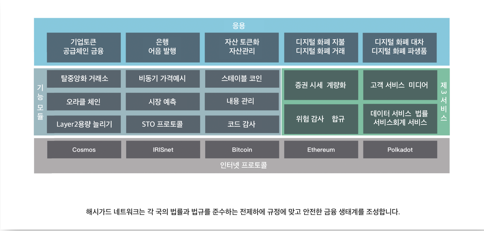

# 해시가드 디지털 금융 블록체인 백서
**차세대 디지털 금융 퍼블릭체인**

2019년 3월 Hashgard Foundation Ltd.
[TOC]
# 제1장 블록체인:사회적 실험이자 금융혁명
## 1.1 블록체인 기술의 발전 역사
1982년, 데이비드 차움（David Chaum）은 추적이 불가능한 암호화 된 익명거래 시스템을 제안했습니다. 1990년에는  나아가 최초의 암호화된 화폐시스템 즉 Ecash를 내놓게 됩니다.
1998년, 웨이 다이(Wei Dai) 는 익명성과 분산 저장 방식의 암호 화폐인 b-money를 논문을 통해 제안합니다.
1998년, 웨이 다이(Wei Dai)가 논문을 발표함과 동시에 닉 사보는 Bit Gold를 제안하며 그후 할피니（Hal Finney）는 이를 보완시켰습니다.
2008년, 나카모토 사토시는 비트코인: 일대일 전자 화폐 시스템’(Bitcoin Peer-to-Peer Electronic Cash System)이라는 논문을 발표하면서 최초로 블록체인이라는 개념에 대해 제기를 하며 그후 비트코인 블록체인 네크워크를 만들었습니다. 2009년부터 시작해 현재까지 비트코인은 안정적으로 운행이 되면서 디지털 자산의 발행부터 유통까지의 전 과정을 완벽하게 실현하고 있습니다. 이와 함께 블록체인은 점점 많은 분야에서 응용이 되면서 그에 따른 다양한 디지털화폐가 탄생합니다.
2015년, 이더리움 오픈소스 프로젝트가 본격화 되면서 사람들은 스마트 계약라는 개념을 접하게 되었습니다. 이더리움 네트워크는 튜링이 완비된 스크립트 언어를 통해 완전한 자유도를 제공함으로써 다양한 디지털 자산 및 스마트 계약의 등록과 이전을 실현하고 디지털 화폐의 발행과 유통을 용이하게 하여 디지털 화폐의 사용을 극대화 하였습니다.
블록체인 기술의 급속한 발전은 디지털 화폐가 점차 대중의 시선으로 들어오게 만들었습니다. 특히 2017년 초부터는 ICO라는 새로운 형식을 통해 다양한 프로젝트가 쏟아져 나오면서 디지털 통화 시장의 새로운 호황을 가져왔습니다. 2017년 말에는 이 열기가 고조되면서 업계 안팎에선 블록체인 기술이 모바일 인터넷 다음으로 후광을 받을 것이라고 믿고 있습니다. 또한 금융과 과학기술 분야의 많은 프로젝트와 종사자들이 블록체인을 적극 이용하고 있습니다.

## 1.2 블록체인이 전통 금융체계에 미치는 충격
기술의 혁신과 발전으로 금융업계의 서비스는 발전하고 있습니다. 지난 50년 동안 수작업으로 기록하던것을 전자화된 금융 데이터가 데체하면서 카드 시대가 열렸습니다. 단말의 보급은 ATM 시대를 가져온 반면 인터넷과 모바일 인터넷은 사이버뱅크와 모바일 결제를 가져왔습니다.
오늘날 블록체인의 도래는 다시 한번 변화를 일으킬 것입니다.
블록체인은 빅테이터, AI, 클라우드 컴퓨팅, 생물학을 포함한 기술과 함께 차세대 금융 인프라를 구축할 것입니다. 블록체인에 구축된 차세대 금융 인프라는 현재 금융시스템의 오래된 문제점들을 극복할 수 있을 것입니다.

1. 전통 금융 체계에서는 중개 비용이 매우 높아 거래 규모를 제한했습니다. 기존의 금융 중개 기관들은 거래를 할때 자체로 많은 비용을 지출해야 하는 동시에 높은 이윤으로 혹시 모를 리스크를 커버해야 했습니다. 원가가 높기 때문에 금융기관에서 금융중개 서비스를 이용할때 최소 예금금액, 외환거래 최소한도, 주식펀드 최소 거래량 등 최소 거래 규모를 규정하여 많은 소금액거래는 불가능하게 하였습니다. 블록체인은 믿음이 가는 분산 저장식의 기술로 중개가 별도로 필요없어 금융 기관들로 하여금 거액의 중개비용을 절약하도록 도울 수 있습니다. 원가의 대폭 하락으로 하여 소금액 거래도 가능하게 합니다.
2. 전통 금융 체계에서는 사기사건도 종종 발생합니다. 현재의 금융시스템의 많은 거래는 직접 거래하는 방식이 아닌 중개기관이 담보 역할을 하고있어서 거래하는 임의적 한쪽이 악의적으로 위약을 하거나 사기를 칠 기회를 줄수 있습니다. 하지만 블록체인은 사기와 붕괴의 위험이 없는 분산 저장형 기술입니다.
3.  전통 금융 체계에서는 사용자의 개인정보와 자산 안전에도 잠재적인 위험이 있습니다. 최근 몇 년 동안, 언론에서는 사용자의 개인정보가 대량으로 유출되는 사건을 빈번하게 보도하고 있습니다. 많은 사용자들의 개인 신상, 은행 계좌번호, 거래 기록 심지어 비밀번호까지 각종 사이트에 게시 및 판매되고 있어 사용자의 개인정보와 자산 안전을 위협하고 있습니다. 하지만 블록체인 네트워크는 시스템에서 사용자의 데이터를 보관하는것이 아니라 사용자 스스로 보관함으로써 진정한 데이터의 보호를 실현하여 사용자의 개인정보와 자산의 안전을 보호합니다.
    블록체인 기술이 발점함에 따라 분산형 장부, 스마트 계약, 영지식 증명, 다자간 연산, 동형 암호와 같은 기술은 현재 금융 업계 내에 존재하는 문제점을 효과적으로 해결할 수 있고 새로운 형식, 새로운 제품을 파생할 수 있으며 따라서 보다 스마트하고 효과적이며 안전한 금융환경을 만들 수 있습니다.

## 1.3 블록체인과 금융의 융합 및 시도
  현재 블록체인은 국제결제, 자산관리, 디지털 법정화폐, 믿을 수 있는 신원, 기업 내부 결제, 증권과 자산 거래 등 분야에서 광범위한 융합과 시도를 하고 있습니다.
  ### 1.3.1 블록체인+국제 결제
  블록체인을 이용한 이체에는 저비용, 실시간 결제, 효과적인 감독 관리, 높은 유동성 등의 편리함이 있습니다. 암호화폐 리플은 이미 다양한 은행에서 응용할수 있 국제 결제 솔루션을 출시했으며 대표로 xCurrent-금융기관의 실시간 결제로 은행 간 빠르고 편리하며 적은 비용으로 국제 결제가 가능한 End to end시스템, XRapid-리플코인 기반의 실시간 결제로 일반 국제 송금 방식에 비해 40%-70%의 비용 절감이 가능, XVia-게이트웨이를 통한 실시간 결제로 기업 간 자금이체 시스템 등이 있습니다. 2019년 1월 리플에서는 도쿄미쓰비시은행, 미즈호은행, 프랑스 농업은행, 스웨덴SEB은행, 미국 익스프레스 지불서비스 산탄데르센트랄히스파노은행 등 리플의 국제 결제를 사용하는 업체가 200개를 넘었으며 매주 2-3개의 신규 고객이 증가하고 있다고 발표했습니다. 리플의 국제 결제서비스의 이용량이 빠르게 증가함에 따라 많은 전문가들은 리플이 향후 SWIFT를 대체하여 국제 결제 분야의 거물이 될 것으로 전망하고 있습니다.

  ### 1.3.2 블록체인+자산관리
  현재 디지털 자산관리업계가 바야흐로 힘차게 발전하고 있습니다. 2019년2월 현재 전 세계에는 700개의 암호화 펀드와 100억에 달하는 달러가 관리중에 있습니다. 2018년 11월 1일, 홍콩 증권선물감사위원회(이하 증감회)는 ‘가상자산투자 관리회사, 펀드 딜러 및 거래 플랫폼 운영자에 대한 감독통제에 관한 성명’(이하 ‘성명’)을 발표한바 펀드 회사는 그 자산의 10% 이내를 디지털 화폐 시장에 배치 할 수 있도록 허용했습니다. 세계 최대의 펀드 회사 중 하나인 피델리티 펀드도 2018년에  디지털 자산 신탁 회사를 설립했습니다. 이 회사는 BTC, ETH 및 기타 암호화된 디지털 화폐에 대한 위탁 솔루션, 암호화폐 거래 플랫폼과 조언 서비스를 7*24시간 제공하고 있습니다.

  ### 1.3.3 블록체인+디지털 법정화폐
  베네수엘라 대통령 니콜라스 마두로는 2017년 12월 3일 TV연설에서 페트로의 탄생을 선언했습니다. 2018년 2월20일 페트로코인을 발행하여 세계 최초 자체로 암호화폐를 발행한 베네수엘라는 첫날부터 7억3500만달러를 팔았습니다.
  페트로 백서에 따르면 베네수엘라 정부는 1억개 약 600억 달러의 페트로코인을 발행할 것이며 암호화폐거래소에업로드 할 예정입니다. 베네수엘라 정부는 세금과 각종 비용, 기부금, 공공서비스 수수료를 페트로코인으로 지급하는 방식을 받아들일 것이며 베네수엘라 국영 원유회사인 PDVSA 및 기타 국영기업들도 페트로코인의 구매와 판매에 참여할 예정입니다.
  마두로는 새로운 화폐가 베네수엘라가 비축하고 있는 석유, 휘발유, 금 그리고 다이아몬드의 지원을 받게 될 것이며, 페트로코인은 베네수엘라가 통화의 주권 문제에 있어 나아갈 수 있도록 도울것이며, 이는 국가에 새로운 형태의 국제 융자를 제공할 것이라고 말했습니다. 마두로는 암호화폐 발행을 빌어 미국의 경제제재에 맞서 나라를 구하고 악성 통화팽창에서 벗어나 빚을 갚고 필수품과 원자재 수입을 늘리는 등 베네수엘라가 심각한 경제위기에서 벗어나길 희망하고 있습니다. 또한 이를 통해 미국정부의 경제제재를 피해갈수도 있으며 미국의 개인기업과 베네수엘라 기업이 거래를 재개할 수도 있습니다.
  베네수엘라 외 여러나라 블록체인 기술에 기초한 디지털 법정화폐의 발행을 연구하는 데 박차를 가하고 있습니다. 싱가포르 통화청과 딜로이트는 공동으로 싱가포르 달러(SGD)를 디지털화하기 위해 Ubin프로젝트를 내놓았습니다. 캐나다 중앙은행도 Jasper을 기반으로 한 디지털화폐 프로젝트인 CAD-coin을 출시하고 중국 중앙은행은 디지털 화폐 연구소를 설립하여 디지털 법정화폐를 연구하고 있고 마셜제도는 자체로 암호화폐를 발행하여 달러와 함께 법정 화폐로 유통시킬 예정입니다. 기술이 계속 발전함에 따라 우리는 미래에 점점 더 많은 국가들이 블록체인 기술로 자신들의 디지털 화폐를 구축할 것이라고 믿습니다.
  ### 1.3.4 블록체인+믿을수 있는 신원
  캐나다의 SecureKey는 IBM과 연합하여 2018년 초 블록체인을 기반으로 한 전국적 범위의 신원 검증 시스템을 출시했는데 이는 IBM의 블록체인 기술을 이용했습니다. 소비자들이 휴대폰과 Windouws장비를 통해 정부, 은행과 통신사에게 자신의 신원을 증명할 수 있도록 하였으며 실제나이나 신용평점같은 정보는 소비자가 서비스를 이용할 때 어플을 통해 자신의 신원을 확인할 수 있도록 하고 또한 인터넷 소비자는 아파트나 새로운 휴대전화를 신청할 때에도 직접 문서를 작성하거나 다른 신분을 증명할 파일을 제공할 필요가 없습니다. 블록체인 신원인증 시스템은 해커들의 공격을 받기 쉽지 않으며 소비자들이 그들의 개인 정보를 통제하고 공유할 수 있도록 하였습니다. 이미 토론토도미니언은행과 캐나다왕립은행 및 기타 대형 금융회사들은 이 프로젝트에 3000만 캐나다달러(약2350만 달러)를 투자한 것으로 알려졌습니다.

  ### 1.3.5 블록체인+기업토큰화
  2019년 2월, 미국 최대의 상업은행인 모건체이스가 자체 디지털화폐 JPMCoin을 플랫폼 Quorum을 통해 발행한다고 발표했습니다. JPMCoin은 달러와 1:1 비율로 자체의 강대한 자금 비축을 이용하여 토큰의 안정성을 보장했습니다. JPMCoin은 기업간 자금 흐름을 위해 설계되었으며, 초창기에는 주로 대기업 고객의 국제 결제, 증권거래 및 달러를 대체하는 것에 응용 되었습니다. 그러나 현재는 아직 테스트 단계로 일부의 기업 및 고객만 테스트에 참여했습니다. 이와 동시에 Facebook에서도 암호화폐 발행을 계획하고 있습니다.

  ### 1.3.6 블록체인+자산 거래
  2018년 12월 미국 뉴욕증권거래서(NYSE)의 모기업인 인터콘티넨탈거래서(ICE)가설립한 디지털 자산거래 플래폼인Bakkt는 첫 융자에 성공 하였으며 12명의 파트너와 투자자로부터 1억8300만 달러의 자금을 조달했다고 발표했습니다.
  Bakkt는 ICE의 거래 인프라를 활용해 비트코인 선거래가 보다 널리 받아들여질 수 있도록 새로운 인프라를 제공했습니다. 첫 감독을 받는 기관급 플랫폼과 현물 교부와 청산 및 저장서비스가 포함됩니다.
  시카고 옵션 거래소(Chicago Board Options Exchange)와 시카고 상품 거래소(Chicago Mercantile Exchange)는 비트코인 선물계약을 거래하는데 이러한 계약은 실제 암호화폐를 사용하는 것이 아닌 비트코인 가격의 변동에 따라 현금으로 결제됩니다. 따라서 실제로 그들은 암호화폐의 미래가격에 베팅하는 격입니다. Bakkt는 보증금 없이 물리적 인도를 합니다.
  Bakkt는 사용자가 디지털 자산을 쉽고 안전하며 효율적으로 구입, 판매, 저장 및 사용할 수 있도록 개방적이며 안전한 글로벌 네트워크를 구축하고 있습니다. Bakkt는 또한 소비자들이 신용카드 대신 비트코인 앱을 사용함으로써 소매업의 지불방식을 간소화하기를 희망하고 있습니다. 전세계의 소비자들은 연간 25조 달러에 달하는 비용을 신용카드 혹은 온라인 쇼핑에 사용되고 있으니 실로 기회가 아닐수 없습니다.
  포춘지도 “ICE가 암호화폐 거래시장에 진출하는 것은 놀라운 일이 아닐수 없다. 금융업계에서 역사가 깊고 존경받는 곳이기 때문이다.” 라고 발표를 했습니다.

  ### 1.3.7 블록체인+증권토큰
  증권류토큰과 관련하여 현재까지 아직 명확한 정의는 없지만 업계의 일반적인 해석에 따르면 감독기준에 부합되는 자산토큰화(Tokenization)로 간단하게 정의할 수 있으며 이는 두 가지를 포함합니다.
1. 토큰의 발행과 거래는 정부기관의 감독기준에 부합해야 합니다.
2. 각 유형별 자산(유형과 무형자산)은 블록체인에서 토큰의 형태로 유동합니다.
증권류토큰에서 감독관리는 중요한 부분입니다. 미국에서 증권류토큰을 발행하는 경우 SEC 및 기타 기관의 감독관리를 받아야 하며 증권류토큰을 발행하는 주체도 연방법에 의해 규제됩니다. 일반적으로 증권류토큰은 SEC에 등록(특정 조항을 충족하여 면제되는 경우는 제외, 예를 들어Reg A+, Reg D, Reg S 등)해야 하며 증권법의 여러 규정을 준수해야 합니다. 이러한 감독은 증권류토큰의 발행과 거래에 많은 제한을 두게 됩니다.
비록 감독관리로 인해 발행원가는 올랐지만 증권류토큰의 우세는 뚜렷했습니다.
1. 투자와 거래의 문턱 낮추기: 예를 들면 상당한 가치가 있는 오피스텔을 증권토큰으로 무제한적인 작은 단위로 쪼개 투자기준을 크게 낮춰 일반인들도 참여할수 있습니다.
2. 자산의 유동성을 강화: 예를 들어 폐쇠기간이 10년인 사모펀드의 경우 투자자는 10년 뒤에나 자신의 투자를 회수할 수 있지만 펀드를 토큰화하면 투자자는 펀드지분을 수시로 매매해 자산의 흐름을 바꿀 수 있습니다.
3. 더욱 낮아진 발행원가: 전통적인 IPO는 발행 비용, 시간 및 원가가 매우 높아 모금액의 4-7%를 차지합니다. STOs 방식으로 하면 원가가 크게 낮아집니다.
4. 감독관리로 인한 마찰비용의 인하: 감독관리를 절차화시켜 감독관리의 원가와 난이도를 낮추어 감독기관간, 국가간 장벽을 허물어 자산으로 하여금 국가별 지역별로 거래가 더욱 편리하게 합니다.
5. 시장의 효율을 향상: 이러한 토큰들이 세계적인 범위내에서 판매되고 거래될 수 있기 때문에 (규정에 부합된다는 전제하) 자산의 정가는 더 공평해지고 가격예시 메커니즘은 더 효율적이기 때문에 투자자의 관심을 이끌수 있습니다.
6. 중소기업 융자 경로 확대: 미국에서만 매년 65만 개 이상의 회사가 설립되고 있지만 월가와 실리콘밸리, 엔젤투자자들은 창업회사에 충분한 자금을 공급하지 않았습니다. 이에 따라, 감독관리를 받고 그 요구에 부합되는 증권류토큰의 발행이나 STO(Security Token Offering)는 중소기업이 새로운 융자 경로를 얻을 수 있도록 도울 수 있습니다.
# 제2장 해시가드의 배경 및 설계목표
## 2.1 해시가드의 발생 배경
해시가드(Hashgard) 프로젝트는 2018년 3월에 정식으로 시작되었지만, 팀내 주요 구성원들이 블록체인 기술에 대한 탐색과 연구는 2013년부터 시작 되었습니다. 블록체인 네트워크 아키텍처 및 오픈 소스에 대한 기술 연구, 이더리움을 기반으로 한 스마트 계약의 개발 및 검증, 여러개의 훌륭한 블록체인 프로젝트의 조기구상, 블록체인 디지털 자산 펀드(Token Fund)의 설립과 관리 등이 있습니다.
해시가드 팀은 장기적인 연구를 통해 기존의 퍼블릭블록체인 체계가 점차적으로 금융 업계에서의 요구를 충족시키지 못한다는 것을 발견했습니다. 그 이유는 아래와 같습니다.
1. 다수의 퍼블릭체인의 성능은 금융 시스템의 요구에 도달하기 어렵습니다. 비트코인은 초당 7건의 거래만 진행할 수 있고 이더리움마저도 수십 건의 거래만 할 수 있어 금융 시스템의 수요를 충족시키기에는 역부족인 경우가 많습니다.
2. 다수의 퍼블릭체인의 사용 문턱이 높습니다. 예를 들어 이더리움의 스마트 계약은 Solidity 언어를 사용해야 하고 EOS의 스마트 계약은C/C++언어를 사용해야 하는데 다수의 사용자의 경우 이러한 언어를 배우는데 어려움을 느끼고 있습니다.
3. 다수의 퍼블릭체인은 체인간 통신과 유연한 확장 메커니즘이 결여되어 있습니다. 다른 퍼블릭체인과의 교호능력이 떨어지고 기능 모듈의 도입을 지원하지 않습니다.
4. 다수의 퍼블릭체인은 지나치게 자유로워 감독관리를 받지 않습니다. 그러나 금융업 자체는 감독관리를 기본 속성으로 하고 있으며 대규모 사용이 이뤄지면서 감독관리의 노드와 감독관리 성질을 갖고있는 관찰자의 노드가 필요합니다.
## 2.2 해시가드의 설계 목표
미래의 금융업계에 잘 적용될수 있는 블록체인 네트워크를 만들어 더 많은 분산형 금융 제품과 비즈니스 애플리케이션의 발전에 도움이 되도록 노력하고 있습니다. 우리는 미래의 금융 블록체인들은 아래와 같은 특성을 가져야 한다고 생각합니다.
1. 금융업계를 충족할 수 있는 거래 능력
2. 기업토큰 발행의 지원
3. 보다 유연한 확장성을 보유
4. 인터체인 통신을 지원
5. 감독관리수준이 금융 감독관리의 요구를 충족
## 2.3 해시가드 네트워크의 응용
전통적 금융업무와 토큰업무에서 활용하는 것을 지원하도록 설계
### 2.3.1 전통적 금융업무에서의 응용
#### 2.3.1.1 금융자산의 확실한 권리
해시가드의 네트워크는 주주권, 채권, 수익권 등을 포함한 금융자산이 등록, 거래 및 결제를 체인에서 진행할 수 있도록 하고 오프라인의 합법적인 기관에서는 체인의 온라인상 기록대로 결제를 진행하며 이는 금융자산의 유동성을 극대화할 것입니다.
#### 2.3.1.2 채권, 어음의 발행
해시가드 네트워크는 선도거래를 지원하며 금융자산을 네크워크를 통해 선물금융자산으로 전환하며 자동교부로 다양한 채권, 어음의 발행을 지원합니다.
#### 2.3.1.3 금융 공급체인
 해시가드 네트워크는 상표, 은표를 발행함으로써 금융 공급체인이 다주체간의 제휴, 다단계의 신용전달, 자산의 디지털화, 프로세스의 지능화 등을 기술적으로 지원합니다.
#### 2.3.1.4 금융 파생삼품의 발행
해시가드 네트워크는 전통적인 금융자산과 디지털 자산에 기초한 선물, 선물옵션과 스왑 계약 등을 포함한 다양한 종류의 금융 파생상품의 발행을 지원합니다.
### 2.3.2 토큰업무의 응용
#### 2.3.2.1 기업토큰 발행
기업은 해시가드 네트워크를 이용해 토큰을 발행할 수 있습니다. 해당 토큰은 아래와 같은 기능이 있습니다.
1. 기업의 포인트로 사용할 수 있으며 기업의 내외부 운영을 지원합니다.
2. 기업의 지분 보유 증빙서류로 보유자는 배당금을 받습니다.
3. 기업이 발행한 채권의 보유 증빙서류로 만기후 기업은 원금을 갚고 이자를 지급합니다.
#### 2.3.2.2 분할 발행
대부분의 경우 투자자가 구매한 기업토큰은 분할로 발행이 되어 점진적으로 유통되어야 합니다. 예를 들어 ABCCoin 토큰의 발금은 10기로 나누어 매월10%씩 발행하며 이더리움ERC20토큰은 아래와 같은 두 가지 방식으로 발행합니다.
1. 발행처는 인위적으로 분할 이체를 합니다. 이런 방식으로 인한 폐해는 중심화된 이체 방식에 의존하기 때문에 위약의 위험이 크므로 구매자가 기한 내에 토큰을 받지 못할 수 있습니다.
2. 발행처가 스마트 계약을 배치하여 발행예정인 토큰을 계약주소로 이체후 계약코드를 통해 지정된 시간이 되면 토큰을 분할 발행하는 방식으로 이는 중심화 시스템에서 나타나는 위약문제를 피할수 있습니다. 하지만 그와 동시에 투자자들은 토큰의 기일별 교부만 기다릴 뿐 곧 보유하게 될 토큰을 미리 유통시킬 수는 없습니다.
해시가드 네트워크에 기초한 토큰 발행 협의와 선물 지불 협의는 상기 문제점을 잘 해결할 수 있습니다. 발행처는 토큰 발행 프로토콜을 통해 ABCCoin토큰을 생성하고 선물 지불 프로토콜을 통해 복수의 선물토큰을 만들어 구매자와 거래를 진행합니다. 선물토큰은 만기 전에 분할하여 유통할 수 있는 동시에 만기가 되면 자동으로 현재토큰ABCCoin으로 전환되어 위약 위험이 없는 동시에 유통성을 높입니다.
#### 2.3.2.3고정 포지션
토큰 발행자는 통상 고정 포지션으로 유통성을 떨어뜨립니다. 통화를 보유하는 것을 독려해 토큰의 시장 가격을 상승 시킵니다. 현재 많은 토큰들은 중심 거래소를 통해 고정 포지션을 진행합니다. 즉, 토큰의 발행처와 중심화된 제3의 플랫폼이 협력하여 사용자가 자신이 보유한 토큰을 제3의 플랫폼 계정에 고정해 고정 기간이 끝나면 고정 포지션 인센티브를 받습니다. 이러한 중심화된 고정 방식은 발행자와 사용자 모두에게 안전하지 않으며 마찬가지로 제3의 플랫폼이 위약되거나 도난당할 위험이 있습니다. 해시가드 네트워크 기반의 예금과 선물 지급 프로토콜은 사용자에게 더 나은 고정 포지션 경험을 줄 수 있습니다. 토큰 발행처에서 정기 예금 박스를 만드는 동시에 고정 포지션 규칙을 설정하여 그것을 고정 포지션 인센티브로 합니다. 토큰 소지자는 자신의 토큰을 박스에 넣을수 있으며 해당 증빙서류를 발급받을 수 있습니다. 만기가 되면 사용자는 그에 상응하는 원금과 인센티브를 받을 수 있습니다.
#### 2.3.2.4 법정화폐를 기반으로 둔 스테이블 코인
현재 다수의 스테이블 코인은 비트코인에 기초한 확장 정보나 이더리움의 ERC20토큰을 사용하여 법정화폐를 기반으로 둔 스테이블 코인을 발행하고 있습니다. 또한 기관에서 제공하는 스테이블 코인과 법정화폐를 같은 양으로 바꾸고 있는바 예를 들면 Tether사가 발행하는 USDT, PAXOS사가 발행하는 PAX등 입니다. 스테이블 코인은 블록체인 자산의 정가와 지급을 편리하게 해 사용자에게 좋은 거래 경험을 제공합니다. 그러나 이러한 스테이블 코인도 여전히 다음과 같은 문제점이 있습니다.
1. 스테이블코인은 비트코인이나 이더리움을 기반으로 둔 것이기 때문에 스테이블 코인 사용자들은 스테이블 코인 외에 BTC나 ETH 코인을 보유해야 블록체인 네크워크에서 비용을 지불할 수 있습니다. 이에 대다수 사용자들은 불편을 겪고 있습니다.
2. 스테이블 코인을 은행의 법정화폐에 비유하자면 사용자들이 갖고있는 스테이블 코인은 은행처럼 사용자에게 보통예금의 이자를 제공하듯이 이자를 제공할수 없습니다. 블록체인 네트워크의 능력이 제한되어 있기 때문에 스테이블 코인의 발행처는 사용자에게 매일 이자정보를 제공할 수 없습니다.
3. 사용자가 보유하고 있는 스테이블 코인은 하나의 네트워크에서만 지불이 가능하고 타 블록체인에서는 사용할 수 없습니다. 예를 들어 사용자가 비트코인 기반의 USDT를 보유하고 있으면 이더리움에서 ERC20버전 USDT로 가격을 책정한 상품이나 서비스를 구매할 수 없습니다.
위와 같은 문제점에 대하여 해시가드는 더 나은 스테이블 코인의 발행 방안을 제공했습니다.
1. 해시가드 네트워크에서의 수수료 지급 방식은 상당이 유연합니다. 블록체인을 통해 제안할 수 있으며 더 많은 종류의 코인을 추가해 수수료로 사용할 수 있도록 합니다. 스테이블 코인의 사용자가 해시가드 네트워크의 주코인을 보유하지 않더라도 스테이블 코인으로 거래비용을 지불 할 수 있도록 함으로써 업무를 전개할 수 있습니다.
2. 해시가드 네크워크는 배당 협의를 제공하며 “한번의 배당급 지급과 비동기로 되찾는”방식으로 스테이블 코인 보유자에게 배당이나 보통예금 이자를 지급하도록 허용함으로써 사용자가 좋은 체험을 경험하도록 합니다.
3. 인터체인을 지원하며 스테인블 체인의 사용자는 인터체인 방식으로 타 네트워크에서도 이용할 수 있습니다.
2.3.2.5 탈중앙화 거래소
해시가드 네트워크는 아토믹 스왑 프로토콜을 제공하며 판매자는 자신이 보유한 토큰 자산을 지정된 가격으로 오더를 할 수 있으며 구매자는 그에 상응하는 가격으로 테이커 할 수 있습니다. 쌍방의 매매 수요가 서로 맞으면 거래 쌍방의 토큰 자산이 서로 교환됩니다.
아토믹 스왑을 기초로 개발자는 또한 사용자들이 선호하는 탈중앙화 거래소를 더욱 쉽게 개발
하고 사용자의 오를 중심화 시스템에 올려놔 수수료를 절감할 수 있도록 하며 거래소 운영자는 사용자를 위해 거래를 알선하고 거래 과정을 아토믹 스왑 프로토콜을 통해 거래의 진실성과 투명성을 확보합니다.
2.3.2.6 탈중앙화 펀드
해시가드 네트워크는 탈중앙화된 디지털 자산 투자 펀드의 창설을 지원하며 펀드 매니저는 토큰을 발행함으로써 이를 펀드 지분 보유 증빙서류로 사용할 수 있으며 펀드가 보유한 자산은 아토믹 스왑의 방식으로 거래할 수 있습니다. 해시가드 네트워크 에코시스템은 탈중앙화 펀드에  hService프로토콜을 기반으로 한 일련의 관리 방법을 제공할 수 있으며 예를 들어 순 생산액의 계산, 펀드 회계, 거래 결산, 실적 계산, 관리비와 캐리의 계산과 같은 것들입니다. 해시가드 네트워크를 기초하여 펀드 관리자는 펀드를 매우 낮은 원가로 만들고 관리할 수 있으며 동시에 상대방의 신용 관련으로 위험도를 낮출 수 있으며 이러한 펀드는 개방형이거나 폐쇄적일 수도 있고 능동형이거나 수동형일 수도 있습니다.
# 제3장 해시가드 네트워크의 개술
## 3.1기술기반
해시가드 네트워크는 Cosmos-SDK에 기반하여 개발 되었습니다. Cosmos-SDK는 Golang언어로 만들었으며 네크워크 계층과 컨센서스 레이어는 Tendermint의 오픈소스 프레임워크를 사용하였으며 개발자들이 Cosmos네트워크에서 쉽게 맞춤이 가능하고 상호운용이 가능한 블록체인 어플리케이션을 만들 수 있도록 설계되었습니다. Cosmos SDK는 안전과 유연성이라는 두 가지 특성을 모두 살려 “Object-Capability Model”과 “Principle of Least Privilege”를 광범위하게 사용했으며 다음과 같은 두 가지 관리 규칙을 수립했습니다.
1. 대상 A와 대상 B가 서로 연관된 경우에만 대상 A가 대상 B에게 메세지를 보낼 수 있습니다.
2. 대상 A가 하나의 대상 C와 연관된 소식을 수신하면 대상 A는 대상 C와 연관됩니다.
이 두 가지 규칙의 결과로는 하나의 기존에 연관된 체인을 통해서만 하나의 대상이 다른 대상에 연관 될수 있습니다. 간단히 말해서, “연결해야만 연관이 생긴다.”
Cosmos네트워크는 서로 다른 독립적이고 병행의 블록체인으로 구성되어 있으며 그 중 각각의 블록체인은 Tendermint와 같은 전형적인 BFT 기술을 통해 컨센서스로 운행합니다. Cosmos에 있는 블록체인을 “구역(zone)”이라고 합니다. 이 중 일부 구역은 “허브(Hub)”라고도 하는데 서로 다른 구역은 공유 허브를 통해 서로 통신할 수 있습니다.
Cosmos Hub는 Cosmos 네트워크에 있는 최초의 허브(Hub)로 주로 인터체인 방식으로(예: 계좌이체, 서비스 조달 등)에 사용되며 블록체인이 IBC프로토콜을 통해 허브에 연결되면 다른 허브에 연결된 블록체인에 대한 접근 권한을 자동으로 얻게 됩니다. 모든 구역을 뛰어넘는 토큰의 이전은 Cosmos Hub를 통해 이루어져야 하므로 토큰은 구역 사이에서 안전하고 신속하게 이전할 수 있습니다. 구역 간에는 직접적인 거래 유동성이 필요 없으며 Cosmos Hub를 통해 구역별로 보유 중인 토큰의 총량을 추적 및 기록하며 모든 구역의 토큰 총량이 변하지 않도록 확보합니다. Cosmos Hub는 중앙은행의 결제 기능 같은 역할을 합니다.
IRIS Hub는 Cosmos Network에 있는 또 다른 허브로 IRIS는 IBC를 통한 인터체인 계산 리소스를 허용하는 동시에 분산형 파일시스템인 IPFS를 통합하였으며 이는 상업적 응용에서 특히 중요합니다.
Ethermint는 사용자가 Tendermint의 PBFT컨센서스에서 스마트 계약을 실행할 수 있도록EVM의 모듈을 제공합니다.
### 3.1.1 네트워크 아키텍처

이미지와 같이 해시가드 네트워크는 Cosmos, IRIS와 유사한 토폴로지 구조를 갖고 있으며 금융업계를 전문으로 서비스를 제공하는 블록체인이며 Cosmos를 기반으로 개발 되었습니다. 또한 Cosmos SDK를 기반으로 해시가드는 새로운 금융 서비스 프레임워크를 개발했으며 전통적인 금융기업들은 블록체인의 저급 프로그래밍 기술을 알 필요 없이 자신의 업무를 블록체인으로 이전하여 빠른 개발과 배치를 가능하게 하고 새로운 업무를 진행할 수 있습니다. 안전성과 신뢰성에 대한 요구가 높은 금융기업도 직접 해시가드 네트워크와 배포 패키지를 사용하여 자체의 독립적인 블록체인을 구축하고 배치함으로써 자체로 응용할 수 있습니다.
해시가드의 금융 서비스 프레임워크는 세가지 서비스가 포함되어 있습니다.
1. 해시가드 네트워크에 내장된 블록체인의 저급 프로그래밍 언어로 제공하는 서비스로 예를 들어 계좌이체, 멀티시그, 저당, 데이터 저장 기술, 위탁투표, 토큰발행 프로토콜, 아토믹 스왑 등이 있습니다.
2. 해시가드 네트워크에 스마트 계약의 형태로 배치하여 스마트 계약을 프로그래밍 하는 것을  통해 사용자에게 서비스를 제공합니다. 예를 들면 증권류 토큰 프로토콜, 비동기 가격 예시 프로토콜 등을 말합니다. 해시가드 네트워크는 VM을 통합하는 방식으로 사용자에게 스마트 계약 서비스를 제공할 것입니다.
3. 외부에서 hService 프로토콜을 통해 해시가드에 해당 외부 서비스를 제공하는 외부 인터페이스 서비스를 제공합니다. 외부 서비스업체와 사용자가 Input/Output을 통해 서로 교류하는 방식으로 예를 들어 데이터 제공 업체가 사용자에게 실시간 금융 데이터를 제공하거나 회계 감사 기관에서 기업 사용자에게 회계 감사 리포트를 제공하는 서비스입니다.
### 3.1.2 컨센서스 메커니즘

 

Cosmos 네트워크에 있는 다른 네트워크와 마찬가지로 해시가드 네트워크는 Tendermint를 컨센서스 레이어로 합니다. Castro와 Liskov가 1999년에 PBFT알고리즘을 도입후 Tendermint는 Jae Know 창설한 첫 PoS개편 버전입니다. 본 장절은 Tendermint의 공식적인 설명을 인용했습니다.
Tendermint가 의사 랜덤으로 검증인 노드를 하나 배치해 여러 라운드로 투표하는 과정에서 하나의 블록을 제안합니다. 그러나 제출 및 최종블록은 대다수에 의해 결정되며 즉 모든 검증인 노드가 보유한 지분 중 2/3를 초과하는 지분을 가진 검증인 노드가 제출하는 블록에 서명하는 것에 달려 있습니다. 블록이 최종화되기 전에 몇 번의 서명이 필요할 수 있습니다. BFT시스템은 1/3의 실패를 용인할 수 있으며 여기서 말하는 실패는 고장이나 악의적인 공격도 포함됩니다.
Tendermint는 주로 두 가지 주요 기술이 포함되어 있습니다. 블록체인 컨센서스 엔진과 일반적인 응용 프로그래밍 인터페이스 입니다. 컨센서스 엔진은 Tendermint의 핵심 모듈로 불리며 도일한 거리가 각 기기에서 동일한 순서로 기록되도록 보장합니다. 응용 프로그래밍 인터페이스는 ABCI(Application BlockChain Interface) 라고 불리며 거래가 그 어떤 언어로 프로그래밍한 프로그램으로도 처리가 가능합니다.
핵심 모듈에서 Tendermint가 순환투표 메커니즘에 기초하여 작업하는 것도 컨센서스 프로토콜의 원리입니다. 모두 세 개의 절차로 처리 됩니다: 검증인은 하나의 블록을 제안하고 제출 의도를 보내며 서명한 후 하나의 새블록을 제출합니다. 이러한 메커니즘은 ZAB에 안전한 레플리케이션을 제공하며 안전상 문제가 생기면 Tendermint에 완전히 귀결될 수 있다는 부분도 추가되었습니다.
Tendermint 컨센서스 알고리즘은 검증인 노드 집합에서 시작합니다. 검증인 노드는 하나의 블록체인 카피를 유지보수하고 공개 키로 검증인의 신원을 식별할 수 있습니다. 매 하나의 새로운 블록 높이에서 그들은 한블록씩 교대로 제안합니다. 매 라운드 투표는 하나의 검증인 노드가 블록을 제안할 수 있고 그에 상응하는 개인 키로 서명을 해야 오류가 발생해도 이를 책임지는 검증인 노드를 찾을 수 있으며 남은 검증인 노드는 개인 키로 제안에 대한 투표를 진행합니다. 이 모든 것이 하나의 라운드를 구성합니다. 그러나 비동기 인터넷 때문에 새로운 블록을 제출하기 위해서는 몇개의 라운드가 필요합니다.

검증인 노드가 블록 제출시 아래와 같은 몇 가지 이류로 실패할 수 있습니다. 현재 제안이 내려갔거나 혹은 네트워크가 지연되었을 수 있습니다. Tendermint는 한 검증인이 블록을 제안할 차례인데 제안되지 않았을때 건너뛸수 있도록 허용합니다. 검증인 노드가 다음 라운드의 투표를 진행 하기 전에 블록을 생성하는 검증인 노드가 제안한 전체 블록을 받아드립니다. 이러한 타임아웃은 Tendermint가 비동기 프로토콜이 아닌 동기 프로토콜이 되도록 합니다. 그러나 나머지 프로토콜은 비동기이며 검증인 노드는 2/3가 넘는 검증인 노드의 정보가 접수된 경우에만 처리를 진행합니다. 이러한 이유로 Tendermint 대다수의 검증인 노드는 100% 정상적으로 실행이 되어야 하며 1/3 또는 그 이상의 검증자 노드가 오프라인이면 네크워크 운행이 중지됩니다.
1/3보다 적은 검증인 노드가 BFT라고 가정하면 Tendermint는 영원히 안전이 파괴되지 않음을 보장합니다. 즉 검증인노드가(2/3 이상) 영원히 동일한 높이에서 충돌되는 블록을 제출하지 않기 때문입니다. 따라서 Tendermint에 기반한 블록체인은 영원히 분할되지 않습니다.
### 3.1.3 인터체인
 인터체인 기술은 해시가드 네트워크에서 실현되기를 바라는 중요한 기능이며 인터체인은 통일화와 비통일화 토근사이의 상이한 블록체인 간의 빈틈없는 이전과 사용을 가능하게 합니다.
해시가드 네트워크는 Cosmos의 IBC(Inter Blockchain Communication)프로토콜로 서로 다른 메인체인사이에 인터체인 기술을 응용할 계획입니다. 단, IBC프로토콜은 블록체인이 전입과 전출시 최종성이 보장된 경우에만 사용할 수 있습니다. 그러나 비트코인은 최종성이 보장되지 않기 때문에 이더리움이 Casper로 발전하는 경우에만 최종성이 보장됩니다.
## 3.2 원생 시스템 서비스
### 3.2.1 이체
해시가드 네트워크에서 사용자가 소량의 토큰을 다른 사용자에게 전이시 무작위로 해시된 전자서명을 배치하여 이는 확실히 본인에 의해 제의되었다는 것을 증명하며 이를 지불이라고 합니다. 서명에 대한 검증을 통해 사용자 본인에 의해 제의되었다는 것을 증명하여 검증 결과가 참이면 체인기록에 남습니다. 이 거래 기록은 부인할 수 없으며 삭제도 안되고 고칠 수도 없습니다.
### 3.2.2 멀티시그
하나의 집단에 둘 이상의 사용자가 있는 것을 허용하고 메세지에 전자 서명을 하여 권한을 부여할 수 있도록 합니다. 이러한 특정 유형의 전자 서명 방식을 멀티시그라고 합니다. 즉 멀티시그는 여러 단일 서명의 조합을 통해 이루어 집니다. 해시가드 네트워크에는 멀티시그 유형의 계좌가 내장되어 있으며 이는 여러 개의 일반 계좌로 구성 되었고 일반 계좌의 서명에
권력을 부여할 수 있으며 멀티시그의 역치를 설정할 수 있습니다. 멀티시크를 도입하면 리스크를 분산 시킬수 있고 안전성을 향상 시킬수 있습니다.
### 3.2.3 데이터 저장 기술
블록체인에 데이터를 보관하는 것은 자본금이 필요합니다. 블록체인의 기술 특성상 데이터양이 너무 많을 수 없기 때문에 모든 데이터를 블록체인에 저장할 수는 없습니다. 하여 거래 데이터에 대해 요점만 따서 디지털 지문과 함께 Merkle Tree알고리즘으로 해시값을 계산해 데이터양을 줄여 마지막에 해시를 블록체인에 기록합니다. 즉 데이터를 고칠 수 없는 거래에 저장하여 데이터를 저장하는 셈입니다. 이 과정을 우리는 정착이라고 합니다. 즉 거래 데이터를 블록체인에 정착하는 것입니다. 블록체인을 기반으로 한 데이터 저장 기술은 블록체인이 갖고 있는 강대한 해시레이트를 활용해 공신력을 강화시켰으며 전자 데이터로 하여금 증명이 가능하고 근본을 탐구할 수 있으며 신뢰할 수 있도록 하였습니다.
### 3.2.4 저당
해시가드는 검증인 노드를 작성할 능력이 없는 사용자가 자신의 토큰을 액티브 검증인 노드에게 저당하여 액티브 검증인 노드가 생성한 블록의 인센티브를 나누고 커뮤니티에 참여할 수 있도록 허용합니다.
저당 토큰을 되찾고 싶은 경우에는 일정 기간의 토큰 고정기간이 지난 후에 자유롭게 유통될 수 있습니다. 의뢰인이 액티브 검증인 노드가 자산의 안전에 영향을 미치는 잠재적 불안요소를 발견할 경우 토큰을 즉시 다른 액티브 검증인 노드에게 위임할 수 있습니다.
### 3.2.5 제안과 투표
해시가드 네트워크는 분산형 시스템으로 운행되며 이러한 분산형 시스템은 블록체인의 각 유형별 활동을 조율할 수 있는 관리 메커니즘을 갖춰야합니다. 해시가드 네트워크는 세 가지 제안 유형을 지원합니다: 텍스트, 파라미터 변경, 소프트웨어 업그레이드, 제안 및 투표과정은 아래와 같습니다.
1. 제안  SubmitProposal
2. 토큰 저당 (충분한 저당후 투표 단계로)
3. 투표 vote
모든 액티브 검증인 노드는 제안의 투표에 대해 책임을 져야 합니다. 만약 액티브 노드가 제안에 즉시 투표를 하지 못하면 해당 노드는 일정 기간 동안 자동으로 활동할 수 있는 권리를 잃게 되며 이 기간을 결정징계기간（AbsenteeismPenaltyPeriod이며 기간은 일주일로 묵인)이라고 합니다.
의뢰인은 액티브 검증인 노드의 투표권을 자동으로 상속하며 위탁한 액티브 검증인 노드와 서로 다른 의견을 가지고 있다면 단독 투표로 커버할 수 있습니다.
위탁 검증인 노드와 바인딩 하지 않은 토큰은 투표에 대해 가중할 수 없습니다.
모든 사용자는 제안할 수 있으며 각 제안은 일정 수의 GARD토큰을 보증금으로 즉 최소 제안 보증금（MinimumProposalDeposit)이 필요하며 이는 일부 사용자가 악의적인 제안을 하여 네트워크를 공격하는 것을 막기 위함입니다.
제안에 대한 사용자의 투표 의견으로는 동의, 반대, 기권, 강력하게 반대 등 네 가지가 있습니다. 기표 시에는 액티브 검증인 노드와 이에 위탁한 검증인 노드의 사용자의 투표만을 산출하고 투표율이 최저 백분율보다 낮으면 투표 결과가 실패로 되며 시스템은 투표를 하지 않은 검증인 노드에 대해 징계를 내립니다. 1/2을 넘는 투표가 동의라면 결과는 성공이지만 1/3을 넘는 투표가 강력한 반대면 제안은 실패합니다.
### 3.2.6 잠금
해시가드 네트워크는 토큰 잠금 기능을 지원하며 금융 기업 또는 사용자의 금융 활동에 대하여 그들이 소지하고 있는 토큰을 일정 기간동안 잠금을 필요로 합니다. 이는 다음과 같은 특징이 있습니다.
1. 블록체인을 기반으로 한 서비스로 간단하고 안전하며 효율적입니다. 잠금이 필요한 토큰의 종류와 수량 및 잠금 만료 시간을 설정하면 됩니다.
2. 조회가 가능하며 정보를 공개합니다.
### 3.2.7 토큰 발행 프로토콜 동일화(HRC10)
해시가드 네트워크는 유틸리티 토큰과 유사한 토큰의 발행을 지원합니다. 사용자들이 익히 알고 있는 이더리움 ERC20토큰의 기능과 유사하지만 다음과 같은 특징이 있습니다.
1. 스마트 계약이 아닌 블록체인 기술로 토큰을 발행할 수 있습니다. 사용자는 솔리디티나 다른 프로그래밍 언어를 알 필요 없이 시스템에서 제공하는 표준 인터페이스만을 사용하여 매우 간편한 방식으로 토큰을 배치할 수 있습니다. 우리는 이더리움 스마트 계약의 수많은 보안 취약점을 보면서 사용자들이 스마트 계약을 사용하는 것은 리스크가 높다고 판단했습니다. 사용자의 프로그래밍을 최소화하는 기능 구성으로 리스크를 줄일 수 있습니다.
2. 토큰의 창설자를 토큰오너라고 불리며 이 사용자는 토큰에 대한 소유권을 가지고 있고 토큰의 옵션에 대해 수정 및 배치를 할 수 있습니다.
### 3.2.8아토믹 스왑 프로토콜(HRC11)
아토믹 스왑 프로토콜은 두 가지 또는 그 이상의 암호화폐의 교환을 가능하게 하는 프로토콜로 거래의 임의의 한쪽은 거래상대를 신뢰하지 않아도 되고 신뢰가 가능한 제3자를 통해 조장할 필요도 없습니다.
아토믹 스왑 프로토콜이 나오기 전에 보편적으로 중심화된 거래 프로토콜(예:거래소, 금융기관)은 정보에 기반한 거래를 진행 시 고유의 약점이 존재합니다.
1. 더 많은 원가가 사용자에게 전가됩니다.
2. 시스템의 단일 고장점을 충당합니다.
또한 이러한 방식은 각 거래자들이 거래를 위해 편의를 제공하기를 요구하며 분쟁이 발생했을 때 거래를 역전시킬 것을 요구합니다. 거래결과에 대해 변경이 불가능하기 때문에 신뢰확장에 대한 수요와 거래 관련자는 중개비용을 계승합니다.
해시가드 네트워크에서는 아토믹 스왑을 지원하며 어떠한 사용자도 상대방을 신뢰할 필요가 없고 심지어는 상대방의 조건을 모르는 전제하에서 거래를 할 수 있으며 자신의 토큰으로 상대방의 토큰을 교환할수 있습니다. 거래의 성공여부와 상관없이 자신의 자산만 내주고 상대방의 자산을 받지 못해 손해를 보는 일은 없습니다.
아토믹 스왑 프로토콜은 두명 혹은 여러명의 참여자가 제3의 중재 기관으로 신뢰를 확장할 필요 없이 대등하게 암호화폐를 교환할 수 있도록 허용합니다.
프로그램을 통한 위탁으로 제3자의 수요와 조정에 대한 비용을 최소화 할 수 있습니다. 사용자와 그 거래 상대는 아토믹 스왑을 통해 불필요한 비용을 줄일 수 있고 결제 그리고 신탁의 리스크를 최소화 할수 있습니다.
아토믹 스왑은 중개가 필요없고 프로그래밍이 가능한 화폐를 통해 다음과 같은 것을 실현 할 수 있습니다.
1. 사용자는 자신만의 금융 서비스 프로그램을 소지하고 있으며 배치할 수 있습니다.(제3자를 신뢰할 필요 없음)
2. 사용자가 거래 과정에서 자산에 대한 완전한 통제권을 보유할 수 있습니다.(탈중앙화)
3. 블록체인 네트워크중 토큰의 P2P유동성을 강화할 수 있습니다.
### 3.2.9 예금 프로토콜(HRC12)
해시가드 네트워크에서는 사용자(박스 오너)가 일종의 예금 박스（DespositBox）를 만들 수 있으며 은행의 정기 예금 서비스와 유사합니다. 다른 사용자(박스의 투자자“investor”)는 유형과 수량을 지정한 토큰을 박스에 넣으면 전표를 획들할 수 있는데 투자자는 획득한 전표로 예금이 만기가 되었을 때 원금과 그에 상응하는 이자를  받을 수 있습니다. 발행자는 예금 전표의 거래와 전이 가능 여부를 설정할 수 있습니다. 예금과 이자의 토큰 유형은 동일할 수도 있고 서로 다를 수도 있습니다.
예를 들어: 박스의 오너 A가 박스1을 만들고 토큰AA유형을 받아들이며 최소 예금은 1000개,최대는 1만개, 총 이자는 1000개의 BB, 예금 기간이 10일이라고 지정하고 박스1을 만들었을 때 오너A는 1000개의 BB를 예금하여 박스를 활성화해야 합니다. investor사용자 B는 박스1에 2000개의 AA를 예금 하면 시작과 동시에 최소 예금 조건을 달성했기 때문에 그에 상응한 전표(명칭: 박스AA-1, 2000개)를 획득하게 됩니다. 만기가 되면 시스템은 자동으로 investor B의 계좌 속 전표를 원금 2000AA와 이자 200BB로 바꿉니다.
### 3.2.10 선도거래 지불 프로토콜(HRC13)
FutureBox 는 특수한 지불 박스 입니다. 다양한 시간에 다양한 사용자를 위해 서로 다른 수의 토큰의 지불할 수 있도록 설정할 수 있습니다. 또한 지급전표의 거래 가능 여부 기능을 설정할 수 있습니다. 사용자는 FutureBox 에 자신이 보유하고 있는 토큰을 예금하고 계좌 주소, 수량, 지불 시간 및 미수금 전표 거래를 허용할지 여부를 설정합니다. 설정을 마치면 수취계좌는 미수금 전표를 받게 되며 미수금 전표는 발행자가 설정한 거래 규칙에 의해 거래가 진행됩니다. 만기가 되면 시스템은 자동으로 사용자의 미수금 전표를 즉시 1:1로 토큰으로 바꿉니다. 선도거래 지불 프로토콜은 채권, 수표, 선물 등 금융 분야에서 사용될 수 있습니다.
### 3.2.11 별칭 서비스 프로토콜(HRC14)
블록체인에서 지갑 주소에는 규칙이 없는 알파벳과 숫자가 있어 매우 난해합니다. 전통적인 금융 기업 사용자들이 쉽게 해시가드 네트워크로 업무를 이전할수 있도록 하기 위해 별칭 프로토콜로 사용자의 지불을 간소화하고 더 많은 업무를 파생할 수 있습니다.
해시가드에서 계좌 별칭이란 일련의 알파벳 및 숫자를 의미하며 최소 8자리에서 최대 20자리를 초과하지 않으며 예를 들면 “charelie1234”,“taalic5566”이 있으며 8자리 이하의 별칭은 보류하여 추후 확장할 예정입니다.
모든 사용자는 선호하는 계좌의 별칭을 구입할 수 있으며 다른 주소에도 사용할 수 있고 자신의 별칭을 다른 사용자에게 양도할 수 있습니다. 별칭이 정해지면 사용자는 별칭으로 시스템에서 지불을 진행할 수 있습니다. 예를 들어 사용자가 gardABCDEFGHIJKLMNOPQRSK 라는 주소에서 “taalic5566”라는 별칭을 사용하면 다른 사용자가 지불할때 “taalic5566” 별칭을 사용하면 메인넷에 있는 주소를 사용자에게 배분합니다.
### 3.2.12 배당 프로토콜(HRC15)
해시가드 네크워크는 배당 기능이 있는 박스（BonusBox）를 제공하며 블록 높이에서 스냅샷을 허용하며 토큰을 보유하고 있는 사용자들에게 비율에 따라 배당합니다.
이 기능은 다음과 같이 사용할 수 있습니다.
1. 사용자에게 새로운 화폐종류를 제공합니다.
2. 동일한 화폐종류로 이익 분배합니다.
3. 회사는 주주에게 배당금을 분배합니다.
4. 위어바오와 유사한 기능으로 사용자에게 보통 예금에 대한 이자를 줍니다.

예를 들어 ABC토큰 총 발행부수가 1억개이고 DEF의 발행자(distributor)가 12월1일 0시에 ABC토큰을 소지한 모든 사용자를 100:1로 에어드롭하기를 원할 경우 DEF의 발행자는 12월1일 0시 이전에 100만개의 DEF토큰을 배당 박스에 넣고 설정을 완료해야 합니다. 12월 1일 시스템은 자동으로 스냅샷을 수행하여 각 사용자의 ABC토큰 소지량을 기록하고 획득이 가능한 DEF토큰의 금액을 지갑 중 팝업을 통해 사용자에게 알립니다. 사용자가 “획득”버튼을 클릭하면 배당을 받을 수 있습니다.
## 3.3 외부 인터페이스 서비스
해시가드 네트워크는 미래에 hService 인터페이스를 구현할 것이며 외부 서비스 제공 업체는 hService 표준 프로토콜을 통해 해시가드 사용자에게 서비스를 제공할 수 있습니다. hService 프로토콜 자체는 제공 업체가 탈중앙화 방식으로 실현할지 여부를 제한하지 않으며 제공 업체가 요청에 대해 모니터링하고 처리한 결과를 해시가드 네트워크에 전송하면 됩니다. 제공 업체는 스스로 서비스 가격을 책정할 수 있습니다.
해시가드 재단은 미래에 모든 hService의 외부 서비스 제공 업체의 요약 문서를 유지보수할 것이며 문서를 통해 사용자는 적절한 제공 업체를 선택할 수 있습니다.
외붓 서비스 제공 업체는 해시가드의 GARD토큰으로 가격을 정해야 합니다.
## 3.4 스마트계약 서비스
해시가드는 미래에 VM을 통합하여 사용자에게 스마트 계약에 기반한 서비스를 제공할 것입니다. 스마트 계약을 선호하는 개발 인력은 스마트 계약을 프로그래미밍함으로써 사용작에게 서비스를 제공할 수 있습니다.
## 3.5 경제 모델
### 3.5.1 기본사상
우리는 미래의 분산형 상업에서 토큰을 자본 혹은 자원의 사용권이라고 생각합니다. 이 둘의 차이점은 무엇인지 늘 고민하고 있는 문제입니다.
총량이 정해진 토큰 모델 중 토큰의 경제적 효용은 이중적입니다. 즉 저당과 거래입니다. 많은 토큰이 이와 같이 사용되기 떄문에 토근은 더 많은 유동성을 갖게됩니다. 그러나 동시에 사람들이 그들의 토큰을 저당해서 얻은 인센티브가 더 적어졌습니다. 더욱 큰 문제는 이러한 유동성이  인터넷의 안전성을 약화시키고 지분증명 시스템이 필요로 하는 토큰 수량으로 하여금 공격당하게 합니다.
예를 들어 모 사용자가 전체 발행부수의 5%를 보유하고 있고 전체 발행부수의 15%보다 적게 저당잡힐 경우 그 사용자는 스스로 33%의 공격(BFT의 상한선)을 할 수 있습니다. 이러한 상황은 단일 토큰 모델에서는 토큰 유통에서의 효용이 더 광범위하기 떄문에 발생합니다. 사용자가 일부러 그런 것은 아니지만 본질적으로 단일 토큰 모델은 전체 인터넷의 안전에 위험을 가하고 있습니다.
단일 토큰 모델과는 반대로 PoS/DPoS의 메인넷이 어떤 종류의 기능을 전문으로 하는 토큰을 구분한다면 서로 다른 기능을 가진 토큰을 구분하여 격리합니다. 지분류 토큰으로 저당을 하고 기능류 토큰으로 거래하며 에코시스템을 통해 두 가지를 결합합니다. 이렇게 되면 이론적으로 인터넷에 가하는 공격이 줄어들 것이며 지분류 토큰의 유동성이 떨어져 가격이 높아지며 사용자가 33% 공격을 하려면 더 많은 대가를 치러야 합니다.
또한 자본과 물리적 자원은 여러가지 측면으로 특성을 보면 본질적인 차이가 있습니다.
우선，자본은 비소모성이라는 속성을 가지고 있습니다. 그러나 자원은 그와 달리 소모성을 가지고 있습니다. 예를 들어 사용자 갑이 100원이라는 현금이로 혹은 인터넷 이체로 을에게 돈을 지불할 때 자본총량은 감소되지 않았지만 인터넷으로 이체를 하면 미미하지만 서버와 인터넷자원을 소모하게 됩니다. 자본이라 함은 사람들이 자발적으로 소각(주식 말소와 유사)하지 않는 한 줄어들지 않지만 물리적 자원은 항상 사람들에 의해 소모되고 있습니다.
둘째, 발행자에게는 자본의 증가를 위해 사용하는 자본금은 미미하거나 혹은 거의 없는 거와 같습니다. 예를 들어 중앙은행이 지폐를 찍는 경우, 회사가 새로운 주식을 발행하는 경우입니다. 그러나 물리적 자원의 증가는 현실적인 노력이 필요합니다. 예를 들어 인터넷 속도가 느리면 새로운 광 파이버를 설치하고 CPU가 부하되면 새로운 서버가 필요합니다. 이 두 가지는 모두 똑같이 공급량을 증가했지만 그에 따른 증가 원가는 완전히 다릅니다.
셋째, 가격을 매기는 것은 매우 주관적이고 거래시 감정의 영항을 크게 받습니다. 예를 들어 주가는 정해진 이익 배분이 있음에도 불구하고 여전히 격하게 오르내리며 심지어 아무런 논리적인 관계가 없음에도 불구하고 폭등할 때도 있습니다. 예를 들어 트럼프가 대통령에 당선됐을 때
 천대지승이라는 주식이 대폭 오른 것처럼 드라마 환락송이 인기를 끌 때 드라마 속 주인공이 매수한 회사 이름과 유사한 홍성발전이라는 주식도 대폭 올랐으며 실제 자산이 뒷받침하지 않는 암호화폐는 더더욱 영향을 받습니다. 그러나 사용자가 자원을 구매하는 것은 사용하기 위함으로 물리적 자원에 가격을 매기는 것은 대부분의 경우 객관적입니다. (가격의 변동은 수급관계의 영향을 받습니다)
넷째, 우리는 많은 사용자들이 자본을 소유함으로써 유통을 줄여 가치를 높이기를 기대하지만 이용료에 대해서는 사용자들이 더 많이 사용하길 기대합니다.
위와 같은 이유로 PoS/DPoS를 사용하는 퍼블릭 체인에 있어서 그 발전 추이는 미래에 지분 증명 토큰을 대체할 수 있을 것이며 물리적 자원을 대표하는 기능류 토큰과는 별도로 설계하여 최종적으로 다중 토큰 체계를 실현할 수 있을 거라고 생각합니다.
### 3.5.2 설계 목표
 지분증명류 토큰의 핵심 효용은 메인넷 블록체인을 보호하는 도구이며 단지 하나의 화폐로 수수료를 지불하는 수단이 아닙니다. 하여 지분증명류 토큰은 비교적 낮은 유통 속도와 유통성이 있어야 합니다. 한편으로 지분증명류 토큰은 ASIC와 같이 하나의 실체가 네트워크의 유지보수자로서 참여할 수 있도록 가상 하드웨어의 일부로 간주해야 합니다. 검증자는 그들의 지분증명 토큰을 보증금으로 장기 저당을 잡도록 격려해야 하며 그들이 네트워크에 컨센서스와 안전성을 제공하기 때문에 그들 또한 인센티브를 받을 수 있습니다.
연료류 토큰은 차급 기능류 토큰으로 그 핵심 효용은 거래에 사용돼야 하기 때문에 유통성이 뛰어나야 하며 유동속도가 더 높을 수 밖에 없습니다.
연구 끝에 우리가 얻어 낸 결론은 이것이야말로 우리가 추구하던 정교하며 안전한 지분 증명 네트워크라는 것입니다.
우리는 해시가드 네트워크의 경제 모델이 다음과 같이 실현되기를 바랍니다.
1. 네트워크의 안정성을 유지하는 검증인 노드는 그에 상응하는 수익을 얻을 수 있습니다.
2. 대규모의 네트워크를 사용하는 사용에 대해서는 예측이 가능하고 상대적으로 안정적인 개발 및 운영 원가를 제공합니다.
3. 일반 사용자 중 활발하게 활동하는 사용자는 원가가 없거나 적은 원가로 네트워크를 이용하길 바라며 수면 상태인 사용자를 자극하길 바랍니다.
4. 퍼블릭 체인의 오픈소스에 대한 기여자와 서비스 개발자를 지속적으로 격려합니다.
또한 블록체인의 사용 원가는 종종 토큰의 가치나 체인상 거래 활성도와 직결되어 있습니다. 토큰은 통상적으로 블록체인 네트워크 사용량이 증가함에 따라 가치가 상승하는 한편 블록체인 네트워크 트래픽이 급증하는 경우에 이용 원가도 현저하게 높아지며 암시장에서의 거래 행위가 이용 원가에 미치는 영향은 고려하지 않았습니다. 그 어떠한 상업도 비즈니스 모델도 통제가 불가능한 운영원가는 수용할 수 없습니다.

따라서 우리가 설계한 경제 모델은 사용 및 거래 원가를 유지하며 가격의 파동과 거래의 활성화가 직접적으로 주는 영향을 최대한 받지 않도록 하며 해시가드 네트워크를 사용하는 프로젝트팀과 일반 사용자들로 하여금 만족감을 느낄 수 있게 합니다.
해시가드 메인넷 초기에는 예상이 가능한 거래 밀도가 높지 않아 거래 수수료가 당분간 폭발적으로 증가하지 않을 것이며 또한 초기에는 해시가드 재단이 보유한 GARD 지분 증명 토큰을 신뢰가 가능한 검증인 노드에게 위탁하여 네트워크의 안정성을 높여 33%의 공격을 할 수 없게 합니다.
이런 상황에서 우리는 듀얼 코인에 대해 충분한 검토와 검증이 필요하다고 봅니다. 초기 해시가드 네트워크는 단일 토큰 모델을 사용하여 네트워크의 안정성을 확보하며 가능하게 발생할 수 있는 손실을 줄일 수 있습니다. 이후 커뮤니티를 관리하는 방식으로 메인넷에 연료 토큰을 추가해 보다 효율적인 다중 토큰 체계를 만들 것입니다.
다음과 같이 우리는 단일 토큰 경제 모델을 기초로 논의하고자 합니다.
3.5.3 토큰 유형
해시가드의 토큰은 시스템 레벨 토큰과 애플리케이션 레벨 토큰으로 구분됩니다. GARD는 시스템 레벨 토큰으로 이는 블록체인 중 시스템 레벨 부분을 다룹니다. 예를 들면 시스템 레벨의 지분 증명, 공용 네트워크 리소스의 사용, 컴퓨터 리소스의 사용, 공용 스토리지 자원 등을 사용하여 이체하고 기업 토큰 발행, 애플리케이션 구축 등입니다. 애플리케이션 레베의 토큰은 애플리케이션 개발자가 자체적으로 만들며 이와 관련된 DAPP가 사용될 수 있습니다.
애플리케이션 개발자는 어떤 토큰을 지급 유형으로 사용할지 스스로 결정할 수 있습니다.
3.5.4 시스템 레벨 토큰: GARD
GARD는 시스템 레벨의 토큰으로 가치 이전의 매개체이며 시스템의 사용권을 대표합니다. 이는 가치의 쾌속 유통을 실현할 수 있으며 그 용도는 다음과 같이 다섯 가지가 있습니다.
1. 사용자가 저당을 신청해 검증인 노드 또는 hService 제공업체가 됩니다.
2. 사용자가 위탁 투표로 관리 활동에 참여합니다.
3. 사용자가 시스템 또는 애플리케이션에 사용료를 지불합니다.
4. 활약적으로 활동하는 검증인 노드에 대한 블록 생성 인센티브
5. 에코 건설에 사용

GARD는 1,000억 개의 토큰을 초기에 발행하며 다음과 같이 배치합니다.
	비율	수량	용도	배치방안
	6.5%	65억개	기구 조기 육성 	거래소에 올린 후 일년 후 배치
	30%	300억개	전략적 파트너 및 전략적 투자 기관	거래소에서 올리기 전 50% 배치, 6개월 후 나머지50% 배치
	10%	100억개	창설 단체	메인넷에 올린 후 배치,24개월에 걸쳐 잠금 해제
	3.5%	35억개	재단 소유로 학술 연구에 사용 및 고문 전문가에게 환원	수요에 따라 배치
	10%	100억개	IP출력 단체 	거래소에 올린 후 일년 후 배치
	40%	400억개	재단 소유로 연구개발 마케팅 및 생태건설에 사용	커뮤니티 인센티브/시장 보급에 10% 사용,기술 연구개발에 10% 사용, 생태건설에 20% 사용.수요에 따라 배치
비고:최신GARD토큰 유통량은 공식 홈페이지를 참조하십시오.
## 3.6 컨센서스 및 관리구조
오픈소스 관점으로 보면 해시가드 네트워크는 초기 개발 단체에 속하지 않으며 공식적으로 메인넷이 오픈된 후에도  해시가드 팀과 재단은 유일한 개발자 혹은 유지보수자가 아닙니다. 해시가드 초기 팀과 재단은 메인넷을 배포하는 일부로써 해시가드의 발전을 위한 관리구조와 의사결정을 지지합니다.
탈중앙화는 블록체인 기술의 기본사상이지만 퍼블릭체인의 중대한 의사결정을 처리함에서는 반응이 느리거나 발언권이 소유하고 있는 노드의 영향을 받을 수 있습니다(이러한 점은 PoS에서 더욱 뚜렷하게 나타남). 현재로선 블록체인 기술이라고 할지라도 완전한 탈중앙화는 이상주의적입니다.
탈중앙화라는 문제에서 균형점을 찾는 것이 해시가드가 거버넌스를 설계하는 관건입니다. 해시가드 인터넷이 발전하는 여러 단계에서 거버넌스는 실제 상황에 맞게 적절하게 조정될 수 있습니다. 거버넌스는 시스템 매개변수와 소프트웨어 업그레이드, 헌법 개정 등 블록체인 기술에 대한 다양한 변화를 조율하기 위한 명확한 메커니즘입니다.
### 3.6.1 이해당사자
이해 당사자란 지분 증명류 토큰GARD의 소지자를 말하며 그중 일부는 액티브 검증인 노드나 검증인 노드 후보자와 같은 특정한 역할을 가지고 있습니다. 이해 당사자들은 합법적인 신분이나 익명인 개인, 회사, 정부 기관, 비영리 단체 및 기타 기관일 수 있습니다. 투표 메커니즘은 해시가드 네트워크에 있는 모든 이해 당사자에 대한 풀 커버리지를 달성할 수 있게 설계합니다.
### 3.6.2 검증인 노드
전형적인 BFT알고리즘에서 각 노드는 동일한 가중치가 있습니다. 해시가드의 검증인 노드는 투표권과 관련되며 상당 수의 투표권을 가진 노드는 액티브 검증인 노드라고 하는데 이들이 돌아가면서 새로운 블록을 제출하고 서명을 하며 블록을 생성하지 않고 동기화만 하는 검증인 노드를 검증인 노드 후보자라고 합니다. 검증인 노드의 선거는 동적이며 해당 노드의 지분 순위가 현재 네트워크에 허용된 최대 액티브 검증인 노드 수 순위에 들어가면 액티브 검증인 노드로 될 수 있습니다. 액티브 검증인 노드는 블록 생성에 참여할 수 있고 그에 따른 인센티브를 받을 수 있습니다. 또한 의뢰인을 대표해 제안에 표결할 수 있습니다. 최소 요건을 활성화할 수 있는 토큰을 저당으로 잡으면 모든 사용자는 제안할 수 있습니다. 마지막에 개표할 때에는 액티브 검증인 노드와 의뢰인의 투표만을 통계합니다.
GARD토큰 소지자는 자가거래를 체결 및 제출을 통해 검증인 노드가 될 수 있습니다. 노드의 커미션 비율, 최대 커미션 비율, 일일 커미션 변동 상한선, 그리고 최소 자가저당 수량(노드의 리스크 부담 능력을 나타내는 것으로 노드 자가저당 수량이 설정 수량보다 작을 경우 모든 저당 지분이 방출됩니다)을 설정해야 합니다.
네트워크 초기화 시 액티브 검증인 노드의 최대 수량을 배치하며 이후 제안과 관리를 통해 수정할 수 있습니다. 모든 사용자는 검증인 노드를 신청할 수 있고 검증인 노드의 지분은 자가저당 지분과 위탁받은 지분까지 합쳐 총지분 순위가 액티브 검증인 노드의 최대수량 순위 안에 들어가야만 액티브 검증인 노드가 될 수 있으며 블록의 생성과 관리에 참여할 수 있습니다. 만약 액티브 검증인 순위에서 밀려나면 더 이상 블록 생성에 참여하지 않습니다. 의뢰인은 수동으로 위탁 지분을 다른 액티브 검증인 노드로 이전할 수 있습니다.
다음 블록을 제안하도록 선택된 액티브 검증인 노드를 제안자라고 합니다. 각 제안자는 명확한 방식으로 선정되었고 당선될 가능성은 그들이 총 지분에서 차지하는 비중과 연관되어 있습니다(총지분=자가저당 지분+의뢰인 지분). 예를 들어 모든 액티브 검증인 노드의 총 저당 지분이 100억 GARD이고 그 중 모 액티브 검증인 노드의 총 지분이 10억 GARD이면 10%의 가능성으로 해당 검증인 노드는 다음 제안자로 선택됩니다.
해시가드의 검증인 노드로서 다음과 같은 비용을 부담해야 합니다.
1. 하드웨어 비용(인터넷과 연동된 서버, 백업 서버, 서명에 사용되는 하드웨어 보안 모듈, 방화벽)
2. 운영 비용(더 많은 위탁을 받기 위함)
3. 자산점용 비용(자가저당GARD)
	액티브 검증인 노드	검증인 노드 후보자/전체노드
	최대 수량	100	/
	완전한 블록 동기화	네	네
	블록 생성에 참여	네	아니오
	제안에 대한 투표 통계 여부 	네	아니오
	삭감 징벌을 받는 여부 	네	아니오

### 3.6.3 의뢰인
의뢰인은 능력이 없거나 검증인 노드를 하기 원하지 않는 GARD토큰의 소지자입니다. 그들은 GARD 토큰을 액티브 검증인 노드에 위탁해 온라인 투표와 같은 행위에 참여하고 블록 생성 인센티브를 받을 수 있습니다. 해당하는 액티브 검증인 노드는 의뢰인을 대표하여 투표권을 행사합니다. 위탁에 참여하지 않은 토큰은 투표권이 없습니다.
### 3.6.4 커미션
한 액티브 검증인 노드의 옵션 풀에서 받은 수익은 액티브 검증인 노도에 주는 부분과 의뢰인에게 주는 부분으로 분할됩니다. 액티브 검증인 노드는 그 의뢰인에게 주는 수익 중 일부를 커미션 인센티브로 자신이 가져갈 수 있습니다. 이 커미션은 백분율로 설정되어 있습니다. 모든 검증인 노드는 초기 커미션, 최대 일일 커미션 변화율과 최대 커미션을 임의로 설정할 수 있습니다. 해시가드는 모든 검증인 노드가 이러한 파라미터를 명시적으로 설정하도록 강제 설정합니다. 이 파라미터들은 선거 시작 시 설정되며 그 이후 더 제한될 수도 있습니다.
### 3.6.5 블록 생성 인센티브
해시가드는 액티브 검증인 노드의 총 지분에 비례하여 인센티브를 지급합니다. 이는 액티브 검증인 노드가 블록이 생성될 때마다 인센티브를 받을 수 있더라도 모든 액티브 검증인 노드는 동등한 가중치를 유지한다는 것을 의미합니다. 해시가드의 초기 블록 생성 인센티브는 재단이 기부하고 GARD를 증가하는 방식으로 액티브 검증인 노드에게 블록 생성 인센티브를 지급하며 커뮤니티에서 제안하여 관리하는 방식으로 결정됩니다.
예를 들어 어떠한 높이에서 블록 생성 인센티브 수량이 30500 GARD에 모두 3개의 액티브 검증인 노드가 있고 지분의 수량이 동일하다고 가정하면 블록을 제안한 액티브 검증인 노드 즉 제안자는(자가저당20%, 의뢰인80%):
-	30500/305%*105%=10500 GARD 획득(제안자가 5% 더 많음)
-	제안자 획든 커미션: 0700*80%*5%=420 GARD(검증인 노드는 커미션 자체 배치 가능, 본 예에서 커미션은 5%)
-	제안자 총 획득 인센티브: 10500*20%+420=2520 GARD
-	제안자의 의뢰인 총 획득 인센티브: 10500*80%-420=7980 GARD(모든 의뢰인은 그들의 지분 차지 비율에 따라 수익을 얻을 수 있다)
2개의 블록을 제안하지 않은 액티브 검증인 노드 즉 비제안자는(자가저당 20%, 의뢰인80%):
-	 30500/305%*100%=10000 GARD 획득
-	비제안자 획득 커미션: 10000*80%*8%=640 GARD(본 예에서 비제안자 커미션은 8%)
-	비제안자 총 획득 인센티브:  10000*20%+640=2640 GARD*
-	비제안자 의뢰인 총 획득 인센티브: 10000*80%-640=7360 GARD(모든 의뢰인은 그들의 지분 차지 비율에 따라 수익을 얻을 수 있다)
### 3.6.6 수수료 배분
DDOS의 공격을 방지하기 위해 사용자가 해시가드를 사용하려면 일정한 수수료를 지불해야 하며 수수료는 GARD로 묵인합니다. 하지만 커뮤니티 제안과 투표로 관리하는 방식으로 새로운 토큰 유형을 추가할 수 있습니다. 수수료의 계산 공식은 다음과 같습니다.
`fee = gas * gasPrice`
Gas는 거래에 의해 결정되며 거래소에서 소비되는 컴퓨팅 및 스토리지 리소스에 사용됩니다. 거래에 따라 필요한 gas의 수는 다를 수 있으며 예를 들어 이체 같은 것입니다. 위탁류 거래가 소모하는 자원은 적은 편이고 화폐 발행이나 선도거래 같은 거래유형은 소모가 많은 편입니다. 노드는 후자를 처리할 때 더 많은gas를 소모합니다.
수수료는 블록 생성 인센티브와 같이 검증인 노드에게 배분하며 시스템 배치 비율에 따라 블록 제안자는 별도의 수수료 인센티브를 획득할 수 있습니다.
한 액티브 검증인 노드가 다음 블록을 제안하도록 선택되었을 때 현재 블록의 최소2/3 지분에 대한 액티브 검증인 노드의 서명 허가를 포함해야 합니다. 또한 액티브 검증인 노드의 서명 허가가 2/3를 초과하면 그에 따르는 인센티브가 존재합니다. 이 인센티브는 선형적입니다. 제안자가 2/3의 서명허가(블록이 유효한 최소치)가 포함하면 비율은 1%이고 제안자가 100%의 서명 허가를 포함하면 비율은 5%입니다. 물론 제안자가 제안하기 위해 너무 오래 기다려서는 안 됩니다. 다른 액티브 검증인 노드가 시간을 초과할 수 있어 장시간의 대기는 제안의 지연을 초래하기 쉽기 때문입니다. 하여 제안자는 가장 많은 서명을 받기 위해 대시하는 시간과 다음 블록을 제안할 기회를 잃는 것 사이에서 균형점을 찾아야 합니다. 이러한 메커니즘은 제안자가 불필요한 블록을 제안하지 않도록 하고 액티브 검증자 노드 사이의 더 나은 네트워크를 유지하고 심사를 경감하기 위함입니다.
예를 들어 10개의 지분이 동일한 액티브 검증인 노드가 3350 GARD의 수수료과 부과된 블록 중 30% 즉 1005 GARD를 액티브 검증인 노드에 분배합니다. 제안된 블록에 액티브 검증인 노드의 서명이 100% 포함되어 있다고 가정하면 제안자는 수수료 인센티브 중5%의 추가 인센티브를 받을 수 있습니다. 액티브 검증인 노드에게 주어지는 인센티브:
` R : 9*R+R*105%=1005 ⇔ R=1005/10.05=100 GARD`

블록을 제안한 액티브 검증인 노드 즉 제안자는(자가저당20%, 의뢰인80%):
-	3100*105%=105 GARD 획득(제안자가 5% 더 많음)
-	제안자 획든 커미션: 105*80%*1%=0.84 GARD(검증인 노드는 커미션 자체 배치 가능, 본 예에서 커미션은 1%)
-	제안자 총 획득 인센티브: 105*20%+0.84=21.84 GARD
-	제안자의 의뢰인 총 획득 인센티브: 105*80%-0.84=83.16 GARD(모든 의뢰인은 그들의 지분 차지 비율에 따라 수익을 얻을 수 있다)
9개의 블록을 제안하지 않은 액티브 검증인 노드 즉 비제안자는(자가저당 20%, 의뢰인80%):
-	 100*100%=100 GARD 획득
-	비제안자 획득 커미션:100*80%*1%=0.8 GARD (본 예에서 9개의 비제안자 커미션은 1%)
-	비제안자 총 획득 인센티브:  100*20%+0.8=20.8 GARD
-	비제안자 의뢰인 총 획득 인센티브: 100*80%-0.8=79.2 GARD(모든 의뢰인은 그들의 지분 차지 비율에 따라 수익을 얻을 수 있다)
### 3.6.7 해시가드 네트워크 개선 프로토콜 HIP
해시가드는 블록체인 오픈소스 프로젝트로서 비트코인과 유사한 장기적인 진화 메커니즘을 가지고 있으며 이를 "HIP"(Hashgard Improvement Proposals)라고 부릅니다.
HIP는 해시가드 커뮤니티에 정보를 제공하거나 해시가드 네트워크, 프로세스, 환경을 기술한 문서입니다.
HIP는 이 기능의 기술 규범과 기본 원리르 제공해야 합니다. 우리는 HIP가 새로운 기능을 제안하고 문제점에 대한 커뮤니티의 의견을 수집하고 해시가드의 개선방침을 기록하는 주 메커니즘이 되기를 바랍니다.
HIP 저자는 커뮤니티 내에서 컨센시스를 형성하고 의견을 기록하여 자신의 의견이나 아이디어를 보완한 뒤 HIP 초안 문서를 작성해 해시가드 재단에 초안을 보내 심의를 받습니다. HIP초안은 규범 양식으로 문제와 수요및 해결 방안을 명확히 서술해야 합니다. 각 초안에는 여러 아이디어가 아닌 단일 아이디어가 포함될 것을 제안하며 이는 검토에 도움이 됩니다. 이 단계를 Draft(초안) 단계라고 합니다. 일반적으로 재단은 HIP가 중복되거나 아이디어나 솔루션이 너무 조잡하고 기술에 문제가 있거나 해시가드의 이념과 발전 방향에 맞지 않는 한 HIP초안을 거절하지 않습니다.
재단은 주기적으로 해시가드 네트워크에서 텍스트 유형의 HIP초안의 제안에 대해 투표를 진행합니다. 커뮤니티를 통해 투표된HIP초안 즉 HIP제안으로 받아들여지면 재단은 그 제안에 유일한 HIP 일련번호를 할당하여 github에 게시합니다. 모든 해시가드 개발자들은 HIP제안을 위해 오픈소스 방안을 제시할 수 있으며 재단은 각 요소를 고려해 가장 적합한 방안을 추천하며 그 저자와 HIP초안을 가장 잘 구현 한 사람에게 상응하는 인센티브를 줍니다. 최적의 구현 방안은 해시가드에서 충분한 테스트를 진행합니다. 투표가 통과하면 Accepted(수용)단계로 진입하며 투표가 통과되지 않으면 Rejected(거부)단계로 넘어갑니다.
해시가드 네트워크에서 방안에 대해 충분한 검증을 마친 후 재단은 해시가드에서 HIP제안, 구현 코드, 테스트 보고서의 “소프트웨어 업그레이드”에 대해 투표를 진행합니다. 커뮤니티를 통해 투표한 HIP제안은 해시가드가 최신 버전으로 업그레이드시 포함되어 배치 및 활성화를 기다립니다. 투표가 통과하면 Final(최종) 단계로 진입하고 투표가 통과 되었지만 다음 최신버전에 포함되지 못하면 Deferred(지연) 단계로 진입해 적절한 버전에 포함되기를 기다립니다. 투표가 통과되지 않으면 Rejected(거부) 단계로 넘어갑니다.
해시가드의 새 버전이 배치 및 활성화된 후 해당 HIP에 문제가 없고 인터넷이 정상적으로 작동하면 HIP제안은 아카이브되며 Active(활성화) 단계로 진입합니다.
새로운 버전이 배치 및 활성화된 후 버전에 문제가 발생하거나 네트워크에 이상이 있으면 전체 투표를 롤백합니다. 중대한 문제가 발생할 시 재단에서는 긴급 롤백을 진행하여 안정적인 이전 버전으로 돌아갑니다. HIP제안이 Replaced(대체) 단계로 넘어가며 Accepted(수용) 단계로 전환됩니다. 문제가 해결된 후 HIP제안은 다시 테스트를 진행합니다.
### 3.6.8 관리 위원회
블록체인 기술의 탈중앙화 운영 메커니즘은 재단에 독특한 거버넌스를 부여합니다.
해시가드 재단은(싱가포르Hashgard Foundat)ion Ltd.)는 비영리 기관으로 해시가드의 개발, 관리, 발전에 주력하고 있습니다. 관리 위원회는 해시가드 재단의 이사회로 중대한 전략의 수립과 직능 위원회 책임자의 선출을 담당합니다. 관리 위원회는 신분이 명확하고 GARD 투표권을 가진 이익 관련 인원 중에서 선거합니다.
## 3.7 기술 로드맵
우리가 예상하는 해시가드의 기술 로드맵은 다음과 같으며 이는 대략적인 방향과 시점이며 미래에 실제 프로젝트 진행 상황에 따라 달라질 수 있다는 점을 알려드립니다.
-	Alfheim(알프헤임)(2018.3 ~ 2019.7): 해시가드의 첫 번째 단계로 메인넷의 구축에 전념하여 기초적인 시스템 원생 서비스를 구현합니다.
-	Midgard(미드가드르)(2019.8 ~ 2020.12): 해시가드의 두 번째 단계로 개발자SDK를 제공하고 다양한 버전의 지갑을 제공합니다. hService 인터페이스와 스마트 계약을 지원하며 HIP메커니즘을 보완하고 Cosmos Network내의 다른 네트워크와 상호 통신함으로써 해시가드의 응용을 점차적으로 확대시킵니다.
-	Asgard(아스가드르) (2021.1 ~ ): 해시가드의 세 번째 단계로 개발자를 격려하고 커뮤니티 건설을 통해 디지털 금융 비즈니스 생태계를 구축합니다.
## 3.8 생태 체계

## 3.9 팀 초기 구성원
쉬차오이(许超逸)

Founder & CEO,  iFLYTEK 엔지니어, HUAWEI엔지니어, ZIE 전략팀 감사, 소우 자본 투자 매니저 등을 역임하였고 14년 동안 하이테크 업계에서 연구, 시장, 관리, 투자 등 경험을 갖고 있습니다. 국가 교육부가 인정한 전국 우수 혁신 창업 멘토 및 인재이며 블록체인 업계의 개척자이자 투자자입니다.

양옌칭(杨延庆)

Co-Founder & CTO, ZIE에서 근무했으며 시안 전자과기대학 사이버보안과 암호학을 전공했으며 16년의 소프트웨어 개발 경험과 프로젝트 관리, 프로세스 개선 경험이 있으며 여러 팀을 지도하였습니다.

황쵸우멍(⻩峤濛)

Co-Founder & COO, 마카오 대학을 졸업하고 세계 500대 기업에서 근무한 뒤 블록체인 업계로 뛰어들었으며 블록체인 투자 기관에서 베테랑 애널리스트로 근무하였으며 투자와 연구에 있어서 베테랑입니다.

## 3.10 전략 고문
심파(沈波)

FENBUSHI Capita의 창시 파트너이자 블록체인 분야의 선구자이며 BitShares 와 FBS Capital의 설립자입니다. 또한 증권과 헤지펀드, 투자은행 등에서 수십 년간의 풍부한 투자 경험을 가진 베테랑입니다.

우커종(吴克忠)

YOUSHI창시 파트너이자 CEO, 상하이교통대학 공학과 기술경제 복수학위를 받은 후 미국 Univ. of Southwestern LA의 경영전문 석사학위를 받았습니다. 1987년부터 상하이교통대학에서 교수로 근무했고 1992년부터 증권투자 컨서링 및 투자은행에서 근무했으며 1995년부터 미국 월가에서 벤처투자와 사모투자를 전문으로 했습니다. 2002년 귀국해 YOUSHI를 설립하고 베이징대, 칭화대, 푸단대, 상하이교통대, 절강대 등 여러 고교에서 EMBA 교수로 있었으며 여러 지방정부 및 유엔공업발전기구 경제고문을 맡고 있습니다.

루양(陆扬)

VeChain설립자 및 CEO이며 상하이 교통대학 전자와 통신공학을 졸업하였으며 13년 동안 500대 다국적 기업에서 IT 임원으로 근무했으며 루이비통 중국지역 수석 정보관을 역임했으며 정보시스템 기술전략 및 관리, 기업 디지털영역에서 풍부한 경험을 갖고 있습니다. 블록체인 기술을 세계적으로 밀고 나가 블록체인의 발전에 힘썼습니다. 2015년에는  VeChain프로젝트를 가동하여 블록체인 기술의 보급에 주력하고 있습니다.

리궈췐(李国权)

싱가포르 대학의 교수이며 싱가포르경제학회 부회장입니다. 미국 좌안학원, 이백 금융 아카데미 및 싱가포르의 푸이(Ferrell)금융그룹을 포함한 여러 기관의 설립자입니다. 여러 상장기업의 이사장으로 지냈으며 동시에 여러 상장기업의 이사국 의장 또는 비상임이사이기도 합니다. 그가
편찬한 ‘디지털 커런시 (Digital Currency)’는 Elsevier에서 출간 후 미국도서관협(American Library Association)로부터 훌륭한 참고문헌 대상을 받았습니다.

바이숴(白硕)

전 상하이증권거래소의 엔지니어이자  ChinaLedger 기술위원회의 주임입니다. 블록체인 전문인사이며 베이징대를 졸업해 이학박사를 받았고 중국과학원의 연구원, 교수로 역임했습니다. 2000년부터 국가전산망 비상기술조정센터 (CNCERT/CC)의 설립에 참여했으며 ChinaLedger 기술위원회 주임을 맡고 있습니다. 블록체인 분야에서 풍부한 이론연구와 실천경험이 있으며 블록체인 기술이 전통적인 금융업무에 미치는 충격을 소개한 바 있습니다.

장민(张敏)

Empower Investment의 관리자이며 첸싱그룹에서 투자 총책임자로 근무하며 TMT에서의 초기 지분 투자에 전념했습니다. Empower Investment는 2012년에 창립했으며 상하이에 본부를 두고 있습니다. 투자팀은 초기 벤처투자, 중기성장투자 등 업무를 하며 위안화와 달러 펀드를 관리하고 있습니다.

시하이펑(奚海峰)

전 Wancloud의 CTO이자 IRIS의 창시 파트너, 고급 기술 전문가이자 사업가입니다. 칭화대 자동화제어 학사와 석사학위, 미국 메릴랜드대 전자와 컴퓨터공학 석사학위를 받았습니다. 그는 IBM에서 6년간 근무하면서 많은 상을 수상했으며 동시에 미국 발명 특허를 보유하고 있으며 여러 학술지에 수 편의 논문을 발표했습니다. 2017년 초 Wancloud 블록체인 주식회사 산하 Wancloud플랫폼의 CTO도 맡았습니다.

부안문(符安文)

Scry.info 창시자. 전자과기대, 소르본대를 졸업했습니다. 컴퓨터와 물리학 석사입니다.
고등학교 때 H.U.C에 가입했고 대학시절 게임 스튜디오를 차린 뒤 텐센트에 팔았습니다. 게임과 소프트웨어 개발회사를 설립해 많은 성과를 냈습니다. 2014년에는  Xcener Blockchain 를 설립하여 농장 판매와 농업 무역 공급 체인을 지지하며 그 서비스는 3.800개가 넘는 국제 농업회사와 17개국에 널리 보급되었습니다. 2017년 8월 SCRY.info 브록체인 데이터 프로토콜 계층 프로젝트를 수립했습니다.

공명(龚鸣)

탈중앙화 거래소CYBEX, ChainB, Longhash의 창시자입니다. 2012년부터 디지털머니와 블록체인 업계의 발전을 위해 블록체인 백서 및 관련자료를 작성, 번역했으며, ‘블록체인 사회’, ‘블록체인-새로운 경제 비전’, ‘디지털 화폐’ 등 다양한 저작물에 참여했습니다.

쿵화웨이(孔华威)

중국과학원 계산기술연구서 상하이 지소장이며 QIDIAN 파트너이며 베이징대, 절강대 물리학과를 다녔습니다.  SHIPS, 서광정보산업그룹에서 근무했으며 슈퍼 컴퓨팅과 그리드 컴퓨팅 기술 연구를 했습니다. 지역 혁신 생태 전문가이며 과학기술부 창업 멘토, ITALK살롱, IC커피 등 혁신적인 조직을 만들었습니다. 블록체인 업계에서 심도있는 연구를 했으며 2013년에는 일베트사의 기술고문으로 지냈으며 ‘디지털머니의 험난함’이라는 책을 저술했으며 현재는 카나안에서 근무하고 있습니다.

덩신(邓辛)

상하이 재경대학 금융학 부교수 및 회사금융학과 주임입니다. 싱가포르 남양공대, 금융학 박사를 졸업하고 현재 상하이 재경대학에서 금융학부 부교수 및 회사 금융학과 주임을 맡고 있습니다. 현재 암호화폐의 가격 책정, 블록체인중 관리 문제를 연구하고 있으며 2018년1월부터 컬럼비아대 경영대학원 연구소에 방문해 블록체인중 관리 문제를 연구하고 있습니다.

## 3.11 부분 협력 파트너
만우테크

국내 최고의 사이버 보안회사로 블록체인 생태안전에 전념하고 있으며 10여 년동안 사이버 보안을 연구한 팀으로 구글, 마이크로소프트, W3C, 공안, 텐센트, 알리바바, 바이두 등에 서비스를 제공하였으며 팀이 이뤄낸 여러가지 성과가 BlackHat과 같은 글로벌 해킹 대회에도 진출했습니다. 2018년 3월 만우테크 보안팀은 이더리움 결함으로 인한 억대 디지털 자산 절도 사고를 성공적으로 밝혔습니다.

Irisnet

WanCloud의 프로젝트이며 가장 선도적인 기술인 인터체인 프로젝트 Cosmos와 WanCloud 블록체인 산하 Wancloud의 전략적 파트저 입니다. 서비스를 지향하는 인프라를 크로스체인 생태계에 통합하는 것이 Irisnet의 핵심이며 Cosmos 크로스 생태계의 첫 번째 지역 허브로서 Irisnet는 분산형 비즈니스 협업 생태계를 효율적이고 안전하게 만들 수 있는 인프라를 제공합니다.

Primas

가짜 뉴스, 표절, 어그로, 저질 콘텐츠 등 인터넷이 가져오는 문제를 블록체인 기술로 해결하는 데 주력하고 있습니다. Primas의 독창적인 분산형 신뢰성 콘텐츠 프로토콜은 믿울 수 있는 고품질의 정보를 인터넷으로 가져와 콘텐츠 가치를 재구성합니다. 우리는 인간의 지혜와 감정에 의해 만들어진 질 높은 정보를 전파하는 것은 인간사회의 발전을 촉진시킬 것이라고 믿습니다.

FINWEX

글로벌 금융 과학기술 및 블록체인 컨설팅을 이끌고 싱크탱크 리더로 되려고 노력하고 있습니다. FINWEX SUMMIT와 FINWEX INSTITUTE를 두고 있으며 등급평가, 지수, 컨설팅, 교육 및 FINWEX LABS등 업무를 포함하고 있습니다. FINWEX팀은 경험이 많은 금융 전문가와 블록체인 팀으로 구성되어 있습니다. 핵심 멤버 모두가 최고의 블록체인, 컨설팅, 금융 그리고 인터넷 회사 출신입니다.

Scry.info

세계 최초의 블록체인 프로토콜 오픈소스로 상생의 목적으로 블록체인 애플리케이션 커뮤니티를 구축하려 하며 모든 사람이 커뮤니티의 건설자 및 수익자가 되도록 합니다.

Math wallet

MediShares에서 출시한 모바일 지갑 어플이며 ETH, NEO, EOS 토큰과 스마트 계약을 지원합니다. 안면인식, 소리인식, 생체 등 다양한 생체인식 기술을 지원하며 자산의 안전과 스마트 계약의 안전을 보장합니다.

MyToken

블록체인 필수 애플리케이션으로 현재 MyToken은 중국 시장에서 가장 유행하는 콘텐츠 플랫폼으로 130만 명이 넘는 가입자와 25만 일의 활약을 펼치고 있습니다. 클라이언트는  iOS / Android / HTML5 / Mac/Win 등 다양하게 지원하며 초보자에게 가장 적합한 애플리케이션입니다.

Loopring

차세대 탈중앙화 거래 주선 프로토콜로 거래와 주선을 수행하는 스마트 계약은 물론 참여자들이 주선과 방송주문도 할 수 있습니다. 루프링 프로토콜은 탈중앙화 기술로 리스크가 없는 토큰 거래소를 제공합니다.

# 제4장 법적 고지 및 리스크 공시
본 백서와 공식 홈페이지에 명시되어 있는 내용 이외에 싱가포르 Hashgard Foundation Ltd.는 해시가드 네트워크 및 토큰에 대한 어떠한 진술이나 보증도 하지 않습니다. 해시가드 네트워크에서 토큰의 판매 및 구매 행위는 본인이 해시가드 네트워크와 해당 토큰에 관한 지식, 법률 법규 그리고 본 백서의 정보에 기초하여 진행합니다. 전술 내용의 보편성을 손상하지 않는다는 전제하에 모든 참여자는 해시가드 퍼블릭체인 프로젝트가 가동된 후 그 기술규격, 파라미터, 성능 또한 기능 등에 관계없이 현황대로 토큰을 받아들입니다.

본 백서에 제시된 목표와 내용은 변경될 수 있으며 문서의 일부는 프로젝트가 진행됨에 따라 새로운 백서 또는 기타 문서를 통해 조정될 수 있으며 해시가드 팀은 웹 사이트에 새로운 백서 또는 문서를 공지하거나 업데이트하는 방식을 통해 내용을 게시합니다.
싱가포르 Hashgard Foundation Ltd.는 다음과 같은 책임은 지지 않음을 명시합니다.

1. 모든 토큰을 구매하는 사람이 그 어떤 국가의 돈세탁 방지, 반테러리즘 융자 또는 감독 관리요구를 위반하는 경우;
2. 모든 토큰을 구매하는 사람이 본 백서에 규정된 모든 진술, 보증, 의무, 약속 또는 기타 요구사항을 위반하여 그로 인해 토큰을 사용할 수 없거나 인출할 수 없는 경우;
3. 어떠한 이유로 토큰의 판매계획이 포기될 경우;
4. 해시가드 네트워크 개발이 실패하거나 포기될 경우 그로 인해 토큰을 교부할 수 없거나 사용할 수 없게 되는 경우;
5. 해시가드 네트워크 개발의 지연으로 인해 사전에 공표한 일정대로 달성이 안될 경우;
6. 해시가드 네트워크와 그 토큰 소스의 오류, 하자, 결함 또는 기타문제;
7. 해시가드 네트워크와 토큰의 고장, 붕괴, 마비, 롤백 또는 영구분산
8. 해시가드 네트워크 또는 토큰이 어떠한 특정 기능을 구현하지 못하거나 어떠한 특정 용도에 적합하지 않을 경우;
9. 해시가드 토큰의 매각계획을 위해 모금된 자금의 사용;
10. 해시가드 네트워크에 대한 정보를 적절한 시기에 완전하게 공표하지 못할 경우;
11. 참여자가 해시가드 토큰 지갑의 개인키를 누설, 분실 또는 훼손할 경우;
12. 해시가드 토큰의 제3의 유통 플랫폼 위약, 규정 위반, 권리 침해, 붕괴, 마비, 서비스 중지 또는 일시 중지, 사기, 오조작, 부당행위, 실수, 부주의, 파산, 청산, 해산 또는 휴업의 경우;
13. 그 어떤 사용자가 제3의 유통 플랫폼과의 약속 내용이 본 백서의 내용과 차이가 있거나 충돌이 되거나 또는 모순이 될 때;
14. 그 어떤 사용자가 해시가드 토큰에 대해 거래하거나 투기하는 행위;
15. 해시가드 토큰이 어떠한 거래 플랫폼에서의 출시, 정지 또는 상장 중단;
16. 해시가드 토큰이 어떠한 정부, 준정부 기관, 주관 당국 또는 공공기관이 일종의 화폐, 증권, 상업어음, 유통어음, 투자상품 또는 기타 사물로 분류되거나 간주되어 금지, 감독 또는 법적 제한을 받을 경우;
17. 본 백서에서 밝힌 어떠한 위험요소 그리고 이 위험요소와 관련되어 손상, 손실, 배상, 책임, 징벌, 원가 또는 기타 부정적인 영향을 초래하거나 수반할 경우
또한 일부 싱가포르  Hashgard Foundation Ltd.와 팀이 아직 언급하지 않았거나 예상치 못한 리스크가 있을 수 있습니다. 법률이 허용하는 최대 범위 내에서 참여로 인한 손상 및 위험은 직간접적인 개인적 손해, 상업적 영리 손실, 비즈니스 정보의 분실 또는 기타 경제적 손실이 포함되지만 이에 국한되지 않으며 싱가포르 Hashgard Foundation Ltd.와 팀은 이에 대해 책임을 지지 않습니다. 참여자들은 결정을 내리기 전에 팀 배경에 대해 충분한 이해와 프로젝트에 대한 전반적인 구조와 아이디어를 알아야 하며 이성적으로 참여하도록 해야합니다.
